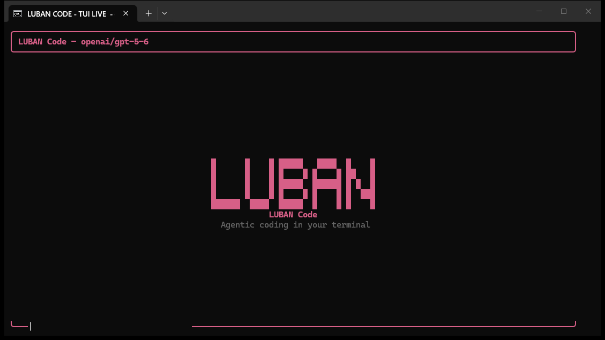
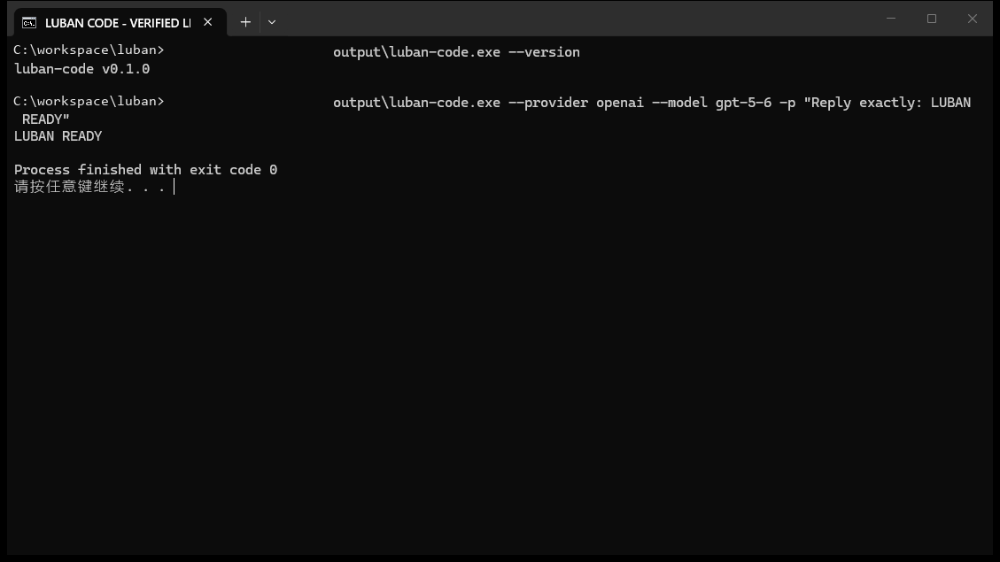

# LUBAN Code

[English](README.md) · [简体中文](README.zh-CN.md) · [日本語](README.ja.md) · [한국어](README.ko.md) · [Deutsch](README.de.md)

LUBAN Code는 긴 저장소 작업을 위해 Go로 만든 코딩 에이전트입니다. 토큰을 줄이려고 원본 세션 기록을 덮어쓰지 않으며, 프록시 URL이 바뀌었다는 이유로 Provider 고유 프로토콜을 몰래 바꾸지도 않습니다.

> 현재 버전은 `v0.1.0` 소스 프리뷰입니다. 바이너리와 패키지 관리자용 배포본은 아직 없으므로 소스에서 빌드해 사용하세요.



_2026-08-12에 Windows에서 현재 소스를 빌드한 뒤 실제 TUI를 촬영했습니다. API key와 endpoint 주소는 표시하지 않았습니다._

## 무엇이 다른가

### 증거는 남기고 Provider가 보는 내용만 줄입니다

세션이 길어지면 오래된 도구 결과를 전부 프롬프트에 넣거나, 검증하기 어려운 요약으로 기록을 바꾸는 경우가 많습니다. LUBAN은 원본 transcript를 보존합니다. 현재 운영 정책이 허용하는 좁은 범위에서는 예전 `Inspect` 결과만 Provider용 결정적 투영으로 바꿉니다. 경로, 줄 범위, 페이지 정보, digest, proof는 그대로 남습니다.

투영하기 전에는 전체 요청 비용을 계산합니다. 콜드 캐시와 복구 비용까지 반영해도 이득일 때만 적용합니다. 가격을 모르거나 usage가 불완전한 경우, 증거 생성이 실패한 경우, 절감량이 부족한 경우에는 투영하지 않습니다. 문제가 생긴 투영은 되돌리고, 같은 세션에서 이상이 3번 연속 발생하면 회로 차단기가 작동합니다.

현재 운영 범위는 의도적으로 좁습니다. `openai/gpt-5.6-sol*`, `deepseek/deepseek-v4-flash*` 모델군의 `Inspect`만 대상입니다. 구현과 한계는 [설계 문서](docs/design/progressive-context-compaction.md)와 [80k 페어 실행 기록](benchmark-results/progressive-context-compaction-v7-80k-2026-08-10/README.md)에 정리되어 있습니다.

### 프록시는 경로만 바꾸고 Provider 정체성은 바꾸지 않습니다

`BaseURL`은 전송 주소 설정입니다. OpenAI, DeepSeek, Anthropic, Vertex, Bedrock을 사용자 지정 주소로 연결해도 인증, 캐시 제어, Responses와 Chat의 의미, Provider별 요청 필드는 원래 계약을 따릅니다. 범용 OpenAI-compatible 방식으로 자동 격하하지 않습니다.

Responses에서 Chat으로 자동 협상하는 기능은 compatible Provider를 명시적으로 선택했을 때만 동작합니다. 현재 구현은 `404`, `405`, `501`을 endpoint 부재로 판단합니다. 인증, 사용량 제한, schema 문제는 오류로 반환되며 프로토콜 fallback을 일으키지 않습니다.

### 모델이 쓰는 도구는 작고, 운영 기능은 깊습니다

기본 운영 설정에서 모델에 공개되는 코딩 커널은 `Inspect`, `ApplyPatch`, `Run` 세 가지입니다. `ContextUpdate` shadow 경로를 켜면 이 내부 도구도 추가됩니다. 그 주변에는 재개 가능한 세션, 병렬 하위 에이전트, 선택형 Git worktree, 권한 확인, 수명 주기 hooks, MCP 연결, NDJSON/Go SDK 경계가 있습니다. 하위 에이전트는 시작 시점의 변경 불가능한 권한 스냅샷을 받습니다. 이후 부모 세션의 권한이 넓어져도 이미 실행 중인 자식 권한은 커지지 않습니다.

TUI에는 컨텍스트, 캐시, 비용, 압축, 하위 에이전트 상태가 표시됩니다. `--screen-reader`는 커서 제어, 마우스 캡처, 애니메이션을 사용하지 않는 추가 전용 모드입니다. 런타임 문구는 영어, 중국어 간체, 독일어, 일본어, 한국어, 러시아어로 제공되며 `Ctrl+L` 또는 `/language`로 바꿉니다.

## 수치에는 근거와 한계가 함께 있습니다

고정된 15개 작업의 로컬 비교에서, 선정된 LUBAN 실행은 선정된 Codex 실행보다 경과 시간, 토큰, 모델 호출 수가 적었습니다.

| 관측 합계 | LUBAN | Codex | 차이 |
| --- | ---: | ---: | ---: |
| 경과 시간 | 4,020.6초 | 5,644.5초 | -28.8% |
| 토큰 | 6,857,490 | 17,889,019 | -61.7% |
| LLM 호출 | 245 | 354 | -30.8% |
| patch 생성 | 15/15 | 15/15 | 같음 |

이 결과는 고정된 로컬 표본일 뿐, 일반적인 우위를 뜻하지 않습니다. 공식 grader 결과가 있는 항목은 처음 5개뿐이며 두 에이전트 모두 3/5를 해결했습니다. 추가 10개 작업은 채점하지 않았습니다. 실행 선정은 최적화 이후에 이루어졌고 모델 seed도 고정하지 않았습니다. 더 넓은 결론을 내리기 전에 [전체 HTML 보고서](benchmark-results/agentic-2026-07-27/representative15-report.html), [선정된 기계 판독 데이터](benchmark-results/agentic-2026-07-27/raw/candidates/selected-15task-20260731.json), [평가 프로토콜](benchmark/agentic/README.md)을 확인하세요.

점진적 압축 실험도 범위가 제한적입니다. 한 번의 80k 페어 실행에서 고정 evaluator 결과는 양쪽 모두 `2/2 + 455/455`였습니다. total token은 `1,362,070`에서 `444,419`로, 예상 비용은 `$5.207999`에서 `$1.004185`로 바뀌었습니다. 다만 seed를 고정하지 못해 두 trace가 첫 투영 전에 이미 갈라졌습니다. 이 값은 실제 두 trace의 측정치와 고정 요율로 계산한 비용 추정치이며, 투영 효과의 인과 평균은 아닙니다.

## 소스에서 빌드하기

Git과 [`go.mod`](go.mod)에 적힌 Go 버전이 필요합니다. 현재 버전은 `1.26.1`입니다. `Run`의 shell-form 단계는 Bash를 호출합니다. Windows에서는 Git Bash, WSL Bash 또는 다른 `bash` 실행 파일을 `PATH`에 넣어야 합니다.

macOS 또는 Linux:

```sh
git clone https://github.com/agent-dance/luban.git
cd luban
go build -o luban-code ./cmd/luban-code
./luban-code --version
```

Windows PowerShell:

```powershell
git clone https://github.com/agent-dance/luban.git
Set-Location luban
go build -o .\luban-code.exe .\cmd\luban-code
.\luban-code.exe --version
```

현재 module에는 로컬 `replace`가 있으므로 `go install github.com/agent-dance/luban/cmd/luban-code@latest` 경로는 지원하지 않습니다.

## Provider에 연결하고 실행하기

인증 정보는 환경 변수로 설정할 수 있습니다. 여러 인증 정보를 함께 보관하고 있다면 Provider도 명시하세요.

```sh
export PROVIDER=openai
export OPENAI_API_KEY="..."
./luban-code
```

```powershell
$env:PROVIDER = "openai"
$env:OPENAI_API_KEY = "..."
.\luban-code.exe
```

DeepSeek은 `PROVIDER=deepseek`과 `DEEPSEEK_API_KEY`로 연결하며 기본 Provider이기도 합니다. Ollama의 기본 주소는 `http://localhost:11434/v1`, 기본 모델은 `llama3.1`입니다. TUI를 먼저 연 뒤 `Alt+P`를 누르면 Provider, 모델, 지원하는 인증 방식이 나타납니다.

TUI를 열지 않고 한 번만 실행하는 예:

```sh
./luban-code -p "이 저장소를 검토하고 위험도가 가장 높은 문제를 보고해 주세요"
```



_두 번째 명령은 로컬에 설정된 OpenAI endpoint로 실제 요청을 보냈고 종료 코드 0으로 끝났습니다. 화면의 로컬 프롬프트 경로는 가렸습니다. 이 화면은 실행 확인 자료이며, Provider 호환성이나 성능을 입증하는 벤치마크는 아닙니다._

TUI 안에서 `/init`을 실행하면 기존 파일을 덮어쓰지 않고 `LUBAN.md`와 프로젝트 설정을 추가합니다. 인증 정보는 설정하지 않습니다.

## 사용 전에 알아야 할 제한

- Linux OS sandbox에는 Bubblewrap이 필요하고 macOS는 `sandbox-exec`을 사용합니다. Windows에는 현재 OS sandbox backend가 없습니다. 검증된 backend가 없을 때 `--force-sandbox-tools`를 쓰면 실행이 실패합니다.
- Agent Teams는 실험적인 선택 기능입니다. 병렬 하위 에이전트와 worktree 격리가 원격 분산 swarm을 뜻하지는 않습니다.
- Provider 등록과 프로토콜 테스트는 모든 모델 또는 타사 gateway에 대한 인증이 아닙니다.
- 로컬 인증 정보는 평문 JSON으로 저장됩니다. Unix 계열에서는 `0600`으로 기록하지만 Windows에는 현재 동등한 ACL 보장이 없습니다. 암호화 vault나 OS keychain도 아닙니다.
- Node.js는 Node 기반 MCP server를 쓸 때만 필요합니다. 핵심 CLI 실행에는 필요하지 않습니다.
- 저장소 루트에는 아직 라이선스가 없습니다. Owner가 라이선스를 게시하기 전에는 일반 저작권 규칙이 적용됩니다.

## 근거 자료

- [점진적 컨텍스트 압축 설계](docs/design/progressive-context-compaction.md)
- [점진적 압축 롤아웃 보고서](docs/reports/progressive-context-compaction-rollout-2026-08-11.md)
- [15개 작업 벤치마크 보고서](benchmark-results/agentic-2026-07-27/representative15-report.html)
- [Agentic 벤치마크 프로토콜](benchmark/agentic/README.md)

코드를 기여하려면 [CONTRIBUTING.md](CONTRIBUTING.md), 보안 문제를 신고하려면 [SECURITY.md](SECURITY.md)를 먼저 확인하세요.
5개 언어로 진행한 세 차례 편집·실행 검토 기록은 [README 릴리스 검토](docs/release/readme-review-2026-08-12.md)에 있습니다.

보안 문제는 공개 issue가 아니라 GitHub의 [비공개 취약점 신고](https://github.com/agent-dance/luban/security/advisories/new)로 보내세요. 필요한 내용은 [SECURITY.md](SECURITY.md)를 확인하세요.
