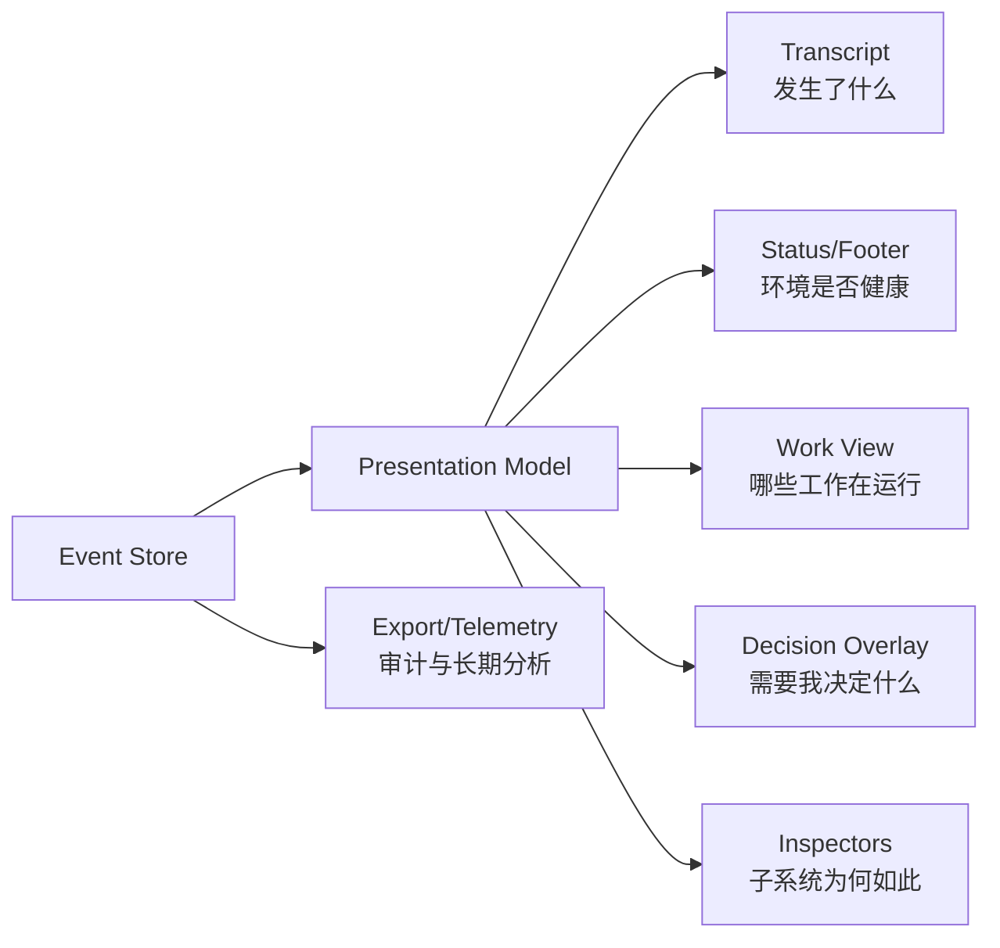

# Agentic TUI 信息呈现、聚合、展开与观测面设计

> 以 Claude Code CLI 为案例，提炼可迁移的信息设计方法，而非复刻其视觉或功能。

| 项目 | 内容 |
| --- | --- |
| 文档状态 | Reviewed draft |
| 研究截面 | Claude Code 2.1.207，2026-07-12 |
| 目标读者 | TUI 产品设计、交互设计、CLI/TUI 工程、Agent Runtime 工程 |
| 适用范围 | 具有流式响应、工具调用、权限、后台任务、子 Agent、上下文管理能力的交互式终端 Agent |

## 1. 摘要

Agentic TUI 的核心问题不是“怎样显示更多运行信息”，而是：**在一个持续增长、并发发生、既有文本又有副作用的执行过程中，怎样让用户始终知道现在发生了什么、是否需要介入、去哪里找证据。**

Claude Code 最值得借鉴的并不是某个边框、颜色或快捷键，而是以下方法：

1. **主会话只保留因果主线。** 默认展示用户意图、Agent 的关键判断、动作摘要、结果和异常，不让原始 stdout、工具参数和扩展协议占满时间流。
2. **信息按决策需要渐进披露。** 从徽标/计数，到一行摘要，到局部详情，再到完整 transcript、专用检查器或导出，形成可逆的下钻路径。
3. **聚合首先服务注意力，而不是底层实现。** “需要输入”“等待审批”“可审阅”比“属于哪个工具”“在哪个目录”更优先。
4. **观测面按职责拆分。** 会话流解释因果，状态栏表达环境态，任务视图表达执行态，权限面表达决策，诊断命令表达子系统健康，机器接口承担审计和长期监控。
5. **正常路径安静，异常路径保留现场。** 高频成功事件被压缩；失败、拒绝、部分完成、人工阻塞不能被吞掉，并且必须保留原始详情的访问路径。
6. **可见历史、模型上下文和持久审计是三个不同对象。** 屏幕折叠不应删除原始数据；上下文压缩不等于删除 transcript；UI 清屏也不应悄悄改变模型状态。

本文据此提出一套适用于本项目的设计模型：

```text
Runtime Event
  -> Semantic Observation（稳定身份、主体、阶段、状态、摘要、详情引用）
    -> Attention Policy（是否打断、是否常驻、是否通知）
      -> Aggregation Policy（在同一工作范围内聚合，再按 actionability 排序）
        -> Disclosure Depth（Summary -> Detail -> Evidence）
          -> Surface Projection（Transcript / Status / Overlay / Inspector / Export）
```

一句话结论：**主界面应是一条低噪声、可追溯的工作叙事，而不是常驻运维仪表盘；在安全与保留策略允许的范围内，所有压缩都必须保留回到证据的路。**

## 2. 研究边界与证据标记

### 2.1 这篇文档不做什么

- 不复刻 Claude Code 的像素、色值、边框、图标或具体快捷键。
- 不假设 Claude Code 的内部组件树或状态管理方式。
- 不把 Claude Code 当前行为视为永久规范；它仍在快速演进，全屏渲染和 Agent View 也仍属于 preview。
- 不要求本项目具备 Claude Code 的全部产品功能。
- 不把“信息可观测”误解为“所有信息常驻可见”。

### 2.2 证据等级

本文使用以下标记区分事实、推断和设计决策：

- **[E] Evidence**：来自 Claude Code 官方文档、官方 changelog、本机 2.1.207 实证或本仓库代码。
- **[I] Inference**：从多个行为事实中推导出的设计意图，不代表 Anthropic 的官方表述。
- **[D] Decision**：本文建议本项目采用的设计规则。
- **[U] Unknown**：官方材料或本仓库无法确认的内容。

### 2.3 主要证据

- [E] Claude Code 经典 renderer 使用终端原生 scrollback；可选 fullscreen renderer 使用 alternate screen、固定底部输入和应用内滚动。[Fullscreen rendering](https://code.claude.com/docs/en/fullscreen)
- [E] `Ctrl+O` 进入 transcript viewer；MCP 连续调用默认可聚合成一行，fullscreen 下可点击工具调用与结果共同展开。[Interactive mode](https://code.claude.com/docs/en/interactive-mode)
- [E] Agent View 采用“分组列表 -> 行摘要 -> peek -> attach 完整会话”的下钻路径，并优先分组 `Ready for review`、`Needs input`、`Working`、`Completed`。[Agent view](https://code.claude.com/docs/en/agent-view)
- [E] 自定义 statusline 独占一行并位于内建 footer 之上，权限提示、补全和帮助菜单出现时暂时让位。[Status line](https://code.claude.com/docs/en/statusline)
- [E] Checklist 与后台任务分离：前者表达计划，后者表达正在运行的 shell/subagent。[Interactive mode](https://code.claude.com/docs/en/interactive-mode)
- [I] `/context`、`/mcp`、`/hooks`、`/permissions`、`/resume` 可归纳为上下文、扩展、自动化、安全和会话的专用观测面。
- [E] 本机 Claude Code 2.1.207 在 `--safe-mode --permission-mode plan --ax-screen-reader` 下完成了只读实证：`/status`、`/usage`、`/context`、`/permissions` 等使用带 Tab 的检查器；`/resume` 默认限制当前范围，再用快捷键扩展到 branch、worktree 或全部项目；所有空面都保留作用域解释和下一入口。复现范围与限制见附录 A。
- [E] 本仓库已实现全屏会话流、工具调用/结果分组、状态栏、任务视图和权限 overlay，但成功工具结果在进入 UI 前会截断到 20 行，`Collapsed` 也没有用户可达的展开动作。见 `tui/renderer.go:150-175`、`tui/root.go:621-626`、`tui/root.go:898-929`。

## 3. 设计问题

传统 REPL 的信息单位是“一条命令、一段输出”。Agentic TUI 的信息结构更复杂：

- 一个用户 turn 可能触发多次模型请求、几十个工具调用和多个并行 Agent。
- 工具输出既是给模型的上下文，也是给人的证据，但两者需要的粒度不同。
- 一部分动作只是读，一部分会修改文件，一部分会触达远端系统。
- 用户可以在执行中插话、取消、后台化、切换会话或审批权限。
- 上下文、token、费用、连接、速率限制等状态持续变化，却不是每一刻都值得占据主视线。
- 同一事实需要同时服务即时交互、回溯检查、故障诊断、审计和机器监控。

因此，一个可用的 Agentic TUI 必须同时解决五个问题：

| 问题 | 用户真正要回答的问题 | 设计失败的表现 |
| --- | --- | --- |
| 呈现 | 现在发生了什么？ | 原始日志倾倒、状态与内容混在一起 |
| 聚合 | 哪些事件其实属于同一件事？ | 一次任务被拆成几十行互不关联的工具日志 |
| 展开 | 我怎样看到足以判断的证据？ | 摘要不可展开，或一展开就丢失当前位置 |
| 注意力 | 什么时候真的需要我？ | 每个进度都通知，真正的阻塞反而被淹没 |
| 观测面 | 不同深度的问题去哪里看？ | 所有信息都塞在主界面，或信息散落且无法关联 |

## 4. 信息本体：先定义“发生了什么”，再决定“画成什么”

本文使用四个正交维度，不能把它们压成一条 UI 层级：

| 维度 | 决定什么 | 例子 |
| --- | --- | --- |
| Attention | 是否需要用户注意或被打断 | Ambient、Progress、Transition、Decision |
| Aggregation | 哪些 observation 属于同一认知工作单元 | 同一次 test run、同一 Agent 子树 |
| Disclosure | 同一对象展示多深 | Summary、Detail、Evidence |
| Surface | 信息在哪里出现 | Transcript、Status、Overlay、Inspector、Export |

[D] 推荐处理顺序是：

1. Runtime event 规范化为 Observation。
2. 确定性状态机计算 severity、actionability 和 outcome。
3. 在同一 turn/work unit 等边界内按领域规则聚合。
4. 聚合组之间按 actionability 和 outcome 排序或分区。
5. 根据对象、用户偏好和当前任务选择 disclosure depth。
6. 将同一 presentation model 投影到一个或多个 surface。

因此，Actionability 通常是**跨组排序/分区依据**，不替代 `toolUseID`、work unit、actor 等聚合键。

### 4.1 术语与数据所有权

| 术语 | 定义 | 所有者与生命周期 |
| --- | --- | --- |
| Runtime Event | 运行时产生的最小事实，不含 UI 决策 | Event producer；append-only 或可重放 |
| Observation | 规范化、有关联 ID 的语义事实 | Presentation pipeline；随 session 保留 |
| Aggregate | 多个 observation 的可解释视图组合 | Aggregator；live 时更新，turn 完成后冻结 |
| Presentation Model | surface 共享的排序、摘要、disclosure 与 focus 状态 | TUI application；可由 observation 重建 |
| Detail Store | 工具原始结果、diff、完整计划等大 payload | 本地 runtime；按引用读取，可分页/落盘 |
| Audit Store | session 的完整事件与操作历史 | Session subsystem；按保留策略清理 |
| Telemetry | 跨 session 的 metric/event/span 导出 | Observability exporter；默认只含脱敏元数据 |

[D] Audit Store 可以在本地权限和脱敏策略允许时保存完整输入输出；外部 Telemetry 默认不得复制敏感 prompt、tool input 或 secret。Evidence view 从 Detail/Audit Store 读取，不等于把完整内容发送到 Telemetry。

### 4.2 核心实体

[D] 视图层不应只接收字符串消息，而应接收具有稳定身份和语义的 Observation：

```go
type Observation struct {
    ID            string
    ParentID      string
    CorrelationID string // prompt / turn / workflow / tool use

    Kind          ObservationKind
    Actor         ActorRef
    Phase         Phase
    State         State
    Severity      Severity
    Actionability Actionability

    Summary       Summary
    DetailRef     DetailRef
    Metrics       Metrics

    StartedAt     time.Time
    UpdatedAt     time.Time
    FinishedAt    *time.Time
}
```

至少需要以下语义实体：

| 实体 | 说明 | 典型例子 |
| --- | --- | --- |
| Turn | 一次用户意图及其直接响应 | 用户要求修 bug 到 Agent 最终答复 |
| Activity | turn 中可观察的动作 | 读取文件、搜索、执行测试、编辑文件 |
| Artifact | 用户最终要检查的产物 | diff、文件、测试报告、PR、plan |
| Decision | 必须由用户确认的关口 | 权限、计划批准、冲突选择、认证 |
| WorkUnit | 可独立运行和管理的工作单元 | task、subagent、background shell、session |
| Resource | 影响运行质量或成本的资源 | context、token、cost、rate limit |
| System | 提供能力或控制流程的子系统 | provider、MCP server、hook、sandbox |

### 4.3 必须保留的关联

[D] 任何展示都不能破坏以下关联：

- `prompt -> turn -> model request -> tool call -> tool result`
- `work unit -> parent work unit -> session`
- `permission request -> actor -> proposed action -> decision -> resulting execution`
- `artifact -> producing activity -> verification result`
- `error -> failed operation -> retained partial output -> recovery action`
- `resource change -> causing activity / subsystem`

这不是纯后端问题。[E] 当前 `TuiRenderer.ToolResult` 通过向后扫描“最近一个 ToolCall”推断工具名（`tui/renderer.go:159-166`）。[I] 并行工具若乱序完成，视觉归属存在错配风险。[D] 工具结果必须携带 `toolUseID`，不能依赖邻接或最近项推断。

### 4.4 三种历史必须分离

| 历史 | 用途 | 可否折叠 | 可否压缩 | 可否删除 |
| --- | --- | --- | --- | --- |
| Visible transcript | 供人理解工作因果 | 可以，可逆 | 只改变视图 | `clear view` 仅清可见投影 |
| Model context | 供模型继续推理 | 不适用 | 可以，需可解释 | `clear conversation` 显式开启空上下文 |
| Audit/event store | 回溯、诊断、导出 | 不适用 | 不应有损 | 按保留策略清理 |

[D] UI 折叠只改变 presentation state；不能在进入视图模型时截断原始 payload。模型上下文压缩也不能覆盖审计记录。

[D] 三种清理动作必须使用不同命令和文案：

- `clear view`：只重置 visible transcript/scroll，不改变 model context 或 audit。
- `clear conversation`（本项目现有 `/clear` 语义）：同时开启新的 model context 和空 visible transcript，旧 audit/session 仍可恢复。
- `delete history`：按用户确认删除 audit/session 数据，是独立且更高风险的动作。

## 5. 信号层与三级内容披露

Claude Code 的多处交互呈现出同一结构：[I] 它不是一个简单的“普通/verbose”开关，而是多层下钻。

| 级别 | 名称 | 回答的问题 | 典型承载面 | 信息预算 |
| --- | --- | --- | --- | --- |
| L0 | Signal | 是否需要注意？ | badge、颜色+文字、计数、通知 | 1 个状态或计数 |
| L1 | Summary | 正在做什么，结果如何？ | transcript 一行、task/session row | 1 行，动作+对象+状态 |
| L2 | Detail | 足够做当前判断吗？ | inline expand、peek、overlay、diff | 一个局部对象的结构化详情 |
| L3 | Evidence | 原始证据和完整历史是什么？ | full transcript、inspector、export、日志 | 完整、可搜索、可导出 |

L0 是 Attention 在 UI 上的信号投影，不是每个对象都必须经过的内容层；L1-L3 才是同一对象的 disclosure depth。Inspector 或 overlay 是 surface，既可以承载 L2，也可以承载 L3。

### 5.1 L0 Signal：路由注意力

Signal 只适合稳定、可枚举、需要快速扫描的状态：

- `Needs input`、`Failed`、`Ready for review`
- 当前权限模式
- context 压力或 rate limit 风险
- 后台任务完成/失败计数
- provider/MCP 断连

[D] 颜色只能作为冗余编码，必须同时使用文字、形状、位置或动画。状态为 `Failed` 时不能只把圆点从绿变红。

### 5.2 L1 Summary：维持因果主线

一行摘要的推荐语法：

```text
<actor?> <action> <object> <state/result> <small metrics?>
```

示例：

```text
Read internal/auth/session.go · 214 lines
Edited 3 files · +42 -17
Tests passed · 128 passed in 14.2s
researcher completed · 6 tools · 8.4K tokens
slack MCP called 3 times
```

[D] 摘要不是对 raw text 做 `truncate(60)`。摘要应由领域 formatter 生成，并优先保留：

1. 主体（非主 Agent 时）
2. 动作
3. 关键对象
4. 状态或结果
5. 与判断有关的少量指标
6. 明确的详情可用性

### 5.3 L2 Detail：局部决策所需信息

Detail 应围绕当前对象展开，而不是把用户送到另一条没有上下文的日志流：

- 工具调用与结果共同展开。
- 编辑展示文件级 diff 或 diffstat。
- 权限展示主体、动作、影响范围、风险原因和授权范围。
- Agent row 展示完整状态句、最新产出、阻塞问题和可发送回复。
- session row 展示最近消息和 branch/worktree。

[D] 展开必须满足五个属性：

1. **可逆**：关闭后恢复原来的焦点、滚动位置和输入草稿。
2. **无损**：详情来自保留的原始数据，而不是被截断后的字符串。
3. **同一身份**：摘要和详情共享同一 observation ID。
4. **不改变执行**：查看详情本身不能重放工具或重新请求模型。
5. **范围明确**：局部展开只影响所选对象；全局 transcript 模式另设开关。

### 5.4 L3 Evidence：审计与深度诊断

在访问控制、脱敏和保留策略允许的范围内，完整证据面应支持：

- 搜索和按 prompt/turn/tool/work unit 过滤
- 原始输入、输出和时间戳
- 关联 ID 和父子关系
- 导出为人类可读文本或结构化事件
- 跳转到 artifact（文件、diff、PR、报告）
- 在不重放执行的情况下恢复现场

[I] Claude fullscreen 中把完整 transcript 写回原生 scrollback、打开 `$EDITOR` 或导出，是对终端生态的尊重：TUI 不需要重新实现所有搜索、复制和文本处理能力。

## 6. 聚合设计

### 6.1 聚合的目标

聚合不是为了“少显示几行”，而是为了把底层事件恢复成用户认知中的工作单元。

正确的聚合：

```text
Grep "SessionID" in 42 files · 17 matches
```

错误的聚合：

```text
17 operations completed
```

前者保留意图、范围和结果；后者只保留计数。

### 6.2 聚合顺序

[D] 推荐按以下优先级对聚合后的组进行排序或分区：

1. **Actionability**：是否需要用户输入、审批或审阅
2. **Outcome**：失败、部分完成、成功、取消

组内聚合键再按场景选择：Work unit、Actor、Phase、Subsystem、Time/space locality。Actionability 不取代这些身份键。

这解释了为什么 Agent View 按 `Needs input` 和 `Ready for review` 分组比按目录分组更有效：前者直接对应人的下一步。

### 6.3 可聚合与不可聚合事件

| 事件 | 默认策略 | 聚合键 | 摘要必须保留 |
| --- | --- | --- | --- |
| 连续 Read/Glob/Grep | 聚合 | turn + actor + tool family + 短时间窗 | 范围、数量、关键对象 |
| MCP 调用 | 聚合 | turn + server + capability | server、次数、结果状态 |
| ToolCall + ToolResult | 成对聚合 | toolUseID | 输入摘要、最终状态、详情引用 |
| 多文件 Edit/Write | 聚合到 artifact group | turn + change set | 文件数、diffstat、失败文件 |
| 测试执行 | 领域摘要 | command/work unit | pass/fail/skip、耗时、失败用例 |
| Agent 子树 | 层级聚合 | parentAgentID | 运行数、阻塞数、后代数 |
| 已完成 checklist | 限量+溢出计数 | task list | 当前项、未完成数 |
| 权限请求 | **禁止合并** | 单个 decision ID | 主体、动作、风险、授权范围 |
| 错误/拒绝 | **禁止静默合并** | operation ID | 原因、部分结果、恢复动作 |
| 用户消息/最终答复 | **禁止与工具日志合并** | turn | 原文或正式摘要 |

### 6.4 聚合窗口

[D] 聚合必须有清晰生命周期：

- **Live group**：执行中可更新计数和当前 activity，但位置稳定。
- **Turn-final group**：turn 结束后冻结摘要，避免历史内容不断改写。
- **Session rollup**：只用于资源和统计，不替代 turn transcript。
- **Cross-session dashboard**：使用独立观测面，不回灌主会话。

状态更新应原地发生，不应每次 spinner tick 都追加一行。流式文本可节流刷新，但首 token 和状态跃迁要立即可见。本仓库的 50ms token debounce（`tui/state.go:17-22`）符合这一原则。

### 6.5 摘要的可信度

Agent View 使用模型生成 session headline。[E] 这类摘要可提升可扫描性，但不是执行真相。

[D] 模型摘要必须：

- 和确定性状态分开显示；`Needs input` 来自状态机，headline 才可以是模型文本。
- 带更新时间，并在新事件到来时标记或刷新。
- 不替代原始输出和 artifact。
- 不参与权限判断、成功判定或自动恢复。
- 在无法生成时退化为确定性摘要，而不是显示旧结论。

## 7. 注意力与打断策略

### 7.1 四级注意力

| 级别 | 含义 | 呈现方式 | 例子 |
| --- | --- | --- | --- |
| A0 Ambient | 仅供顺手查看 | status/footer | 模型、branch、context、cost |
| A1 Progress | 工作仍在正常推进 | 原地 activity、spinner、task row | 正在测试、Agent 运行中 |
| A2 Transition | 有价值的状态变化 | transcript state、应用内 toast、recap | 完成、失败、进入等待 |
| A3 Decision | 没有人就无法继续或风险过高 | modal/overlay，抢占输入焦点 | 权限、认证、冲突选择 |

[D] 打断条件只允许两类：

1. **执行无法继续**：需要输入、审批、认证或冲突决策。
2. **风险发生跃迁**：将触发不可逆或外部副作用，或系统失去安全保证。

工具开始、普通文件读取、重试中的暂时错误都不应发出抢占式提示。

### 7.2 后台工作的通知

后台任务的**系统级通知**只在以下状态跃迁出现：

- `running -> needs_input`
- `running -> ready_for_review`
- `running -> failed`
- 用户明确订阅时的 `running -> completed`

`completed` 即使不触发系统通知，也必须在 transcript/work view 记录状态跃迁；应用内记录、toast 和操作系统通知是三种不同强度。

通知内容必须带 work unit 身份，点击或快捷键能直达对应 peek/会话。不能只说“Task completed”。

### 7.3 错误呈现

[D] 错误信息必须回答四个问题：

1. 发生了什么？
2. 哪些工作已经完成并被保留？
3. 系统正在自动做什么（重试、回滚、等待）？
4. 何时以及怎样需要用户介入？

错误和取消不是同一状态：至少区分 `failed`、`denied`、`cancelled_by_user`、`cancelled_by_parent`、`timed_out`、`partial`、`disconnected`。

## 8. 观测面设计

### 8.1 观测面不是越多越好

每个观测面必须有单一主要问题。多个面可以引用同一 Observation，但不能各自维护一套状态真相。



### 8.2 推荐观测面

| 观测面 | 核心问题 | 默认内容 | 不应该包含 |
| --- | --- | --- | --- |
| Conversation transcript | 这次工作为何走到这里？ | 用户意图、关键动作、artifact、结果、异常 | 每个内部事件、常驻系统指标 |
| Status/footer | 当前环境和资源状态如何？ | mode、context pressure、branch/session、连接、少量 cost | 长错误、工具输出、任务列表 |
| Activity strip | 当前 turn 正在做什么？ | 当前 phase、并行数、可取消状态 | 已完成历史 |
| Checklist | 计划走到哪一步？ | pending/in progress/completed | shell PID、Agent 健康 |
| Background work view | 哪些 work unit 正在运行或阻塞？ | task/agent/shell 状态、owner、age、needs input | 完整 transcript |
| Decision overlay | 我现在要批准或选择什么？ | actor、action、impact、risk、choices | 无关的 session 状态 |
| Context inspector | 上下文被什么占用？ | 分类占比、阈值、compact 影响 | 累计 session cost 混算 |
| Extension inspector | MCP/hook/plugin 是否健康？ | server/event/source/status/count/error | 所有调用的完整日志 |
| Session navigator | 我要恢复哪条工作线？ | name、summary、time、branch/worktree、preview | 当前 session 的持续状态栏 |
| Evidence/export | 原始证据是什么？ | full payload、IDs、timestamps、links | 为可读性做有损摘要 |
| Telemetry | 跨 session 有何趋势？ | event/metric/span、correlation IDs | 直接驱动交互状态 |

### 8.3 常驻信息预算

[D] Status/footer 只常驻满足以下至少一个条件的信息：

- 会改变用户下一步行为；
- 难以从当前 transcript 推断；
- 变化频率适中且值得持续关注；
- 丢失后会造成安全或成本风险。

推荐优先级：

```text
permission mode > context pressure > needs-input count > connection health
> current session/branch > rate limit > cost > decorative model metadata
```

窄终端下低优先级 segment 应整段消失或进入详情，不能把所有字段压缩成不可读缩写。当前本仓库状态栏已经把 mode/context 设为固定高优先级、其余信息可截断（`tui/root.go:1712-1806`），方向正确。

### 8.4 机器观测面

[D] 人类 TUI 与机器遥测共享事件身份，但使用不同 schema：

- 每个 prompt 生成 `prompt_id`；同 turn 的模型请求和工具事件都可关联。
- 每个 tool call 使用 `tool_use_id`，结果、权限和 hook 都引用它。
- 每个 work unit 使用稳定 ID，并保留 parent ID。
- event 使用单调递增 sequence，时间戳用于跨进程相关，不用于替代顺序。
- metrics 只承载可聚合数值；高基数的 prompt/tool/workflow ID 进入 event/span。
- 默认不记录敏感 prompt、tool input 和 secrets；详细日志必须显式开启并做脱敏。

### 8.5 专用检查器的统一外壳

[I] 本机 2.1.207 的多个样本可归纳出相似的检查器结构：

```text
Title / Tabs
  -> Scope or summary
    -> Search / filters
      -> Selectable rows or structured sections
        -> Context-specific detail
          -> One-line operation hints
```

[D] 本项目的 inspector/picker 应复用同一套交互合同：

- `Left/Right` 切换同一领域的 Tab，`Up/Down` 移动行，`Enter` 下钻，`Esc` 返回。
- 标题明确当前实体和作用域，不依赖边框颜色表达。
- 搜索只过滤当前层；扩大范围是显式动作，不能在后台悄悄混入跨项目结果。
- 每个异步面都有 `Loading -> Result | Empty | Error`，不能用空白代替状态。
- Empty state 说明“为什么为空、当前查了什么范围、下一步去哪里”，而不是营销文案。
- 底部操作提示只展示当前上下文可用的动作，不常驻列出全部快捷键。
- `/usage` 这类命令可以深链到统一 Settings/Status shell 的对应 Tab，不应复制一套孤立页面。

### 8.6 逐步扩大作用域

[I] `/resume` 默认从当前 worktree/项目开始，再由用户扩展到 branch、全部 worktree 或所有项目，体现了一个可迁移原则：**发现面默认使用最小相关作用域，用户再显式扩域。**

[D] 推荐的作用域阶梯：

```text
current entity -> current session -> current worktree/project
-> current repository -> all local projects -> remote/global
```

扩大作用域后必须在标题或 filter chip 中持续显示，避免用户误以为结果仍来自当前项目。关闭面板后恢复默认作用域，除非用户明确保存偏好。

## 9. 典型场景矩阵

本节用于检验前述原则能否覆盖典型 Agent 场景，不代表本项目必须复制 Claude 的全部功能。关键设计取舍先归纳如下：

| 本地用户问题 | Claude 案例启发 | 本项目采用/改造 | 明确不采用 |
| --- | --- | --- | --- |
| 工具日志淹没答复 | 默认摘要，按需 transcript | 领域摘要 + 无损 DetailRef | 统一 20 行截断 |
| 并行工作难以判断 | needs-input 优先，row -> peek -> attach | actionability 分区 + work unit 下钻 | 常驻展示所有子事件 |
| 状态/资源散落 | footer ambient + 专用 inspector | mode/context 常驻，其他按需 | 多行常驻 dashboard |
| 权限无法审清影响 | 请求点名 actor，模式持续可见 | 专用 Decision model | 把 plan 塞进通用 Yes/No 框 |
| fullscreen 失去终端能力 | transcript、scrollback、editor 出口 | 搜索/导出/editor/键盘退化路径 | 重写弱化版终端生态 |

| 场景 | 默认呈现 | 聚合方式 | 展开路径 | 注意力级别 | 主要观测面 |
| --- | --- | --- | --- | --- | --- |
| 首次进入 | 简洁身份、项目、输入建议 | 不显示空面板 | help/command menu | A0 | home + footer |
| 编辑输入 | 多行输入、类型提示、附件 chip | `/`、`!`、`@` 统一入口但语义着色 | 补全列表、外部编辑器 | A0 | composer |
| 流式回答 | 当前 assistant block 原地增长 | token 节流，不聚合语义段落 | transcript | A1 | transcript |
| 读取/搜索 | 一行 activity/结果摘要 | 同 turn 同 actor 同类工具聚合 | inline detail -> evidence | A1 | transcript |
| 文件修改 | 文件或 change set 摘要、diffstat | 多 edit 聚合为 artifact group | diff -> 文件/IDE | A1/A2 | transcript + artifact |
| 运行测试 | 测试状态、通过/失败数、耗时 | 按一次 test run 聚合 | 失败列表 -> raw output | A1/A2 | transcript + detail |
| 权限审批 | 点名 actor 的专用决策面 | 不合并 | 影响详情、规则来源 | A3 | decision overlay |
| Plan 完成 | 把 plan 作为 artifact 和状态关口 | plan 章节可折叠 | 审阅 plan -> 选择执行模式 | A3 | plan view |
| 多并行工具 | 当前 phase + `N running` | 按 actor/work unit 聚合 | activity list | A1 | activity strip |
| 子 Agent | 一行状态或树节点 | 父子树、后代计数 | row -> transcript -> resume | A1/A2/A3 | work view |
| 后台 shell | task ID、命令摘要、状态 | 每个 process 一个 work unit | tail/output file | A1/A2 | background view |
| Context 逼近阈值 | footer 风险信号 | resource rollup | `/context` 分类 -> compact preview | A0/A2 | status + inspector |
| Compact 完成 | 一行明确提示保留/丢弃范围 | 不用假装原历史消失 | 查看 summary、完整 transcript | A2 | transcript + context |
| MCP 断连 | server 级健康告警 | 按 server 聚合工具 | server -> capability -> error | A2/A3 | extension inspector |
| Hook 阻断 | 指明 hook、动作和原因 | 不与普通 tool error 合并 | event -> matcher -> handler | A3 | transcript + hook inspector |
| 会话恢复 | name/summary/time/branch | root/fork/worktree 分组 | row -> preview -> resume | A1 | session navigator |
| 长时间离开后返回 | 一行 recap + needs-input 数 | 按状态跃迁汇总 | recap -> affected work units | A2 | notification + work view |
| API/网络重试 | spinner 中显示 attempt/倒计时 | 同一 request 原地更新 | error detail | A1，耗尽后 A2 | activity + transcript |
| 中途失败 | 保留已输出内容并标 partial | 不重放已完成副作用 | partial evidence + retry choices | A2/A3 | transcript + evidence |

## 10. 两种 renderer，不同取舍

Claude Code 同时保留 classic 和 fullscreen 两种路径是重要的设计信号：[I] renderer 选择不是单纯性能开关，而是“应用掌控力”和“终端原生能力”的权衡。

| 维度 | Classic / native scrollback | Fullscreen / alternate screen |
| --- | --- | --- |
| 输入稳定性 | 输出增长时位置可能移动 | 输入固定，布局稳定 |
| 长会话性能 | 依赖终端 scrollback 与重绘 | 可只渲染可见节点，内存更可控 |
| 搜索/复制 | 原生 Cmd+F、tmux copy | 需要应用内搜索/选择或导出 scrollback |
| 鼠标 | 主要由终端处理 | 应用可提供滚动、点击展开、链接 |
| 恢复能力 | 终端生态成熟 | 必须处理 resize、suspend、异常退出 |
| 信息展开 | 适合追加式 verbose | 适合原地展开和稳定焦点 |

[D] 本项目当前默认 fullscreen，不必为了“像 Claude”改成 classic；但必须补齐 fullscreen 对原生能力的替代和逃生路径：搜索、复制、完整 transcript、导出、编辑器打开、鼠标关闭选项，以及可靠的终端恢复。

## 11. 对当前 Go TUI 的落地判断

### 11.1 已经成立的设计基础

- [E] `MsgKind` 区分 user、assistant、thinking、tool、system、error 等语义，而不是单一日志字符串（`tui/state.go:24-74`）。
- [E] 主布局已经形成“scrollable transcript + persistent chrome + modal overlay”（`tui/root.go:273-461`）。
- [E] 相邻的 ToolCall 与 ToolResult 被视觉成组（`tui/root.go:621-626`）；这不等同于按稳定 ID 关联并行结果。
- [E] thinking 和成功工具结果默认降噪，错误默认展开（`tui/renderer.go:68-76`、`tui/renderer.go:150-175`）。
- [E] Agent JSON 已转换为 completed/backgrounded/teammate 等领域摘要，而不是直接暴露协议 payload（`tui/root.go:1042-1142`）。
- [E] status bar 已明确 segment 优先级，窄屏时保留 mode/context（`tui/root.go:1712-1806`）。
- [E] permission 是真正阻塞工具执行的 modal，并支持键盘决策（`tui/renderer.go:357-395`、`tui/root.go:2027-2102`）。
- [E] token 流使用 50ms debounce，并在完成后重新渲染完整 Markdown（`tui/state.go:17-22`、`tui/stream_renderer.go:254-290`）。

### 11.2 结构性缺口

本文的优先级不是工程排期承诺，而是按信息可信度与用户风险判级：

| 等级 | 判级条件 | 典型后果 |
| --- | --- | --- |
| P0 | 会造成证据不可恢复、UI/engine 状态分叉、安全决策信息不足或错误归属 | 用户基于错误事实批准动作，或无法恢复真实现场 |
| P1 | 主流程可完成，但高频场景显著增加认知负担、误操作或诊断成本 | 并行工作不可判断、展开路径不一致、fullscreen 能力缺口 |
| P2 | 主要影响低频诊断或扩展可见性，且已有命令/日志 workaround | MCP/hook 健康需要手动检查 |

每项进入实施排期前还需要补充发生频率、受影响用户、依赖关系和基线测量；以下级别只表达当前风险上界。

> 实施状态说明（2026-07-13）：本节“当前”描述保留为迁移前的证据基线，
> 不是现行实现说明。P0/P1 合同的 owner、迁移结果和验证证据见
> `TUI_INFORMATION_ARCHITECTURE_IMPLEMENTATION.md`；下列 `[D]` 合同仍为权威要求。

#### P0：摘要不可回到证据

当前成功 ToolResult 在进入状态前截断到 20 行，然后才标记 collapsed（`tui/renderer.go:150-175`）；生产代码也没有切换 `Collapsed` 的动作。这个机制是**有损截断**，不是渐进披露。

[D] 目标合同：原始 payload 在保留策略内可由稳定引用无损访问，summary 不拥有或截断唯一副本。候选实现是独立 Detail Store，Message/Observation 只保存 summary 和 `DetailRef`；是否落盘、分页或复用现有 session store 由实现设计决定。

#### P0：UI transcript 与 engine session 可能分叉

`/resume` 切换 engine/runtime 后没有把目标 transcript 写回 `AppState.Messages`；`/clear` 清 engine messages，但没有调用 `AppState.ClearMessages`。用户看到的会话与模型实际使用的会话可能不一致。

[D] 目标合同：session 切换和 `clear conversation` 完成后，engine、presentation、usage、focus 必须指向同一 session epoch；任一步失败都不能暴露半切换状态。采用事务对象、staged apply 还是补偿回滚由实现设计决定。

#### P0：权限详情不足以支撑判断

通用权限框只接收 toolName/input/riskLevel，输入被压成一行；权限系统的解释、请求 actor 和授权影响范围没有进入视图。ExitPlanMode 把完整 plan 塞进 input map，但通用 preview 会截断。

[D] permission 和 plan approval 必须是独立的 Decision 类型，至少展示：请求者、动作、目标、影响、风险理由、授权持续时间、规则来源和可选动作。

#### P1：并行执行被过度压缩

执行层按 toolUseID 维护多个 spinner，但 UI 只显示栈顶工具名。用户无法判断是一个动作卡住，还是多个动作仍在推进。

[D] 默认显示 phase + 数量，例如 `Verifying · 3 activities`；展开后按 work unit/actor 列出每个 activity，而不是平铺所有 token 事件。

#### P1：Disclosure state 过于简单

一个 `Collapsed bool` 无法表达 preview、detail、evidence、全局 show-all，也无法为不同对象记忆局部状态。

[D] 目标合同：disclosure 至少能表达 summary/detail/evidence、是否还有详情、用户是否固定展开，并绑定 observation ID。`DisclosureState{Level, UserPinned, HasMore}` 是候选数据形状，不是唯一实现。

#### P2：扩展系统缺少持续健康模型

MCP 已有较好的文本型 list/get/diagnostics；hooks 也有丰富生命周期，但 TUI 没有稳定的 MCP/hook observation。用户往往只能看到“被阻断”，无法知道哪个 hook、为何、耗时多久。

[D] 候选方向是建立 extension health observation：server/event/source/status/count/last error/last transition；主流仅在状态变化时出现，完整信息进入专用 inspector。是否升为 P1 需要 MCP/hook 故障频率和用户定位成本数据。

### 11.3 需求到验收映射

| 缺口/需求 | 关键证据 | 用户影响 | 验收入口 |
| --- | --- | --- | --- |
| P0 无损详情 | `tui/renderer.go:150-175` | 成功输出无法审计 | 12.1 完整性、12.2 下钻 |
| P0 session 一致性 | `repl_tui.go:548-602`、`commands/builtins.go:85-88` | 用户所见与模型上下文分叉 | 12.1 clear/switch 原子性 |
| P0 Decision 信息 | `tui/root.go:1991-2011`、`tools/exit_plan_mode.go:145-179` | 无法判断授权影响 | 12.1 权限字段、Decision PTY 测试 |
| P1 并行活动 | `repl_tui.go:1193-1245`、`tui/root.go:360-364` | 无法定位卡住的 work unit | 12.2 身份一致、12.3 注意力 |
| P1 disclosure | `Collapsed bool` 且无 action | 详情路径不一致 | 12.2 三步下钻、焦点恢复 |
| P1 fullscreen 出口 | 当前默认 fullscreen | 搜索/复制/回溯受限 | 12.4 terminal matrix |
| P2 extension health | `/mcp` 有诊断，TUI 无结构状态 | 故障定位依赖命令 | 12.1 关联、inspector 空/错态 |

### 11.4 不建议做的事

- 不要把 token、cost、MCP、hooks、tasks、agents、git、provider 全部常驻成多行 dashboard。
- 不要为每种工具发明不同的展开手势。
- 不要用 `truncate + ...` 假装已经实现摘要。
- 不要让颜色承担唯一状态语义。
- 不要让查看详情触发新的模型请求或工具执行。
- 不要把模型生成的 activity headline 当作完成判定。
- 不要为了 fullscreen 重写一个能力更弱的 diff viewer；应允许跳转 IDE/editor。
- 不要把 plan approval 当普通 Yes/No 权限框。

## 12. 设计验收标准

### 12.1 信息完整性

- 每个 tool result 都能从 summary 无损进入完整 evidence。
- 每个错误都能关联到原 operation、actor、turn 和 partial output。
- 每个权限请求都能显示请求者、动作、影响和授权范围。
- session switch/clear 后，可见 transcript、engine context、status 和输入状态一致。
- 任意聚合组都能解释其 count 的来源。

### 12.2 交互一致性

- 同一种实体在不同观测面使用同一状态名称和 ID。
- 对存在 Signal 的对象，从 Signal 到对应 Summary、Detail、Evidence 最多三次明确操作；没有 Signal 的对象从 Summary 起算。
- 关闭 overlay/peek 后恢复焦点、滚动位置和输入草稿。
- 用户滚动离开底部后，新输出不抢回 viewport；阻塞决策除外。
- 局部展开不导致消息列表重排或滚动锚点跳动。

### 12.3 注意力

- 正常工具开始/结束不产生系统通知。
- needs input、权限、失败、可审阅状态不会被成功聚合吞掉。
- 同一 work unit 的重复错误合并通知，但保留 occurrence count 和时间线。
- 离开后 recap 只总结状态跃迁，不复述整段 transcript。

### 12.4 性能与终端行为

- 从首 token event 到可见字符的本地 p95 小于 100ms；状态跃迁不等待 token debounce。
- 以 100,000 个 observation 的合成长会话测试，render tree 节点数与 viewport + 用户展开项成正比，而不与总历史线性增长。
- detail store 可以落盘或分页，不要求全部常驻内存。
- 内存详情展开 p95 小于 100ms；落盘详情展开 p95 小于 250ms。该目标是初始预算，基线测量后可调整但不能删除预算。
- 在 macOS/Linux PTY、tmux 和至少一种 IDE terminal 中验证 resize、Ctrl+Z、正常/异常退出后 cursor、mouse mode、alternate screen 恢复。
- 在 40x12、80x24、120x40 以及 CJK/长路径输入下截图或 buffer 测试：无重叠；mode、阻塞决策和输入可见；低优先 segment 以整段隐藏降级。
- Fullscreen 至少提供 transcript 搜索、完整导出到 native scrollback 或文件、`$EDITOR` 打开，以及纯键盘路径；鼠标捕获必须可关闭。

### 12.5 可访问性

- 所有颜色状态有文字或符号冗余。
- 所有鼠标操作有键盘等价路径。
- 动画 spinner 可被静态状态文本替代。
- screen reader 模式输出线性、稳定且不依赖光标回写表达关键状态。
- shortcut/help 能从当前上下文发现，而不是只存在于文档。
- presentation model 必须先能线性朗读，再增加边框、颜色、并列列和动画；screen-reader renderer 不能依赖二维位置补足语义。
- 弹层关闭、取消、提交都输出简短回执，使不依赖视觉焦点的用户知道状态已经变化。

## 13. 风险与反例审查

### 13.1 “信息越多越可观测”是错的

如果把所有内部事件常驻展示，真正需要人工处理的状态会更难发现。观测性的目标是降低定位成本，不是提高屏幕字符数。

**对策**：用 actionability 决定排序和打断，用 inspector/evidence 承载深度。

### 13.2 “折叠了就等于聚合了”是错的

折叠一个 20 行 raw output，只是隐藏噪声；把多次搜索总结为“搜索了哪些范围、找到多少结果”才是语义聚合。

**对策**：为工具类别建立 formatter 和 aggregate policy，不对 raw string 做统一截断。

### 13.3 “模型会帮我们生成准确摘要”不可靠

模型 headline 可能过时、遗漏失败或把计划写成完成。

**对策**：确定性状态机决定 state/outcome/actionability；模型只补充自然语言 summary。

### 13.4 “一个全局 verbose 开关就够了”不够

全局 show-all 会把用户重新推回日志海洋，也无法支持只检查一个 tool、一个 Agent 或一个 turn。

**对策**：局部 disclosure state + 全局 transcript mode + 专用 inspector 并存。

### 13.5 “做成全屏就能完全接管终端体验”代价很高

fullscreen 会失去原生 scrollback、搜索和选择，尤其在 tmux、SSH、IDE terminal 和无障碍环境下更明显。

**对策**：提供 classic/accessible 退化路径，或至少支持导出到 scrollback/editor，并允许关闭鼠标捕获。

### 13.6 Pre-mortem

假设六个月后这套 TUI 被认为失败，最可能的死因是：

| 死因 | 早期信号 | 预防措施 |
| --- | --- | --- |
| 摘要很干净，但用户无法审计 | 用户频繁要求“显示完整输出”，错误复现困难 | detail store 无损保留；展开/导出纳入 P0 测试 |
| 面板越来越多，主流程越来越慢 | 每个新功能都要求一个常驻区域 | 新观测面必须声明单一问题、触发条件和退出路径 |
| 并行状态错配 | spinner、结果、权限偶发归到错误 Agent/工具 | 所有呈现以稳定 ID 关联，禁止最近项推断 |
| UI 与模型状态分叉 | clear/resume 后用户说“你怎么还记得/怎么不记得” | session transition 原子化并做端到端状态一致性测试 |
| 重要告警被通知疲劳淹没 | 用户关闭通知或忽略所有 toast | 只通知状态跃迁和人工阻塞，普通进度留在 work view |

## 14. 建议的决策记录

本文建议确认以下产品级决策，后续视觉和工程实现都以此为约束：

1. **Transcript 是因果叙事，不是原始事件日志。**
2. **所有摘要在保留策略内必须有无损 evidence 路径。**
3. **Actionability 是跨任务、Agent、session 聚合的第一排序键。**
4. **Checklist 与 runtime work units 分离。**
5. **Permission/Plan 是 Decision，不是普通 Message。**
6. **Visible transcript、model context、audit store 独立管理。**
7. **确定性状态与模型生成摘要严格分离。**
8. **fullscreen 必须提供回到终端原生工具的出口。**
9. **人类 UI 与机器 telemetry 共享关联 ID，不共享呈现 schema。**
10. **新增常驻信息必须证明它会改变用户下一步行为。**

## 15. 官方参考资料

- [Interactive mode](https://code.claude.com/docs/en/interactive-mode)
- [Fullscreen rendering](https://code.claude.com/docs/en/fullscreen)
- [How Claude Code works](https://code.claude.com/docs/en/how-claude-code-works)
- [Agent view](https://code.claude.com/docs/en/agent-view)
- [Subagents](https://code.claude.com/docs/en/sub-agents)
- [Permission modes](https://code.claude.com/docs/en/permission-modes)
- [Permissions](https://code.claude.com/docs/en/permissions)
- [Context window](https://code.claude.com/docs/en/context-window)
- [Status line](https://code.claude.com/docs/en/statusline)
- [MCP](https://code.claude.com/docs/en/mcp)
- [Hooks reference](https://code.claude.com/docs/en/hooks)
- [Sessions](https://code.claude.com/docs/en/sessions)
- [Errors](https://code.claude.com/docs/en/errors)
- [Monitoring usage](https://code.claude.com/docs/en/monitoring-usage)
- [Official changelog](https://github.com/anthropics/claude-code/blob/main/CHANGELOG.md)

## 16. 已知未知项

- [U] Claude Code 主 TUI 的内部组件树、布局算法和 presentation state 并未公开。
- [U] 权限弹框、窄终端断点和所有 renderer 的精确视觉规则不构成稳定公开合同。
- [U] 部分新能力带版本门槛或 staged rollout，不能直接作为本项目兼容性要求。
- [E] 本仓库存在 expanded renderer 分支且当前没有可检索到的用户 action；[U] 无法仅从代码判断它是未接线功能还是遗留路径。

因此，本文把 Claude Code 当作经过真实使用检验的设计案例，而不是需要追随的接口规范。真正应被继承的是信息分层、状态关联、注意力路由和无损下钻，而不是它在 2.1.207 的具体外观。

## 附录 A：本机实证记录

本附录用于界定第 2.3、8.5、8.6 节的本机观察证据，不把一次观察升级为永久产品合同。

| 项目 | 记录 |
| --- | --- |
| 可执行文件 | `/opt/homebrew/bin/claude`，Anthropic Claude Code 原生可执行文件 |
| 最终版本 | `2.1.207`；首次启动前为 `2.1.193`，交互启动后自动更新 |
| 启动参数 | `--safe-mode --permission-mode plan --ax-screen-reader` |
| 观察日期 | 2026-07-12 |
| 观察方式 | PTY + screen-reader 线性文本，只访问只读面板，不发送执行代码的 prompt |
| 访问面 | 欢迎屏、slash menu、`/help`、`/status`、`/usage`、`/context`、`/resume`、`/diff`、`/tasks`、`/workflows`、`/permissions`、`/hooks`、`/mcp` |
| 安全边界 | safe mode 禁用了 CLAUDE.md、skills、plugins、hooks、MCP、agents 等自定义项；未观察真实工具调用和权限审批 |
| 资料保留 | 未提交含本机 session/account/path 信息的原始终端 transcript；只保留本文中的去标识化观察结论 |

复现时应先记录 `claude --version`，使用独立临时目录和 safe mode，再逐个打开上述只读面板。由于 Claude Code 会自动更新，观察者必须把版本号和 staged rollout 视为证据的一部分。
