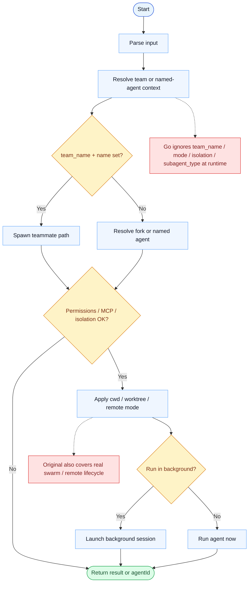

# Agent Parity Report

- Original: `src/tools/AgentTool/AgentTool.tsx`
- Go: `tools/agent.go`, `tools/agent_cwd.go`, `tools/agent_sessions.go`

## Verdict

- Summary: Exact surface; Go now supports sync runs, background launch, local continuation, and cwd rebasing, but not the original full remote/swarm lifecycle.

## Name And Description

- Name parity: exact.
- Description parity: Both versions describe the tool around the same core capability: Launches a delegated sub-agent that can work on a bounded subtask inside the same overall session. Wording differences are minor unless called out under key gaps.

## Parameters And Types

- Type signature: description?: string, prompt: string, subagent_type?: string, model?: string, run_in_background?: boolean, name?: string, team_name?: string, mode?: string, isolation?: string, cwd?: string.
- Parameter parity: top-level parameter names match the original audit; ordering differences are non-semantic.

## Implementation Overview

- Core capability: Launches a delegated sub-agent that can work on a bounded subtask inside the same overall session.
- Typical scenarios: Use it when the main agent wants to split work, keep the conversation responsive with a background helper, or continue a named local worker later.
- Core pain point addressed: It addresses delegation, isolation, and continuity: the main loop should not have to do every long or orthogonal step inline.
- Main challenges: The hard parts are stable agent identity, background lifecycle, cwd rebasing, message continuation, and avoiding overlap with the parent worker.
- Strategy consistency: Partially consistent. Both versions spawn a sub-agent and feed it prompts, but the Go path is local-loop-centric while the original also covers broader swarm and remote lifecycle concerns.

## Visual Flow And Decision Map

### How To Read The Diagram

- Read the blue path first to understand the shared happy path.
- Read the yellow diamonds next; they are the branch conditions that decide which path the tool takes.
- Read the red boxes last; they mark exact places where Go diverges from `../src`, or where a path is intentionally out of scope.

### Decision Points

- `team_name + name set?` decides whether the call should become a swarm teammate spawn or a normal delegated agent run.
- `Permissions / MCP / isolation OK?` is where the original validates execution policy, required MCP servers, and isolation mode before any sub-agent runs.
- `Run in background?` splits the synchronous result path from the retained background-session path.

### Flow-Divergence Hotspots

- At context resolution, the original can spawn teammates, resolve named definitions, and prepare remote-capable execution; Go mostly stays in a local QueryLoop model.
- At validation, the original has explicit MCP / permission / isolation gates; Go parses several fields but does not drive behavior from them.
- At lifecycle handling, the original keeps richer transcript and swarm state; Go background continuation is still in-memory session retention.

## Output And Format

- Output comparison: The original returns richer structured progress and status data; Go returns text with `agentId`, usage trailers, and background launch guidance.

## Key Gaps

- Remote-control/swarm transcript lifecycle and full structured progress parity are still incomplete.
