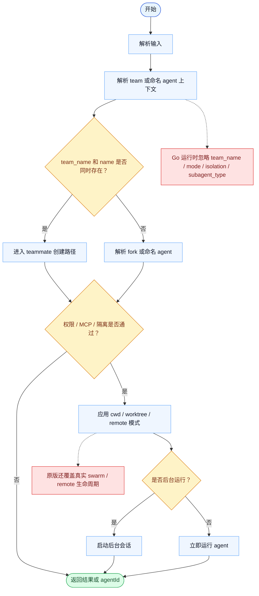

# Agent 一致性报告

- 原版: `src/tools/AgentTool/AgentTool.tsx`
- Go版: `tools/agent.go`, `tools/agent_cwd.go`, `tools/agent_sessions.go`

## 结论

- 摘要: 接口完全对齐；Go 现已支持同步运行、后台启动、本地续跑和 cwd 重映射，但还没有原版完整的 remote/swarm 生命周期。

## 名称与描述

- 名称一致性: 完全一致。
- 描述一致性: 两边都把这个工具描述为用于启动一个被委派的子 agent，在同一个整体会话里处理边界明确的子任务。 除“关键差异”外，措辞差别不影响核心语义。

## 参数与类型

- 类型签名: description?: string，prompt: string，subagent_type?: string，model?: string，run_in_background?: boolean，name?: string，team_name?: string，mode?: string，isolation?: string，cwd?: string。
- 参数一致性: 顶层参数名与原版审计结果一致；字段顺序差异不构成语义差异。

## 实现概要

- 核心能力: 启动一个被委派的子 agent，在同一个整体会话里处理边界明确的子任务。
- 典型场景: 适用于主 agent 需要拆分工作、用后台 helper 保持对话响应，或稍后继续一个有名字的本地 worker。
- 核心痛点: 它解决的是委派、隔离和连续性问题：主循环不应该把所有耗时或旁支步骤都内联完成。
- 主要挑战: 难点在于稳定的 agent 身份、后台生命周期、cwd 重映射、消息续跑，以及避免和父 worker 的工作重叠。
- 实现思路一致性: 部分一致。两边都会生成子 agent 并向其喂 prompt，但 Go 路径以本地 loop 为中心，而原版还覆盖了更宽的 swarm 和 remote 生命周期。

## 流程图与决策地图

### 如何阅读这张图

- 先读蓝色主路径，用它理解共享的 happy path。
- 再看黄色菱形，它们是决定工具走哪条分支的判断条件。
- 最后看红色节点，它们标出 Go 与 `../src` 真正分叉的位置，或被有意排除的范围。

### 决策点

- `team_name 和 name 是否同时存在？` 决定这次调用走 swarm teammate 创建，还是普通委派 agent 运行。
- `权限 / MCP / 隔离是否通过？` 是原版在任何子 agent 真正运行前做执行策略、所需 MCP 服务和隔离模式校验的位置。
- `是否后台运行？` 把同步返回路径和保留后台会话的路径分开。

### 差异热点

- 在上下文解析阶段，原版可以创建 teammate、解析命名定义，并准备 remote-capable 执行；Go 主要仍停留在本地 QueryLoop 模型里。
- 在校验阶段，原版有明确的 MCP / 权限 / 隔离 gate；Go 会解析若干字段，但不会据此驱动行为。
- 在生命周期处理阶段，原版维护更丰富的 transcript 和 swarm 状态；Go 的后台续跑仍是进程内会话保留。

## 输出与格式

- 输出对比: 原版返回更丰富的结构化进度与状态数据；Go 返回带 `agentId`、usage 尾注和后台启动提示的文本。

## 关键差异

- Remote-control/swarm transcript 生命周期以及完整结构化进度对齐仍未完成。
