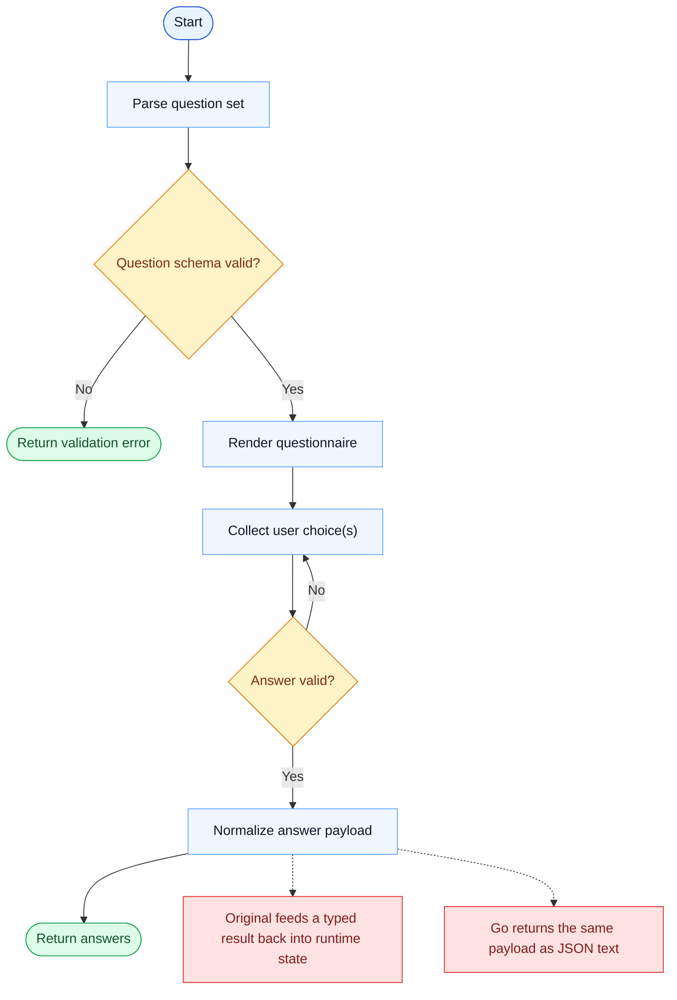

# AskUserQuestion Parity Report

- Original: `src/tools/AskUserQuestionTool/AskUserQuestionTool.tsx`
- Go: `tools/askuser.go`

## Verdict

- Summary: Exact surface; the CLI questionnaire flow is close, but Go still returns serialized JSON text instead of the richer original typed result pipeline.

## Name And Description

- Name parity: exact.
- Description parity: Both versions describe the tool around the same core capability: Asks the user a structured question set and collects validated choices. Wording differences are minor unless called out under key gaps.

## Parameters And Types

- Type signature: questions: Array<{header: string, question: string, options: Array<{label: string, description: string, preview?: string}>, multiSelect?: boolean}>.
- Parameter parity: top-level parameter names match the original audit; ordering differences are non-semantic.

## Implementation Overview

- Core capability: Asks the user a structured question set and collects validated choices.
- Typical scenarios: Use it when the model must pause for a constrained user decision instead of guessing or free-form chatting.
- Core pain point addressed: It addresses safe decision capture: the model needs a bounded answer shape instead of ambiguous natural-language feedback.
- Main challenges: The hard parts are validation, multi-select handling, and making terminal interaction feel structured rather than ad hoc.
- Strategy consistency: Largely consistent. Both versions ask a constrained question set and wait for a valid answer before continuing.

## Visual Flow And Decision Map

### How To Read The Diagram

- Read the blue path first to understand the shared happy path.
- Read the yellow diamonds next; they are the branch conditions that decide which path the tool takes.
- Read the red boxes last; they mark exact places where Go diverges from `../src`, or where a path is intentionally out of scope.

### Decision Points

- `Question schema valid?` covers missing headers, bad option lists, and malformed multi-select configuration.
- `Answer valid?` decides whether the UI must keep waiting or can hand control back to the model with a constrained answer payload.

### Flow-Divergence Hotspots

- The shared path is straightforward: validate, present, collect, and normalize.
- The main parity gap is after collection: the original returns a richer typed runtime object, while Go serializes the result as JSON text.

## Output And Format

- Output comparison: The original feeds a richer typed result back into its runtime; Go returns a JSON string that carries the same decision payload more simply.

## Key Gaps

- The remaining gap is result plumbing and UX richness, not the core questionnaire behavior.
