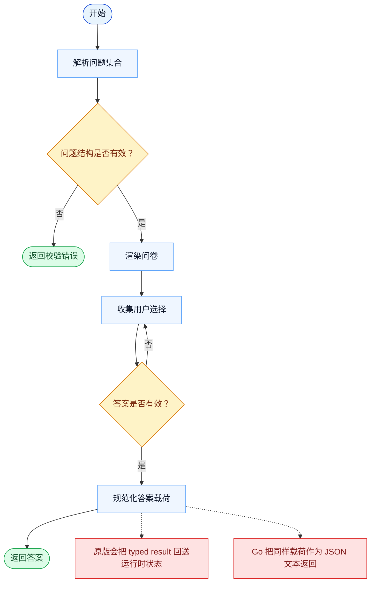

# AskUserQuestion 一致性报告

- 原版: `src/tools/AskUserQuestionTool/AskUserQuestionTool.tsx`
- Go版: `tools/askuser.go`

## 结论

- 摘要: 接口完全对齐；CLI 问答流程已较接近，但 Go 仍返回序列化 JSON 文本，而不是原版更丰富的 typed result 流水线。

## 名称与描述

- 名称一致性: 完全一致。
- 描述一致性: 两边都把这个工具描述为用于向用户提出一组结构化问题，并收集经过校验的选择结果。 除“关键差异”外，措辞差别不影响核心语义。

## 参数与类型

- 类型签名: questions: 数组<{header: string，question: string，options: 数组<{label: string，description: string，preview?: string}>，multiSelect?: boolean}>。
- 参数一致性: 顶层参数名与原版审计结果一致；字段顺序差异不构成语义差异。

## 实现概要

- 核心能力: 向用户提出一组结构化问题，并收集经过校验的选择结果。
- 典型场景: 适用于模型必须暂停等待一个受约束的用户决策，而不是靠猜测或自由对话继续。
- 核心痛点: 它解决的是安全决策采集问题：模型需要的是有边界的答案形状，而不是含混的自然语言反馈。
- 主要挑战: 难点在于校验、多选处理，以及让终端交互保持结构化而不是临时拼凑。
- 实现思路一致性: 大体一致。两边都会提出受约束的问题集合，并在拿到有效答案后再继续。

## 流程图与决策地图

### 如何阅读这张图

- 先读蓝色主路径，用它理解共享的 happy path。
- 再看黄色菱形，它们是决定工具走哪条分支的判断条件。
- 最后看红色节点，它们标出 Go 与 `../src` 真正分叉的位置，或被有意排除的范围。

### 决策点

- `问题结构是否有效？` 覆盖了缺失 header、错误的选项列表，以及畸形的多选配置。
- `答案是否有效？` 决定 UI 是否必须继续等待，还是可以把受约束的答案载荷交还给模型。

### 差异热点

- 共享路径本身比较直接：校验、展示、收集、规范化。
- 主要一致性差距出现在收集之后：原版返回更丰富的 typed runtime 对象，而 Go 会把结果序列化成 JSON 文本。

## 输出与格式

- 输出对比: 原版会把更丰富的 typed result 回注到自身运行时；Go 则用 JSON 字符串以更简单的方式承载相同决策载荷。

## 关键差异

- 剩余差距主要在结果管线和交互丰富度，而不是问答本体行为。
