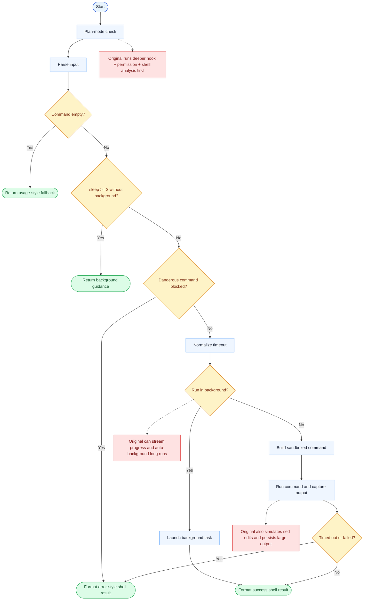

# Bash Parity Report

- Original: `src/tools/BashTool/BashTool.tsx`
- Go: `tools/bash.go`, `tools/bash_permission_checks.go`

## Verdict

- Summary: Exact surface; permission checks, background handling, and output phrasing have improved, but the original full shell/runtime stack is still deeper.

## Name And Description

- Name parity: exact.
- Description parity: Both versions describe the tool around the same core capability: Executes a shell command with permission, task, and sandbox-related behavior around it. Wording differences are minor unless called out under key gaps.

## Parameters And Types

- Type signature: command: string, timeout?: number, description?: string, run_in_background?: boolean, dangerouslyDisableSandbox?: boolean.
- Parameter parity: top-level parameter names match the original audit; ordering differences are non-semantic.

## Implementation Overview

- Core capability: Executes a shell command with permission, task, and sandbox-related behavior around it.
- Typical scenarios: Use it for repository inspection, builds, tests, scripted edits, and other shell-native operations that are too awkward to model as file-only tools.
- Core pain point addressed: It addresses the gap between model reasoning and real command execution: the model often needs the actual shell, not just text transforms.
- Main challenges: The hard parts are command safety, read-only inference, sandbox rules, background lifecycle, and making outputs understandable to both models and humans.
- Strategy consistency: Partially consistent. Both versions center on executing shell commands under policy control, but the Go stack still covers fewer shell, permission, and task-runtime edge cases than the original.

## Visual Flow And Decision Map

### How To Read The Diagram

- Read the blue path first to understand the shared happy path.
- Read the yellow diamonds next; they are the branch conditions that decide which path the tool takes.
- Read the red boxes last; they mark exact places where Go diverges from `../src`, or where a path is intentionally out of scope.

### Decision Points

- `Command empty?` decides whether the tool stops immediately with a usage-style fallback.
- `sleep >= 2 without background?` captures the explicit guard that blocks obvious long waits in the foreground path.
- `Dangerous command blocked?` is the short Go-side safety gate before execution begins.
- `Run in background?` splits immediate execution from task launch.
- `Timed out or failed?` determines whether the tool emits an error-style shell result or a normal success response.

### Flow-Divergence Hotspots

- Before execution, the original runs a much deeper permission and hook pipeline, including AST-style shell analysis and richer allow / ask / deny logic.
- Around execution, the original can stream progress, auto-background commands, and handle simulated edit semantics; Go mainly chooses between immediate run and explicit background launch.
- After execution, the original keeps richer task-aware output handling, including large-output persistence and image / hint post-processing.

## Output And Format

- Output comparison: The original emits richer structured/task-aware results; Go now emits more original-like text for foreground and background runs, but not the full original result model.

## Key Gaps

- Full read-only path analysis, sed-edit approval semantics, and the complete original shell runtime remain incomplete in Go.
