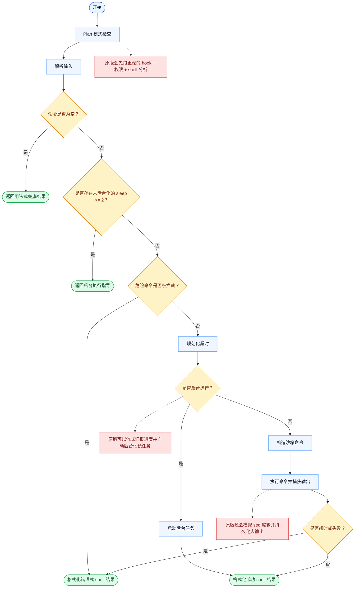

# Bash 一致性报告

- 原版: `src/tools/BashTool/BashTool.tsx`
- Go版: `tools/bash.go`, `tools/bash_permission_checks.go`

## 结论

- 摘要: 接口完全对齐；权限检查、后台处理和输出措辞已明显改善，但原版完整的 shell/运行时栈仍然更深。

## 名称与描述

- 名称一致性: 完全一致。
- 描述一致性: 两边都把这个工具描述为用于执行一条 shell 命令，并在其外层附带权限、任务和沙箱相关行为。 除“关键差异”外，措辞差别不影响核心语义。

## 参数与类型

- 类型签名: command: string，timeout?: number，description?: string，run_in_background?: boolean，dangerouslyDisableSandbox?: boolean。
- 参数一致性: 顶层参数名与原版审计结果一致；字段顺序差异不构成语义差异。

## 实现概要

- 核心能力: 执行一条 shell 命令，并在其外层附带权限、任务和沙箱相关行为。
- 典型场景: 适用于仓库检查、构建、测试、脚本化编辑，以及其他仅靠文件工具难以自然表达的 shell 原生操作。
- 核心痛点: 它解决的是模型推理与真实命令执行之间的断层：很多时候模型需要的是真实 shell，而不只是文本变换。
- 主要挑战: 难点在于命令安全、只读推断、沙箱规则、后台生命周期，以及让输出同时对模型和人类都可理解。
- 实现思路一致性: 部分一致。两边都围绕“在策略控制下执行 shell 命令”展开，但 Go 栈在 shell、权限和任务运行时边角语义上仍比原版覆盖得少。

## 流程图与决策地图

### 如何阅读这张图

- 先读蓝色主路径，用它理解共享的 happy path。
- 再看黄色菱形，它们是决定工具走哪条分支的判断条件。
- 最后看红色节点，它们标出 Go 与 `../src` 真正分叉的位置，或被有意排除的范围。

### 决策点

- `命令是否为空？` 决定工具是否立刻停下并返回用法式兜底结果。
- `是否存在未后台化的 sleep >= 2？` 对应的是显式前置保护：阻断明显需要长时间等待的前台路径。
- `危险命令是否被拦截？` 是 Go 侧在执行前的短链路安全 gate。
- `是否后台运行？` 把立即执行和任务启动分成两条路径。
- `是否超时或失败？` 决定工具最终返回错误式 shell 结果，还是正常成功响应。

### 差异热点

- 在执行前，原版会跑一条更深的权限与 hook 流水线，包括接近 AST 级的 shell 分析，以及更丰富的 allow / ask / deny 逻辑。
- 在执行过程中，原版可以流式汇报进度、自动后台化命令，并处理模拟编辑语义；Go 主要只是在立即执行和显式后台启动之间二选一。
- 在执行后，原版保留了更丰富的任务感知输出处理，包括大输出持久化，以及图片 / hint 的后处理。

## 输出与格式

- 输出对比: 原版会输出更丰富、任务感知的结构化结果；Go 现在已能为前台和后台运行输出更接近原版的文本，但还不是完整原版结果模型。

## 关键差异

- 完整的只读路径分析、sed-edit 审批语义，以及原版完整 shell 运行时在 Go 中仍未补齐。
