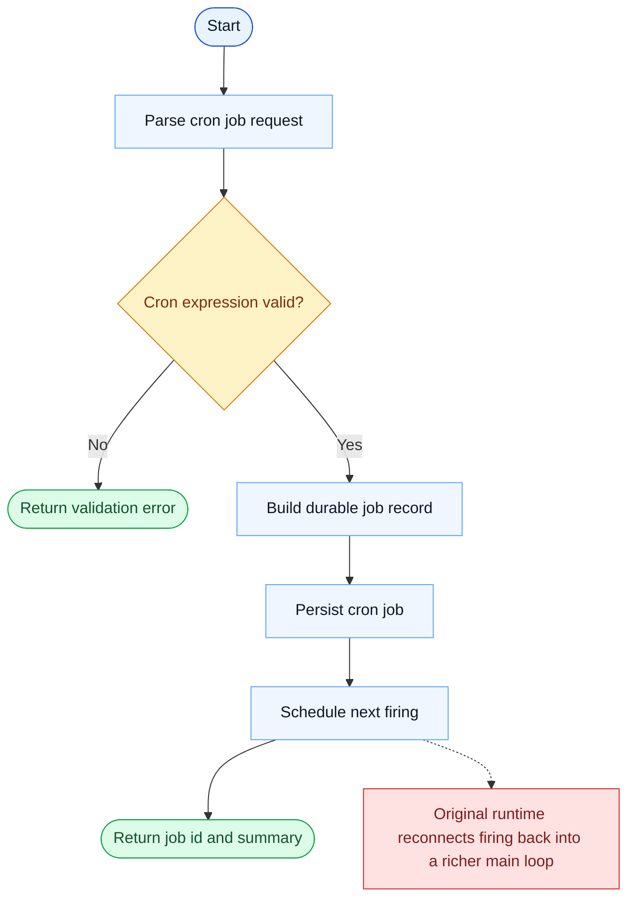

# CronCreate Parity Report

- Original: `src/tools/ScheduleCronTool/CronCreateTool.ts`
- Go: `tools/cron.go`

## Verdict

- Summary: Exact surface; Go stores and schedules cron jobs, but end-to-end firing into the main runtime is still lighter than the original.

## Name And Description

- Name parity: exact.
- Description parity: Both versions describe the tool around the same core capability: Creates a scheduled cron trigger that will run a prompt later or repeatedly. Wording differences are minor unless called out under key gaps.

## Parameters And Types

- Type signature: cron: string, prompt: string, recurring?: boolean, durable?: boolean.
- Parameter parity: top-level parameter names match the original audit; ordering differences are non-semantic.

## Implementation Overview

- Core capability: Creates a scheduled cron trigger that will run a prompt later or repeatedly.
- Typical scenarios: Use it for recurring checks, deferred maintenance, or autonomous follow-up work that should happen on a schedule.
- Core pain point addressed: It solves scheduled execution so recurring or deferred work does not depend on a human remembering to trigger it.
- Main challenges: The hard parts are durable storage, firing semantics, and reconnecting the schedule to the main query loop.
- Strategy consistency: Partially consistent. Both versions model cron jobs explicitly, and Go now persists durable jobs and fires them into the local runtime, but the original still has broader scheduler policy, missed-task, and watcher semantics.

## Visual Flow And Decision Map

### How To Read The Diagram

- Read the blue path first to understand the shared happy path.
- Read the yellow diamonds next; they are the branch conditions that decide which path the tool takes.
- Read the red boxes last; they mark exact places where Go diverges from `../src`, or where a path is intentionally out of scope.

### Decision Points

- `Cron expression valid?` decides whether the runtime can safely persist and schedule the job at all.

### Flow-Divergence Hotspots

- The shared path persists and schedules the job similarly.
- The bigger divergence starts after creation: the original firing lifecycle is still richer than the Go runtime.

## Output And Format

- Output comparison: The original returns a richer scheduled-trigger result; Go returns a plain-text creation summary.

## Key Gaps

- The main remaining gaps are scheduler-policy details such as missed-task handling, jitter/lease behavior, and the broader original cron lifecycle.
