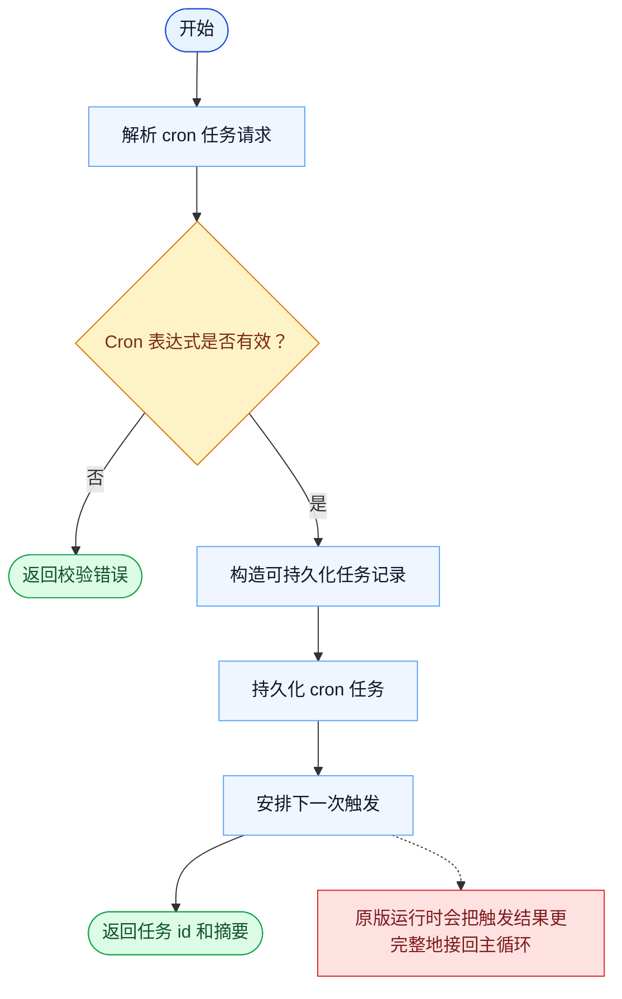

# CronCreate 一致性报告

- 原版: `src/tools/ScheduleCronTool/CronCreateTool.ts`
- Go版: `tools/cron.go`

## 结论

- 摘要: 接口完全对齐；Go 已能存储并调度 cron 任务，但触发后回接主运行时的端到端链路仍比原版轻。

## 名称与描述

- 名称一致性: 完全一致。
- 描述一致性: 两边都把这个工具描述为用于创建一个定时 cron 触发器，用于稍后或周期性运行某个 prompt。 除“关键差异”外，措辞差别不影响核心语义。

## 参数与类型

- 类型签名: cron: string，prompt: string，recurring?: boolean，durable?: boolean。
- 参数一致性: 顶层参数名与原版审计结果一致；字段顺序差异不构成语义差异。

## 实现概要

- 核心能力: 创建一个定时 cron 触发器，用于稍后或周期性运行某个 prompt。
- 典型场景: 适用于周期检查、延后维护，或需要按计划自动执行的后续工作。
- 核心痛点: 它解决的是定时执行问题，让周期性或延后任务不再依赖人工记得去触发。
- 主要挑战: 难点在于持久化存储、触发语义，以及把调度结果重新接回主查询循环。
- 实现思路一致性: 部分一致。两边都显式建模了 cron 任务，Go 现在也已持久化 durable 任务并把触发接回本地运行时，但原版仍有更宽的调度策略、missed-task 和 watcher 语义。

## 流程图与决策地图

### 如何阅读这张图

- 先读蓝色主路径，用它理解共享的 happy path。
- 再看黄色菱形，它们是决定工具走哪条分支的判断条件。
- 最后看红色节点，它们标出 Go 与 `../src` 真正分叉的位置，或被有意排除的范围。

### 决策点

- `Cron 表达式是否有效？` 决定运行时能否安全地持久化并调度这个任务。

### 差异热点

- 共享路径在持久化和调度这一步上是相近的。
- 更大的分歧发生在创建之后：原版的触发生命周期仍比 Go 运行时更丰富。

## 输出与格式

- 输出对比: 原版返回更丰富的定时触发器结果；Go 返回纯文本的创建摘要。

## 关键差异

- 主要剩余差距在于 missed-task 处理、jitter/lease 行为，以及更宽的原版 cron 生命周期这类调度策略细节。
