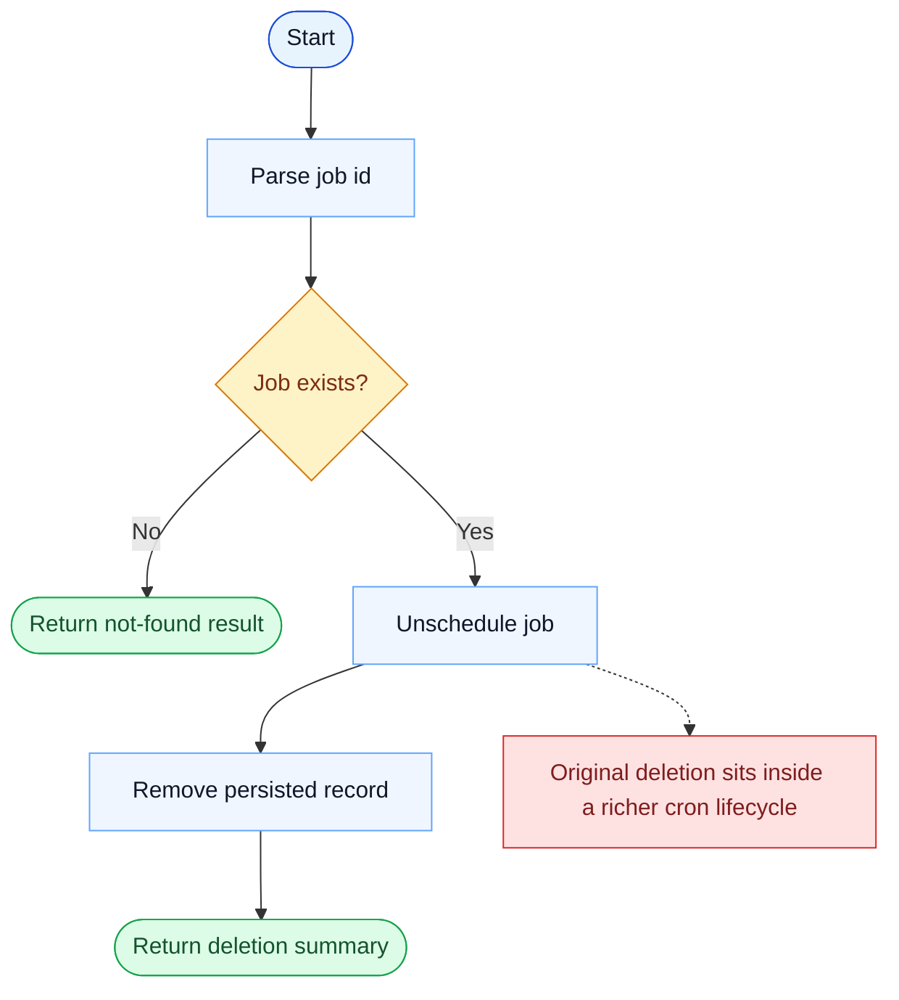

# CronDelete Parity Report

- Original: `src/tools/ScheduleCronTool/CronDeleteTool.ts`
- Go: `tools/cron.go`

## Verdict

- Summary: Exact surface; deleting scheduled jobs is aligned, but the surrounding cron runtime remains lighter in Go.

## Name And Description

- Name parity: exact.
- Description parity: Both versions describe the tool around the same core capability: Deletes a cron trigger by identifier. Wording differences are minor unless called out under key gaps.

## Parameters And Types

- Type signature: id: string.
- Parameter parity: top-level parameter names match the original audit; ordering differences are non-semantic.

## Implementation Overview

- Core capability: Deletes a cron trigger by identifier.
- Typical scenarios: Use it when a scheduled job is obsolete, incorrect, or should stop firing.
- Core pain point addressed: It solves scheduled execution so recurring or deferred work does not depend on a human remembering to trigger it.
- Main challenges: The hard parts are durable storage, firing semantics, and reconnecting the schedule to the main query loop.
- Strategy consistency: Partially consistent. Both versions model cron jobs explicitly, and Go now persists durable jobs and fires them into the local runtime, but the original still has broader scheduler policy, missed-task, and watcher semantics.

## Visual Flow And Decision Map

### How To Read The Diagram

- Read the blue path first to understand the shared happy path.
- Read the yellow diamonds next; they are the branch conditions that decide which path the tool takes.
- Read the red boxes last; they mark exact places where Go diverges from `../src`, or where a path is intentionally out of scope.

### Decision Points

- `Job exists?` determines whether the runtime can actually unschedule a live cron entry or only report a no-op / not-found result.

### Flow-Divergence Hotspots

- Delete itself is close between the two implementations.
- The remaining difference is mostly in the richer original cron lifecycle around scheduling and firing, not in the delete operation itself.

## Output And Format

- Output comparison: The original returns a structured deletion result; Go returns a plain-text deletion summary.

## Key Gaps

- Deletion itself is close; the broader scheduler-policy lifecycle is where most remaining divergence lives.
