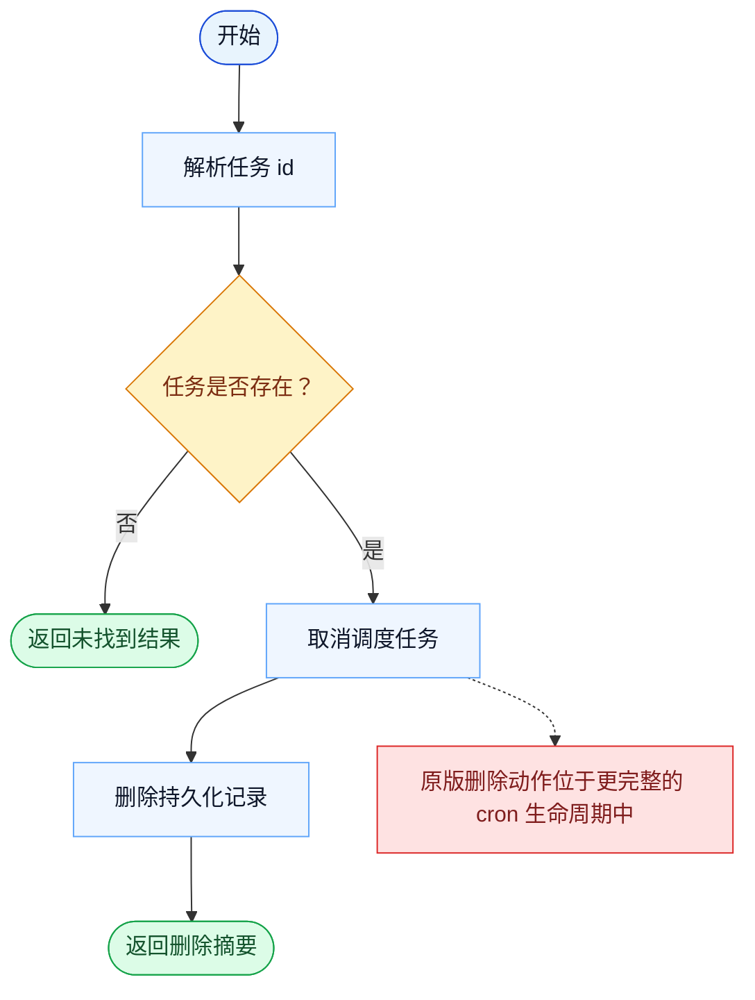

# CronDelete 一致性报告

- 原版: `src/tools/ScheduleCronTool/CronDeleteTool.ts`
- Go版: `tools/cron.go`

## 结论

- 摘要: 接口完全对齐；删除定时任务的动作已对齐，但周围的 cron 运行时在 Go 中仍更轻。

## 名称与描述

- 名称一致性: 完全一致。
- 描述一致性: 两边都把这个工具描述为用于按标识删除一个 cron 触发器。 除“关键差异”外，措辞差别不影响核心语义。

## 参数与类型

- 类型签名: id: string。
- 参数一致性: 顶层参数名与原版审计结果一致；字段顺序差异不构成语义差异。

## 实现概要

- 核心能力: 按标识删除一个 cron 触发器。
- 典型场景: 适用于某个定时任务已经过时、配置错误，或不应再被触发。
- 核心痛点: 它解决的是定时执行问题，让周期性或延后任务不再依赖人工记得去触发。
- 主要挑战: 难点在于持久化存储、触发语义，以及把调度结果重新接回主查询循环。
- 实现思路一致性: 部分一致。两边都显式建模了 cron 任务，Go 现在也已持久化 durable 任务并把触发接回本地运行时，但原版仍有更宽的调度策略、missed-task 和 watcher 语义。

## 流程图与决策地图

### 如何阅读这张图

- 先读蓝色主路径，用它理解共享的 happy path。
- 再看黄色菱形，它们是决定工具走哪条分支的判断条件。
- 最后看红色节点，它们标出 Go 与 `../src` 真正分叉的位置，或被有意排除的范围。

### 决策点

- `任务是否存在？` 决定运行时是真正取消一个已存在的 cron 条目，还是只返回 no-op / not-found 结果。

### 差异热点

- 删除动作本身在两边之间已经比较接近。
- 剩余差异主要在原版更完整的 cron 调度和触发生命周期，而不是 delete 操作本身。

## 输出与格式

- 输出对比: 原版返回结构化删除结果；Go 返回纯文本删除摘要。

## 关键差异

- 删除动作本身已较接近；剩余差异主要来自更宽的调度策略生命周期。
