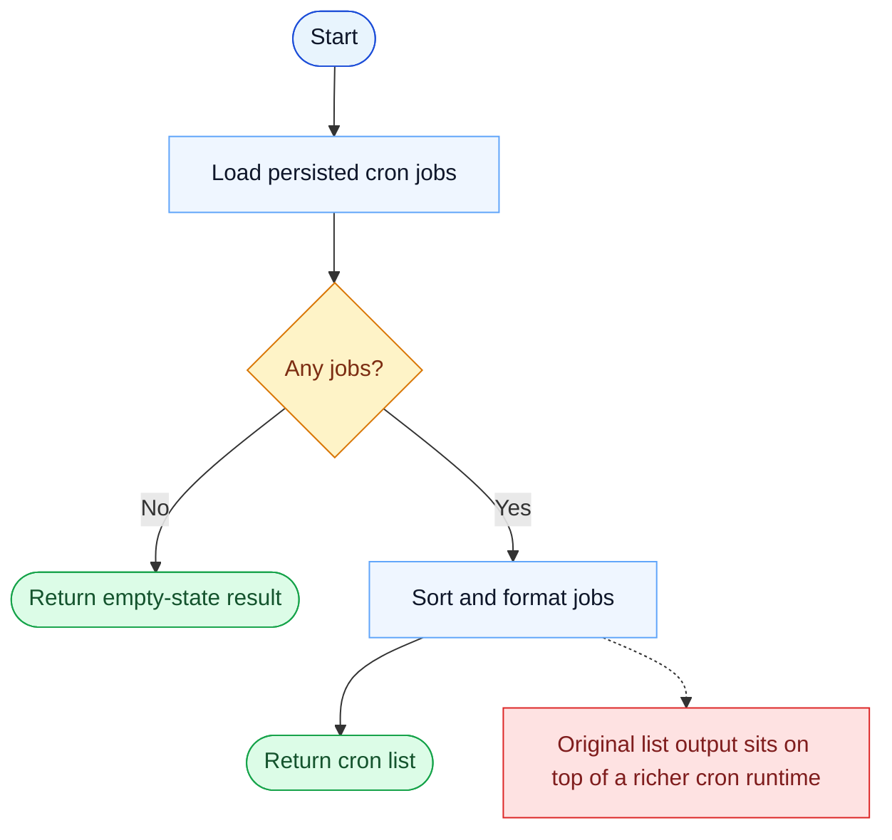

# CronList Parity Report

- Original: `src/tools/ScheduleCronTool/CronListTool.ts`
- Go: `tools/cron.go`

## Verdict

- Summary: Exact surface; listing cron jobs is aligned, while the broader cron execution model remains lighter in Go.

## Name And Description

- Name parity: exact.
- Description parity: Both versions describe the tool around the same core capability: Lists the currently registered cron triggers. Wording differences are minor unless called out under key gaps.

## Parameters And Types

- Type signature: No input parameters.
- Parameter parity: top-level parameter names match the original audit; ordering differences are non-semantic.

## Implementation Overview

- Core capability: Lists the currently registered cron triggers.
- Typical scenarios: Use it when the model needs to inspect what is scheduled before adding, changing, or deleting jobs.
- Core pain point addressed: It solves scheduled execution so recurring or deferred work does not depend on a human remembering to trigger it.
- Main challenges: The hard parts are durable storage, firing semantics, and reconnecting the schedule to the main query loop.
- Strategy consistency: Partially consistent. Both versions model cron jobs explicitly, and Go now persists durable jobs and fires them into the local runtime, but the original still has broader scheduler policy, missed-task, and watcher semantics.

## Visual Flow And Decision Map

### How To Read The Diagram

- Read the blue path first to understand the shared happy path.
- Read the yellow diamonds next; they are the branch conditions that decide which path the tool takes.
- Read the red boxes last; they mark exact places where Go diverges from `../src`, or where a path is intentionally out of scope.

### Decision Points

- `Any jobs?` decides whether the tool returns a meaningful schedule listing or an explicit empty-state response.

### Flow-Divergence Hotspots

- The list path itself is direct: load, sort, format, return.
- As with the other cron tools, the bigger remaining difference is in the runtime behind the list rather than in listing itself.

## Output And Format

- Output comparison: The original returns a richer list result; Go returns a plain-text list.

## Key Gaps

- The list behavior is reasonably close; the bigger remaining gaps are scheduler-policy details behind it rather than the list call itself.
