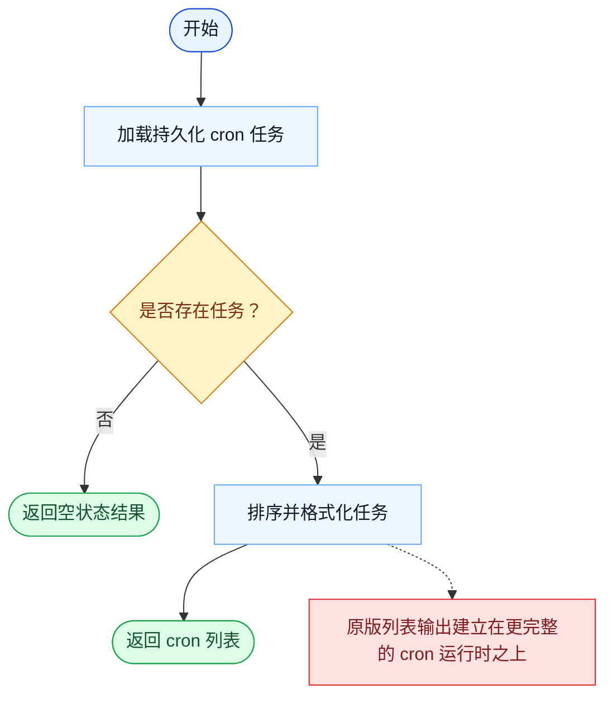

# CronList 一致性报告

- 原版: `src/tools/ScheduleCronTool/CronListTool.ts`
- Go版: `tools/cron.go`

## 结论

- 摘要: 接口完全对齐；列出 cron 任务的能力已对齐，而更宽的 cron 执行模型在 Go 中仍更轻。

## 名称与描述

- 名称一致性: 完全一致。
- 描述一致性: 两边都把这个工具描述为用于列出当前已注册的 cron 触发器。 除“关键差异”外，措辞差别不影响核心语义。

## 参数与类型

- 类型签名: 无输入参数。
- 参数一致性: 顶层参数名与原版审计结果一致；字段顺序差异不构成语义差异。

## 实现概要

- 核心能力: 列出当前已注册的 cron 触发器。
- 典型场景: 适用于模型在新增、修改或删除任务前，需要先查看当前调度状态。
- 核心痛点: 它解决的是定时执行问题，让周期性或延后任务不再依赖人工记得去触发。
- 主要挑战: 难点在于持久化存储、触发语义，以及把调度结果重新接回主查询循环。
- 实现思路一致性: 部分一致。两边都显式建模了 cron 任务，Go 现在也已持久化 durable 任务并把触发接回本地运行时，但原版仍有更宽的调度策略、missed-task 和 watcher 语义。

## 流程图与决策地图

### 如何阅读这张图

- 先读蓝色主路径，用它理解共享的 happy path。
- 再看黄色菱形，它们是决定工具走哪条分支的判断条件。
- 最后看红色节点，它们标出 Go 与 `../src` 真正分叉的位置，或被有意排除的范围。

### 决策点

- `是否存在任务？` 决定工具是返回一份有内容的调度列表，还是显式的空状态响应。

### 差异热点

- 列表路径本身比较直接：加载、排序、格式化、返回。
- 和其他 cron 工具一样，真正更大的剩余差异在列表背后的运行时，而不是 list 这个动作本身。

## 输出与格式

- 输出对比: 原版返回更丰富的列表结果；Go 返回纯文本列表。

## 关键差异

- 列表行为本身已经比较接近；更大的剩余差距在于它背后的调度策略细节，而不是列表调用本身。
