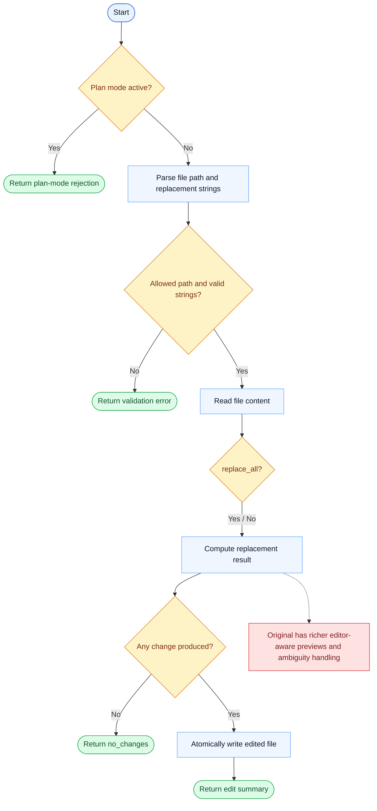

# Edit Parity Report

- Original: `src/tools/FileEditTool/FileEditTool.ts`
- Go: `tools/file_operations.go`

## Verdict

- Summary: Exact surface; Go captures the main replace-text workflow well, but the original still has richer editor-aware instrumentation.

## Name And Description

- Name parity: exact.
- Description parity: Both versions describe the tool around the same core capability: Edits a file by replacing one string with another under tool-level guardrails. Wording differences are minor unless called out under key gaps.

## Parameters And Types

- Type signature: file_path: string, old_string: string, new_string: string, replace_all?: boolean.
- Parameter parity: top-level parameter names match the original audit; ordering differences are non-semantic.

## Implementation Overview

- Core capability: Edits a file by replacing one string with another under tool-level guardrails.
- Typical scenarios: Use it when the change is a bounded textual replacement and a full rewrite would be less safe or less precise.
- Core pain point addressed: It addresses precision editing: the model often knows exactly what fragment to replace and should not be forced into coarse file rewrites.
- Main challenges: The hard parts are read-before-write safety, correct replacement semantics, and surfacing enough metadata for the model to understand what changed.
- Strategy consistency: Largely consistent. Both versions center on bounded string replacement rather than free-form editing.

## Visual Flow And Decision Map

### How To Read The Diagram

- Read the blue path first to understand the shared happy path.
- Read the yellow diamonds next; they are the branch conditions that decide which path the tool takes.
- Read the red boxes last; they mark exact places where Go diverges from `../src`, or where a path is intentionally out of scope.

### Decision Points

- `Plan mode active?` blocks edits while the session is still supposed to be planning only.
- `Allowed path and valid strings?` covers path policy, required fields, and the guard against identical old and new strings.
- `replace_all?` chooses one-shot replacement vs replace-every-match behavior.
- `Any change produced?` decides whether the tool writes anything or returns `no_changes`.

### Flow-Divergence Hotspots

- The Go path is intentionally simple: validate, replace, atomically write, return.
- The original still offers richer editor-facing instrumentation around what changed and how ambiguous matches are surfaced.

## Output And Format

- Output comparison: The original returns richer structured edit metadata; Go returns a JSON string summary of the replacement result.

## Key Gaps

- The main gap is richer original edit instrumentation rather than the core replace-text behavior.
