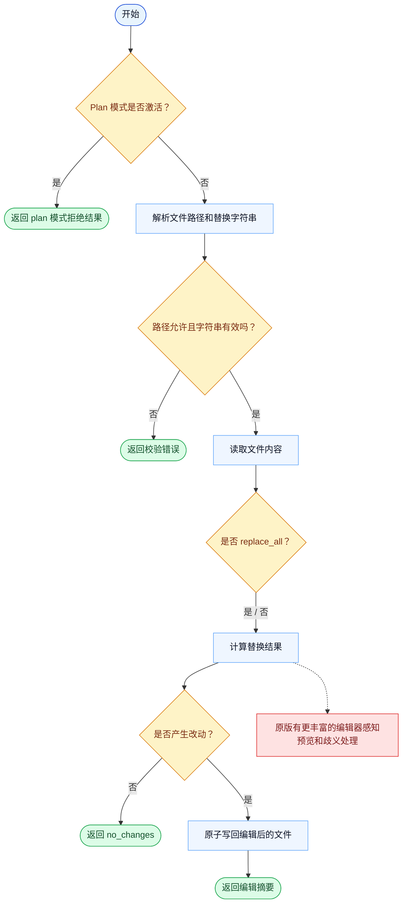

# Edit 一致性报告

- 原版: `src/tools/FileEditTool/FileEditTool.ts`
- Go版: `tools/file_operations.go`

## 结论

- 摘要: 接口完全对齐；Go 已较好覆盖核心替换文本流程，但原版仍有更丰富的 editor 感知型埋点。

## 名称与描述

- 名称一致性: 完全一致。
- 描述一致性: 两边都把这个工具描述为用于在工具级护栏下，通过字符串替换编辑一个文件。 除“关键差异”外，措辞差别不影响核心语义。

## 参数与类型

- 类型签名: file_path: string，old_string: string，new_string: string，replace_all?: boolean。
- 参数一致性: 顶层参数名与原版审计结果一致；字段顺序差异不构成语义差异。

## 实现概要

- 核心能力: 在工具级护栏下，通过字符串替换编辑一个文件。
- 典型场景: 适用于改动是有边界的文本替换，而不是整文件重写，因为后者更不安全或更不精确。
- 核心痛点: 它解决的是精确编辑问题：模型往往明确知道要替换哪个片段，不应被迫退化成粗粒度整文件重写。
- 主要挑战: 难点在于先读后写的安全性、正确的替换语义，以及暴露足够元信息让模型理解改了什么。
- 实现思路一致性: 大体一致。两边都围绕有边界的字符串替换展开，而不是任意自由编辑。

## 流程图与决策地图

### 如何阅读这张图

- 先读蓝色主路径，用它理解共享的 happy path。
- 再看黄色菱形，它们是决定工具走哪条分支的判断条件。
- 最后看红色节点，它们标出 Go 与 `../src` 真正分叉的位置，或被有意排除的范围。

### 决策点

- `Plan 模式是否激活？` 会在会话仍应只做规划时阻断编辑。
- `路径允许且字符串有效吗？` 覆盖路径策略、必填字段，以及 old 和 new 相同的保护判断。
- `是否 replace_all？` 决定是只替换一次，还是替换全部匹配项。
- `是否产生改动？` 决定工具是写回文件，还是直接返回 `no_changes`。

### 差异热点

- Go 路径是有意保持简单的：校验、替换、原子写回、返回。
- 原版在“具体改了什么”和“如何暴露歧义匹配”这两点上仍提供了更丰富的编辑器侧支撑。

## 输出与格式

- 输出对比: 原版返回更丰富的结构化编辑元信息；Go 返回 JSON 字符串形式的替换结果摘要。

## 关键差异

- 主要差距在于原版更丰富的编辑埋点，而不是核心替换文本行为。
