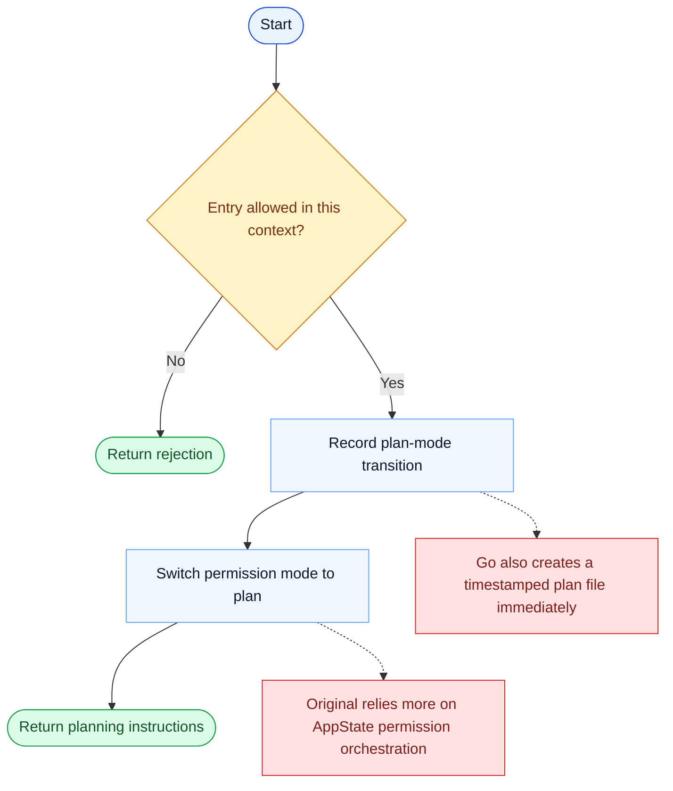

# EnterPlanMode Parity Report

- Original: `src/tools/EnterPlanModeTool/EnterPlanModeTool.ts`
- Go: `tools/planmode.go`

## Verdict

- Summary: Exact surface; Go now persists plan-mode state and prevents duplicate entry, but the original runtime still has richer UI, agent-context, and permission integration.

## Name And Description

- Name parity: exact.
- Description parity: Both versions describe the tool around the same core capability: Switches the session into a planning phase and materializes a plan artifact. Wording differences are minor unless called out under key gaps.

## Parameters And Types

- Type signature: No input parameters.
- Parameter parity: top-level parameter names match the original audit; ordering differences are non-semantic.

## Implementation Overview

- Core capability: Switches the session into a planning phase and materializes a plan artifact.
- Typical scenarios: Use it when implementation should pause until the model has produced and reviewed a plan first.
- Core pain point addressed: It addresses premature execution: planning needs an explicit mode so the model does not drift straight into code changes.
- Main challenges: The hard parts are mode state, plan-file lifecycle, and coordinating the mode with prompts and approvals.
- Strategy consistency: Partially consistent. Both versions use an explicit plan-mode transition, and Go now keeps a recoverable plan-file-backed state, but the original still surrounds that transition with more UI and runtime orchestration.

## Visual Flow And Decision Map

### How To Read The Diagram

- Read the blue path first to understand the shared happy path.
- Read the yellow diamonds next; they are the branch conditions that decide which path the tool takes.
- Read the red boxes last; they mark exact places where Go diverges from `../src`, or where a path is intentionally out of scope.

### Decision Points

- `Entry allowed in this context?` captures the channels / agent-context checks that decide whether plan mode can be entered at all.

### Flow-Divergence Hotspots

- Both versions explicitly enter a planning state before implementation continues.
- The original treats the mode switch mainly as permission-state orchestration; Go additionally materializes a plan file and later enforces writes through PlanState checks.

## Output And Format

- Output comparison: The original has richer structured/UI integration; Go returns a plain-text instruction/result summary backed by persisted local state.

## Key Gaps

- The remaining gap is approval/UI orchestration rather than plan-state existence.
