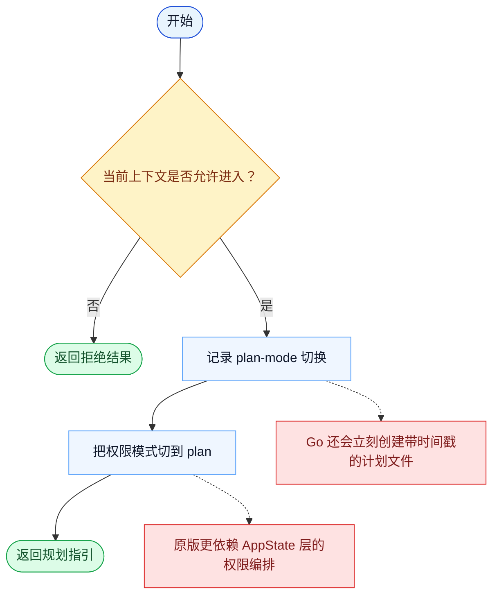

# EnterPlanMode 一致性报告

- 原版: `src/tools/EnterPlanModeTool/EnterPlanModeTool.ts`
- Go版: `tools/planmode.go`

## 结论

- 摘要: 接口完全对齐；Go 现在已经持久化 plan-mode 状态并阻止重复进入，但原版运行时仍有更丰富的 UI、agent 上下文和权限集成。

## 名称与描述

- 名称一致性: 完全一致。
- 描述一致性: 两边都把这个工具描述为用于把当前会话切换到规划阶段，并落地生成计划产物。 除“关键差异”外，措辞差别不影响核心语义。

## 参数与类型

- 类型签名: 无输入参数。
- 参数一致性: 顶层参数名与原版审计结果一致；字段顺序差异不构成语义差异。

## 实现概要

- 核心能力: 把当前会话切换到规划阶段，并落地生成计划产物。
- 典型场景: 适用于在真正动手实现前，需要先暂停并产出、审视一份计划。
- 核心痛点: 它解决的是过早执行问题：需要一个显式规划模式，避免模型还没想清楚就直接开始改代码。
- 主要挑战: 难点在于模式状态、计划文件生命周期，以及把该模式和 prompt、审批流程协调起来。
- 实现思路一致性: 部分一致。两边都用显式 plan-mode 切换，Go 现在也已经保持了可恢复、以 plan file 为中心的状态，但原版仍在这次切换外层包了更多 UI 和运行时编排。

## 流程图与决策地图

### 如何阅读这张图

- 先读蓝色主路径，用它理解共享的 happy path。
- 再看黄色菱形，它们是决定工具走哪条分支的判断条件。
- 最后看红色节点，它们标出 Go 与 `../src` 真正分叉的位置，或被有意排除的范围。

### 决策点

- `当前上下文是否允许进入？` 对应的是 channels / agent-context 检查，用来决定 plan mode 是否能被进入。

### 差异热点

- 两边都会在继续实现前显式进入一个规划状态。
- 原版主要把这次切换当作权限状态编排；Go 额外会落地生成计划文件，并在后续通过 PlanState 检查拦写。

## 输出与格式

- 输出对比: 原版有更丰富的结构化/UI 集成；Go 返回的是由本地持久化状态支撑的纯文本指令/结果摘要。

## 关键差异

- 剩余差距主要是审批与 UI 编排，而不是 plan-state 本身是否存在。
