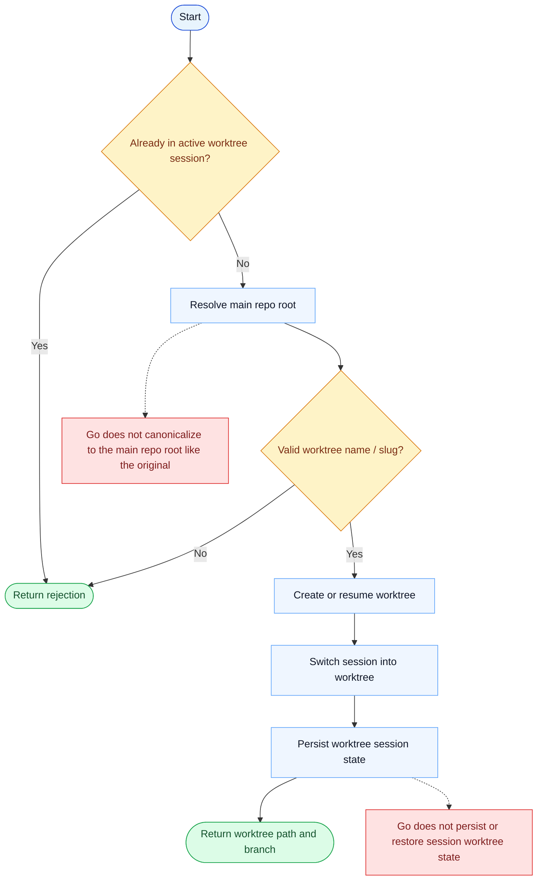

# EnterWorktree Parity Report

- Original: `src/tools/EnterWorktreeTool/EnterWorktreeTool.ts`
- Go: `tools/worktree.go`

## Verdict

- Summary: Exact surface; Go now mirrors more of the original worktree-entry safety model with canonical-root resolution, slug validation, and persisted local state.

## Name And Description

- Name parity: exact.
- Description parity: Both versions describe the tool around the same core capability: Creates and enters an isolated git worktree for separate changes. Wording differences are minor unless called out under key gaps.

## Parameters And Types

- Type signature: name?: string.
- Parameter parity: top-level parameter names match the original audit; ordering differences are non-semantic.

## Implementation Overview

- Core capability: Creates and enters an isolated git worktree for separate changes.
- Typical scenarios: Use it when the task needs isolation from the main checkout, a separate branch context, or cleaner experimentation.
- Core pain point addressed: It solves isolation: risky or branch-heavy changes should happen in a separate git worktree instead of polluting the main session state.
- Main challenges: The hard parts are git worktree lifecycle, branch cleanup, and keeping session state aligned with filesystem state.
- Strategy consistency: Largely consistent. Both versions center on explicit worktree state transitions backed by git operations.

## Visual Flow And Decision Map

### How To Read The Diagram

- Read the blue path first to understand the shared happy path.
- Read the yellow diamonds next; they are the branch conditions that decide which path the tool takes.
- Read the red boxes last; they mark exact places where Go diverges from `../src`, or where a path is intentionally out of scope.

### Decision Points

- `Already in active worktree session?` prevents nesting incompatible worktree transitions.
- `Valid worktree name / slug?` is where the original enforces naming and reuse rules before any git operation happens.

### Flow-Divergence Hotspots

- The original canonically resolves the main repo root and can resume named worktrees; Go mostly creates a fresh `.claude/worktrees/...` entry under the current repo.
- The original also persists and later restores session worktree state; Go keeps much lighter in-memory state.

## Output And Format

- Output comparison: The original returns a richer structured result tied to session state; Go returns a plain-text summary, but it is now backed by persisted worktree-session state instead of process-local flags only.

## Key Gaps

- Remaining differences are now mainly advanced runtime integrations such as hooks, sparse-checkout, and broader session switching.
