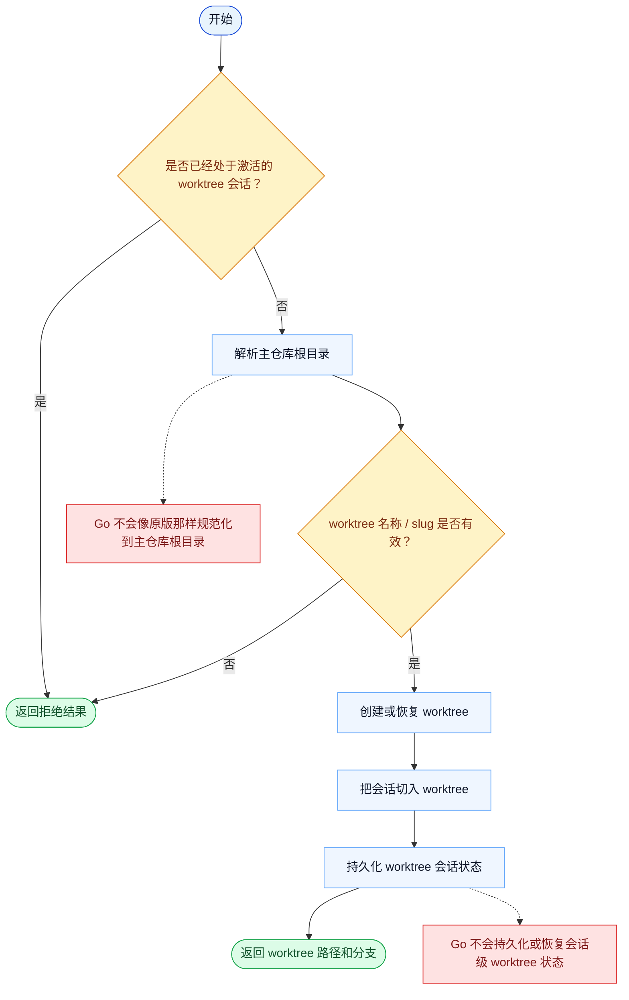

# EnterWorktree 一致性报告

- 原版: `src/tools/EnterWorktreeTool/EnterWorktreeTool.ts`
- Go版: `tools/worktree.go`

## 结论

- 摘要: 接口完全对齐；Go 现在已通过 canonical-root 解析、slug 校验和本地持久化状态，镜像了更多原版的 worktree-entry 安全模型。

## 名称与描述

- 名称一致性: 完全一致。
- 描述一致性: 两边都把这个工具描述为用于创建并进入一个隔离的 git worktree，用于独立改动。 除“关键差异”外，措辞差别不影响核心语义。

## 参数与类型

- 类型签名: name?: string。
- 参数一致性: 顶层参数名与原版审计结果一致；字段顺序差异不构成语义差异。

## 实现概要

- 核心能力: 创建并进入一个隔离的 git worktree，用于独立改动。
- 典型场景: 适用于任务需要与主 checkout 隔离、需要独立分支上下文，或需要更干净的试验环境。
- 核心痛点: 它解决的是隔离问题：高风险或分支很多的改动，应当放在独立 git worktree 中，而不是污染主会话状态。
- 主要挑战: 难点在于 git worktree 生命周期、分支清理，以及让会话状态和文件系统状态保持一致。
- 实现思路一致性: 大体一致。两边都以显式的 worktree 状态切换为中心，并由 git 操作承载。

## 流程图与决策地图

### 如何阅读这张图

- 先读蓝色主路径，用它理解共享的 happy path。
- 再看黄色菱形，它们是决定工具走哪条分支的判断条件。
- 最后看红色节点，它们标出 Go 与 `../src` 真正分叉的位置，或被有意排除的范围。

### 决策点

- `是否已经处于激活的 worktree 会话？` 用来阻止不兼容的嵌套 worktree 切换。
- `worktree 名称 / slug 是否有效？` 是原版在任何 git 操作发生前执行命名和复用规则校验的位置。

### 差异热点

- 原版会规范化解析主仓库根目录，并且可以恢复命名 worktree；Go 主要是在当前仓库下创建新的 `.claude/worktrees/...` 条目。
- 原版还会持久化并在之后恢复会话级 worktree 状态；Go 只保留更轻的内存态。

## 输出与格式

- 输出对比: 原版返回与会话状态绑定的更丰富结构化结果；Go 返回纯文本摘要，但现在它背后已经是持久化的 worktree-session 状态，而不再只是进程内旗标。

## 关键差异

- 剩余差异现在主要集中在 hook、sparse-checkout 和更宽的会话切换等高级运行时集成上。
