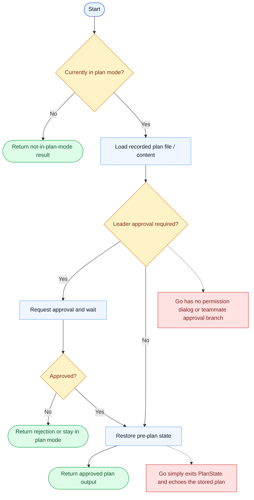

# ExitPlanMode Parity Report

- Original: `src/tools/ExitPlanModeTool/ExitPlanModeV2Tool.ts`
- Go: `tools/planmode.go`

## Verdict

- Summary: Exact surface; Go now persists and restores local plan-mode state and surfaces allowed prompt categories, but the original approval-aware exit workflow is still richer.

## Name And Description

- Name parity: exact.
- Description parity: Both versions describe the tool around the same core capability: Exits plan mode and hands control back to execution mode. Wording differences are minor unless called out under key gaps.

## Parameters And Types

- Type signature: allowedPrompts?: Array<{tool: "Bash", prompt: string}>.
- Parameter parity: top-level parameter names match the original audit; ordering differences are non-semantic.

## Implementation Overview

- Core capability: Exits plan mode and hands control back to execution mode.
- Typical scenarios: Use it when planning is complete and the session should transition from planning to execution.
- Core pain point addressed: It addresses the handoff boundary: planning and execution should not blur together without an explicit transition.
- Main challenges: The hard parts are approvals, request IDs, leader/teammate handoff, and permission orchestration around the exit step.
- Strategy consistency: Partially consistent. Both versions expose the same exit surface, and Go now preserves local plan-state and allowed-prompt metadata more faithfully, but the original still carries much richer approval orchestration.

## Visual Flow And Decision Map

### How To Read The Diagram

- Read the blue path first to understand the shared happy path.
- Read the yellow diamonds next; they are the branch conditions that decide which path the tool takes.
- Read the red boxes last; they mark exact places where Go diverges from `../src`, or where a path is intentionally out of scope.

### Decision Points

- `Currently in plan mode?` decides whether this is a valid state transition or a no-op / error.
- `Leader approval required?` is where the original branches into teammate mailbox approval flow instead of a purely local exit.
- `Approved?` controls whether the runtime actually restores state and exits plan mode.

### Flow-Divergence Hotspots

- The original exit flow is approval-aware and can involve team lead messaging.
- Go currently skips that orchestration and behaves like a local state flip plus plan-file readback.

## Output And Format

- Output comparison: The original returns a structured result integrated into its approval workflow; Go returns a plain-text plan summary that now also includes allowed-prompt guidance.

## Key Gaps

- Leader approval, teammate handoff, and full permission orchestration remain the main gaps.
