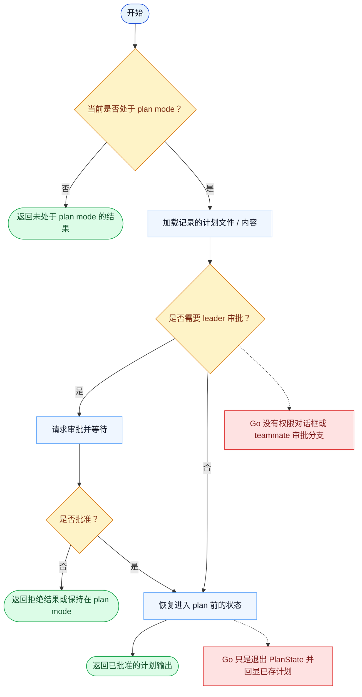

# ExitPlanMode 一致性报告

- 原版: `src/tools/ExitPlanModeTool/ExitPlanModeV2Tool.ts`
- Go版: `tools/planmode.go`

## 结论

- 摘要: 接口完全对齐；Go 现在已经持久化并恢复本地 plan-mode 状态，也会展示 allowed prompt 分类，但原版带审批语义的退出流程仍然更丰富。

## 名称与描述

- 名称一致性: 完全一致。
- 描述一致性: 两边都把这个工具描述为用于退出 plan mode，并把控制权交回执行模式。 除“关键差异”外，措辞差别不影响核心语义。

## 参数与类型

- 类型签名: allowedPrompts?: 数组<{tool: "Bash"，prompt: string}>。
- 参数一致性: 顶层参数名与原版审计结果一致；字段顺序差异不构成语义差异。

## 实现概要

- 核心能力: 退出 plan mode，并把控制权交回执行模式。
- 典型场景: 适用于规划已经完成，会话需要从规划阶段切回执行阶段。
- 核心痛点: 它解决的是交接边界问题：规划和执行不应在没有显式切换的情况下混在一起。
- 主要挑战: 难点在于审批、request ID、leader/teammate 交接，以及退出这一步周围的权限编排。
- 实现思路一致性: 部分一致。两边暴露了相同的退出接口，Go 现在也更忠实地保留了本地 plan-state 和 allowed-prompt 元数据，但原版仍承载了更丰富的审批编排。

## 流程图与决策地图

### 如何阅读这张图

- 先读蓝色主路径，用它理解共享的 happy path。
- 再看黄色菱形，它们是决定工具走哪条分支的判断条件。
- 最后看红色节点，它们标出 Go 与 `../src` 真正分叉的位置，或被有意排除的范围。

### 决策点

- `当前是否处于 plan mode？` 决定这是不是一个合法的状态切换，还是 no-op / error。
- `是否需要 leader 审批？` 是原版切入 teammate 邮箱审批流，而不是纯本地退出的地方。
- `是否批准？` 控制运行时是否真的恢复状态并退出 plan mode。

### 差异热点

- 原版退出流程是审批感知的，并且可能涉及 team lead 消息链路。
- Go 目前会跳过这层编排，更像是一次本地状态切换加计划文件回读。

## 输出与格式

- 输出对比: 原版返回集成在审批流中的结构化结果；Go 返回纯文本计划摘要，但现在也会带上 allowed-prompt 指引。

## 关键差异

- leader 审批、teammate 交接和完整权限编排仍是主要差距。
