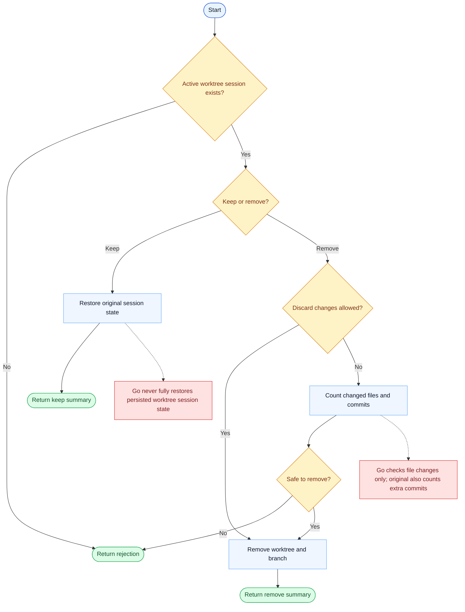

# ExitWorktree Parity Report

- Original: `src/tools/ExitWorktreeTool/ExitWorktreeTool.ts`
- Go: `tools/worktree.go`

## Verdict

- Summary: Exact surface; Go now mirrors more of the original keep-or-remove worktree flow with canonical repo cleanup and persisted state recovery.

## Name And Description

- Name parity: exact.
- Description parity: Both versions describe the tool around the same core capability: Keeps or removes the current isolated worktree and cleans up related state. Wording differences are minor unless called out under key gaps.

## Parameters And Types

- Type signature: action: string, discard_changes?: boolean.
- Parameter parity: top-level parameter names match the original audit; ordering differences are non-semantic.

## Implementation Overview

- Core capability: Keeps or removes the current isolated worktree and cleans up related state.
- Typical scenarios: Use it when work in the isolated checkout is done and the session must either keep the branch or tear the environment down cleanly.
- Core pain point addressed: It solves isolation: risky or branch-heavy changes should happen in a separate git worktree instead of polluting the main session state.
- Main challenges: The hard parts are git worktree lifecycle, branch cleanup, and keeping session state aligned with filesystem state.
- Strategy consistency: Largely consistent. Both versions center on explicit worktree state transitions backed by git operations.

## Visual Flow And Decision Map

### How To Read The Diagram

- Read the blue path first to understand the shared happy path.
- Read the yellow diamonds next; they are the branch conditions that decide which path the tool takes.
- Read the red boxes last; they mark exact places where Go diverges from `../src`, or where a path is intentionally out of scope.

### Decision Points

- `Active worktree session exists?` prevents invalid exits when the session never entered worktree mode in the first place.
- `Keep or remove?` selects between restoring the main session state and actually destroying the isolated git state.
- `Discard changes allowed?` and `Safe to remove?` are the protective gates before destructive cleanup.

### Flow-Divergence Hotspots

- The original remove guard is stricter: it fails closed on both changed files and extra commits, and treats unknown state as unsafe.
- Go never fully adopted the original persisted session restore path, so keep / remove act on lighter in-memory worktree state.

## Output And Format

- Output comparison: The original returns a richer structured result tied to session state; Go returns a plain-text keep/remove summary, but the backing state is now persisted and repo-root aware.

## Key Gaps

- The main remaining differences are advanced hook/session integrations rather than the visible action choices.
