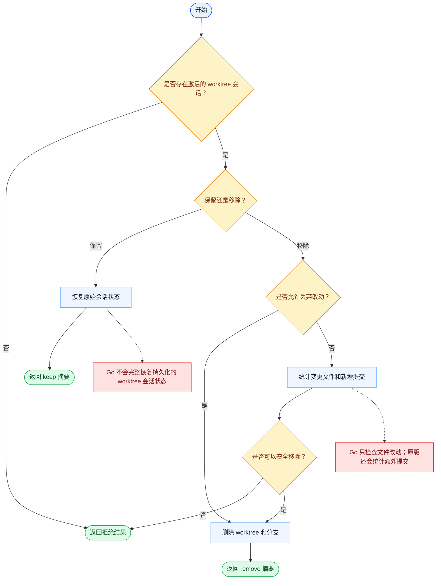

# ExitWorktree 一致性报告

- 原版: `src/tools/ExitWorktreeTool/ExitWorktreeTool.ts`
- Go版: `tools/worktree.go`

## 结论

- 摘要: 接口完全对齐；Go 现在已通过 canonical repo 清理和持久化状态恢复，镜像了更多原版的保留或删除 worktree 流程。

## 名称与描述

- 名称一致性: 完全一致。
- 描述一致性: 两边都把这个工具描述为用于保留或移除当前隔离 worktree，并清理相关状态。 除“关键差异”外，措辞差别不影响核心语义。

## 参数与类型

- 类型签名: action: string，discard_changes?: boolean。
- 参数一致性: 顶层参数名与原版审计结果一致；字段顺序差异不构成语义差异。

## 实现概要

- 核心能力: 保留或移除当前隔离 worktree，并清理相关状态。
- 典型场景: 适用于隔离 checkout 中的工作已完成，会话需要决定保留该分支，还是干净地把环境拆掉。
- 核心痛点: 它解决的是隔离问题：高风险或分支很多的改动，应当放在独立 git worktree 中，而不是污染主会话状态。
- 主要挑战: 难点在于 git worktree 生命周期、分支清理，以及让会话状态和文件系统状态保持一致。
- 实现思路一致性: 大体一致。两边都以显式的 worktree 状态切换为中心，并由 git 操作承载。

## 流程图与决策地图

### 如何阅读这张图

- 先读蓝色主路径，用它理解共享的 happy path。
- 再看黄色菱形，它们是决定工具走哪条分支的判断条件。
- 最后看红色节点，它们标出 Go 与 `../src` 真正分叉的位置，或被有意排除的范围。

### 决策点

- `是否存在激活的 worktree 会话？` 用来阻止从未进入 worktree 模式的会话执行非法退出。
- `保留还是移除？` 决定只是恢复主会话状态，还是彻底销毁隔离 git 状态。
- `是否允许丢弃改动？` 和 `是否可以安全移除？` 是破坏性清理前的保护 gate。

### 差异热点

- 原版的 remove 保护更严格：它会同时对变更文件和新增提交 fail closed，并把未知状态视为不安全。
- Go 从未完整采纳原版那条持久化会话恢复路径，所以 keep / remove 作用的仍是更轻的内存态 worktree 状态。

## 输出与格式

- 输出对比: 原版返回与会话状态绑定的更丰富结构化结果；Go 返回纯文本的保留/删除摘要，但背后的状态现在已经是持久化且具备 repo-root 感知。

## 关键差异

- 剩余主要差异在于高级 hook/会话集成，而不是可见操作选项本身。
