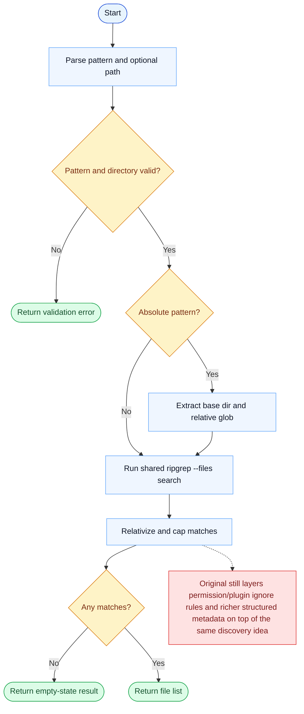

# Glob Parity Report

- Original: `src/tools/GlobTool/GlobTool.ts`
- Go: `tools/search.go`

## Verdict

- Summary: Exact surface; Go now uses a shared ripgrep-backed discovery path, so core glob behavior is much closer to the original.

## Name And Description

- Name parity: exact.
- Description parity: Both versions describe the tool around the same core capability: Finds files that match a glob pattern inside a target path. Wording differences are minor unless called out under key gaps.

## Parameters And Types

- Type signature: pattern: string, path?: string.
- Parameter parity: top-level parameter names match the original audit; ordering differences are non-semantic.

## Implementation Overview

- Core capability: Finds files that match a glob pattern inside a target path.
- Typical scenarios: Use it when the model needs fast file discovery before reading, editing, or searching more deeply.
- Core pain point addressed: It addresses navigation at repository scale: the model should not brute-force directory traversal mentally.
- Main challenges: The hard parts are base-directory extraction for absolute patterns, hidden-file behavior, result truncation, and keeping glob semantics predictable at repository scale.
- Strategy consistency: Largely consistent. Both versions now rely on a ripgrep-style file-discovery path instead of ad hoc directory walking.

## Visual Flow And Decision Map

### How To Read The Diagram

- Read the blue path first to understand the shared happy path.
- Read the yellow diamonds next; they are the branch conditions that decide which path the tool takes.
- Read the red boxes last; they mark exact places where Go diverges from `../src`, or where a path is intentionally out of scope.

### Decision Points

- `Pattern and directory valid?` rejects empty patterns, missing roots, and file paths passed where a directory is required.
- `Absolute pattern?` decides whether the tool first extracts a static base directory before handing the relative glob to ripgrep.
- `Any matches?` controls empty-state output vs the final match list.

### Flow-Divergence Hotspots

- The core discovery path is now much closer because Go also routes globbing through a shared ripgrep-based backend.
- The remaining differences are mostly around permission/plugin ignore integration and richer structured runtime metadata, not the raw match engine.

## Output And Format

- Output comparison: The original still returns richer structured/runtime metadata; Go returns a plain-text file list from the shared ripgrep adapter.

## Key Gaps

- Permission-ignore integration, plugin-cache exclusions, and structured result metadata remain the main gaps.
