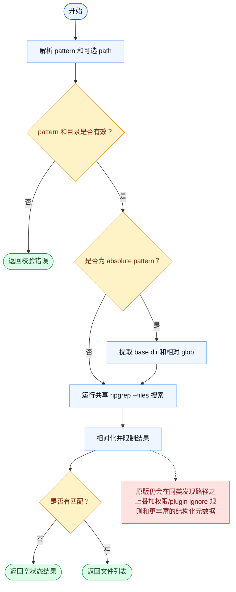

# Glob 一致性报告

- 原版: `src/tools/GlobTool/GlobTool.ts`
- Go版: `tools/search.go`

## 结论

- 摘要: 接口完全对齐；Go 现在已使用共享的 ripgrep 驱动发现路径，因此核心 glob 行为更接近原版。

## 名称与描述

- 名称一致性: 完全一致。
- 描述一致性: 两边都把这个工具描述为用于在目标路径内查找匹配 glob 模式的文件。 除“关键差异”外，措辞差别不影响核心语义。

## 参数与类型

- 类型签名: pattern: string，path?: string。
- 参数一致性: 顶层参数名与原版审计结果一致；字段顺序差异不构成语义差异。

## 实现概要

- 核心能力: 在目标路径内查找匹配 glob 模式的文件。
- 典型场景: 适用于模型在进一步读取、编辑或搜索前，需要快速发现目标文件。
- 核心痛点: 它解决的是仓库级导航问题：模型不该靠脑内暴力遍历目录。
- 主要挑战: 难点在于 absolute pattern 的 base-directory 提取、hidden file 行为、结果截断，以及在仓库规模下保持 glob 语义可预测。
- 实现思路一致性: 大体一致。两边现在都更依赖 ripgrep 风格的文件发现路径，而不是临时拼装的目录遍历。

## 流程图与决策地图

### 如何阅读这张图

- 先读蓝色主路径，用它理解共享的 happy path。
- 再看黄色菱形，它们是决定工具走哪条分支的判断条件。
- 最后看红色节点，它们标出 Go 与 `../src` 真正分叉的位置，或被有意排除的范围。

### 决策点

- `pattern 和目录是否有效？` 用来尽早拒绝空 pattern、缺失根目录，以及把文件路径误传成目录的情况。
- `是否为 absolute pattern？` 决定工具是否先提取静态 base directory，再把相对 glob 交给 ripgrep。
- `是否有匹配？` 决定返回空状态输出，还是最终的匹配列表。

### 差异热点

- 核心发现路径现在更接近了，因为 Go 也把 glob 路由到了共享的 ripgrep 后端。
- 剩余差异主要在权限/plugin ignore 集成和更丰富的结构化运行时元数据，而不是原始匹配引擎本身。

## 输出与格式

- 输出对比: 原版仍会返回更丰富的结构化/运行时元数据；Go 通过共享 ripgrep 适配层返回纯文本文件列表。

## 关键差异

- 权限 ignore 集成、plugin cache 排除，以及结构化结果元数据仍是主要差距。
