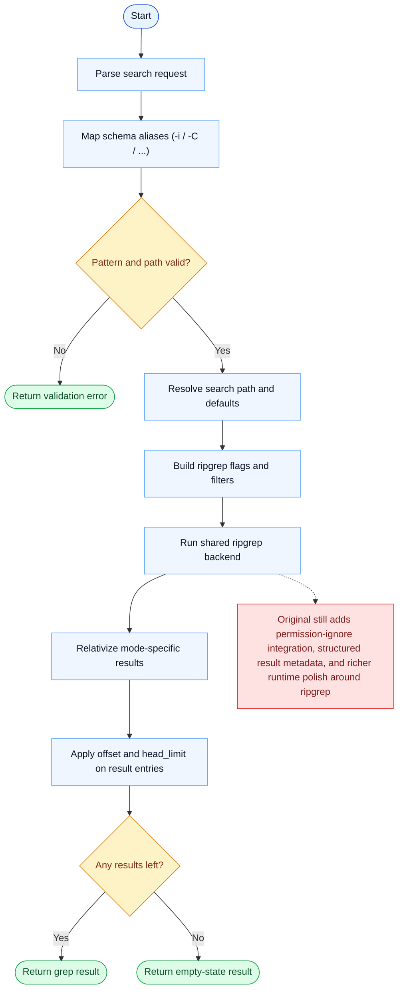

# Grep Parity Report

- Original: `src/tools/GrepTool/GrepTool.ts`
- Go: `tools/search.go`

## Verdict

- Summary: Exact surface; Go now uses a shared ripgrep-backed engine, closing the biggest semantic gaps from the old pure-Go scanner.

## Name And Description

- Name parity: exact.
- Description parity: Both versions describe the tool around the same core capability: Searches file content with grep-style filters, context controls, and result shaping. Wording differences are minor unless called out under key gaps.

## Parameters And Types

- Type signature: pattern: string, path?: string, glob?: string, output_mode?: string, -B?: number, -A?: number, -C?: number, context?: number, -n?: boolean, -i?: boolean, type?: string, head_limit?: number, offset?: number, multiline?: boolean.
- Parameter parity: top-level parameter names match the original audit; ordering differences are non-semantic.

## Implementation Overview

- Core capability: Searches file content with grep-style filters, context controls, and result shaping.
- Typical scenarios: Use it when the model needs repository-wide pattern search without dropping to a shell command.
- Core pain point addressed: It addresses codebase search as a first-class tool: the model needs fast semantic narrowing before reading or editing files.
- Main challenges: The hard parts are regex semantics, context windows, multiline handling, pagination, and keeping result ordering predictable at repository scale.
- Strategy consistency: Partially consistent. Both versions now rely on ripgrep-style execution, but the original still carries broader runtime integration and richer result shaping around that backend.

## Visual Flow And Decision Map

### How To Read The Diagram

- Read the blue path first to understand the shared happy path.
- Read the yellow diamonds next; they are the branch conditions that decide which path the tool takes.
- Read the red boxes last; they mark exact places where Go diverges from `../src`, or where a path is intentionally out of scope.

### Decision Points

- `Pattern and path valid?` rejects empty search requests and missing search roots before ripgrep is invoked.
- `Any results left?` is the final branch after ripgrep execution, relativization, and result-entry pagination.

### Flow-Divergence Hotspots

- The biggest engine-level gap is gone because Go now also runs a shared ripgrep-backed path instead of a hand-rolled scanner.
- The remaining differences are mostly around surrounding runtime integration and structured result shaping, not raw search semantics.

## Output And Format

- Output comparison: The original has richer structured/UI rendering; Go returns plain-text matches from a shared ripgrep adapter.

## Key Gaps

- Structured result metadata, permission-ignore integration, and some original runtime polish remain incomplete in Go.
