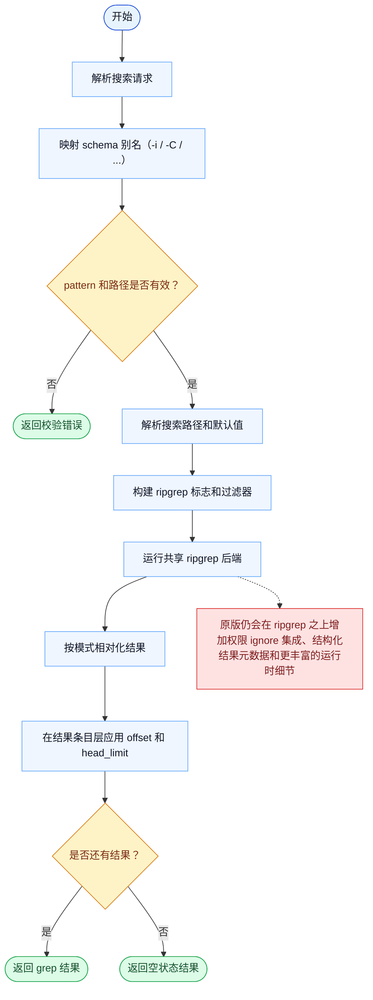

# Grep 一致性报告

- 原版: `src/tools/GrepTool/GrepTool.ts`
- Go版: `tools/search.go`

## 结论

- 摘要: 接口完全对齐；Go 现在已使用共享 ripgrep 驱动引擎，补上了旧纯 Go 扫描器最大的语义缺口。

## 名称与描述

- 名称一致性: 完全一致。
- 描述一致性: 两边都把这个工具描述为用于使用 grep 风格的过滤项、上下文控制和结果塑形来搜索文件内容。 除“关键差异”外，措辞差别不影响核心语义。

## 参数与类型

- 类型签名: pattern: string，path?: string，glob?: string，output_mode?: string，-B?: number，-A?: number，-C?: number，context?: number，-n?: boolean，-i?: boolean，type?: string，head_limit?: number，offset?: number，multiline?: boolean。
- 参数一致性: 顶层参数名与原版审计结果一致；字段顺序差异不构成语义差异。

## 实现概要

- 核心能力: 使用 grep 风格的过滤项、上下文控制和结果塑形来搜索文件内容。
- 典型场景: 适用于模型需要做仓库级模式搜索，但又不想直接退回 shell 命令。
- 核心痛点: 它把代码库搜索变成一等工具：模型在读写文件前，需要先快速缩小语义范围。
- 主要挑战: 难点在于正则语义、上下文窗口、多行处理、分页，以及在仓库规模下保持结果顺序可预测。
- 实现思路一致性: 部分一致。两边现在都更依赖 ripgrep 风格执行，但原版在此后端之上仍承载更广的运行时集成和更丰富的结果塑形。

## 流程图与决策地图

### 如何阅读这张图

- 先读蓝色主路径，用它理解共享的 happy path。
- 再看黄色菱形，它们是决定工具走哪条分支的判断条件。
- 最后看红色节点，它们标出 Go 与 `../src` 真正分叉的位置，或被有意排除的范围。

### 决策点

- `pattern 和路径是否有效？` 用来在调用 ripgrep 之前尽早拒绝空搜索请求和缺失搜索根路径。
- `是否还有结果？` 是 ripgrep 执行、结果相对化和结果条目分页之后的最终分支。

### 差异热点

- 最大的引擎级差距已经收掉了，因为 Go 现在也运行共享 ripgrep 后端，而不是手搓扫描器。
- 剩余差异主要在外围运行时集成和结构化结果塑形，而不是原始搜索语义。

## 输出与格式

- 输出对比: 原版有更丰富的结构化/UI 渲染；Go 通过共享 ripgrep 适配层返回纯文本匹配结果。

## 关键差异

- 结构化结果元数据、权限 ignore 集成，以及部分原版运行时细节在 Go 中仍未补齐。
