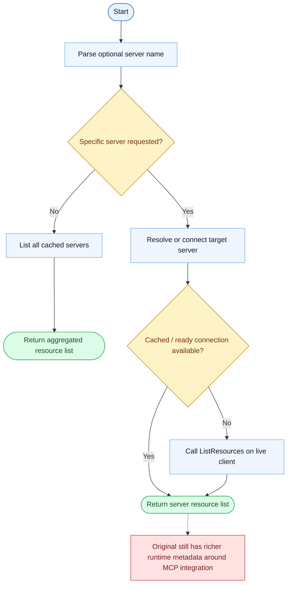

# ListMcpResourcesTool Parity Report

- Original: `src/tools/ListMcpResourcesTool/ListMcpResourcesTool.ts`
- Go: `tools/mcp_tools.go`

## Verdict

- Summary: Exact surface; the active MCP resource-listing path is close between the two implementations.

## Name And Description

- Name parity: exact.
- Description parity: Both versions describe the tool around the same core capability: Lists MCP resources, optionally scoped to one server. Wording differences are minor unless called out under key gaps.

## Parameters And Types

- Type signature: server?: string.
- Parameter parity: top-level parameter names match the original audit; ordering differences are non-semantic.

## Implementation Overview

- Core capability: Lists MCP resources, optionally scoped to one server.
- Typical scenarios: Use it when the model needs to discover what MCP-managed resources exist before reading one of them.
- Core pain point addressed: It solves access to external MCP-managed resources without forcing the model to know each backend protocol directly.
- Main challenges: The hard parts are server discovery, connection management, and normalizing remote resource results.
- Strategy consistency: Largely consistent. Both versions use MCP as the abstraction boundary and then expose a model-facing tool on top.

## Visual Flow And Decision Map

### How To Read The Diagram

- Read the blue path first to understand the shared happy path.
- Read the yellow diamonds next; they are the branch conditions that decide which path the tool takes.
- Read the red boxes last; they mark exact places where Go diverges from `../src`, or where a path is intentionally out of scope.

### Decision Points

- `Specific server requested?` decides whether the tool aggregates cached resources across all servers or drills into one server's live / cached state.
- `Cached / ready connection available?` chooses between reusing cached MCP metadata and actively listing resources from a live connection.

### Flow-Divergence Hotspots

- The active MCP listing path is fairly close in both implementations.
- The remaining gap is mostly the richer original runtime metadata and surrounding integration, not the core list flow.

## Output And Format

- Output comparison: The original returns a richer list result; Go returns a plain-text resource list.

## Key Gaps

- Remaining differences are mainly in surrounding runtime integration rather than the core listing action.
