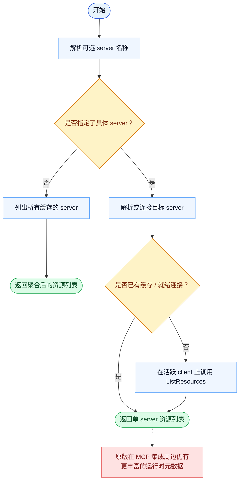

# ListMcpResourcesTool 一致性报告

- 原版: `src/tools/ListMcpResourcesTool/ListMcpResourcesTool.ts`
- Go版: `tools/mcp_tools.go`

## 结论

- 摘要: 接口完全对齐；对当前启用的 MCP 资源列出路径，两边已比较接近。

## 名称与描述

- 名称一致性: 完全一致。
- 描述一致性: 两边都把这个工具描述为用于列出 MCP 资源，并可选择限制在某个 server 下。 除“关键差异”外，措辞差别不影响核心语义。

## 参数与类型

- 类型签名: server?: string。
- 参数一致性: 顶层参数名与原版审计结果一致；字段顺序差异不构成语义差异。

## 实现概要

- 核心能力: 列出 MCP 资源，并可选择限制在某个 server 下。
- 典型场景: 适用于模型在真正读取某个 MCP 资源前，需要先发现有哪些可用资源。
- 核心痛点: 它解决的是访问外部 MCP 管理资源的问题，不需要模型直接理解每个后端协议。
- 主要挑战: 难点在于服务发现、连接管理，以及把远端资源结果规范化。
- 实现思路一致性: 大体一致。两边都把 MCP 作为抽象边界，再在其上暴露模型可见工具。

## 流程图与决策地图

### 如何阅读这张图

- 先读蓝色主路径，用它理解共享的 happy path。
- 再看黄色菱形，它们是决定工具走哪条分支的判断条件。
- 最后看红色节点，它们标出 Go 与 `../src` 真正分叉的位置，或被有意排除的范围。

### 决策点

- `是否指定了具体 server？` 决定工具是聚合所有 server 的缓存资源，还是深入一个 server 的 live / cached 状态。
- `是否已有缓存 / 就绪连接？` 决定是复用缓存的 MCP 元数据，还是从活跃连接上主动列出资源。

### 差异热点

- 在激活的 MCP 列表路径上，两边实现已经比较接近。
- 剩余差距主要在原版更丰富的运行时元数据和外围集成，而不在核心 list 流程本身。

## 输出与格式

- 输出对比: 原版返回更丰富的列表结果；Go 返回纯文本资源列表。

## 关键差异

- 剩余差异主要在外围运行时集成，而不是核心列出动作本身。
