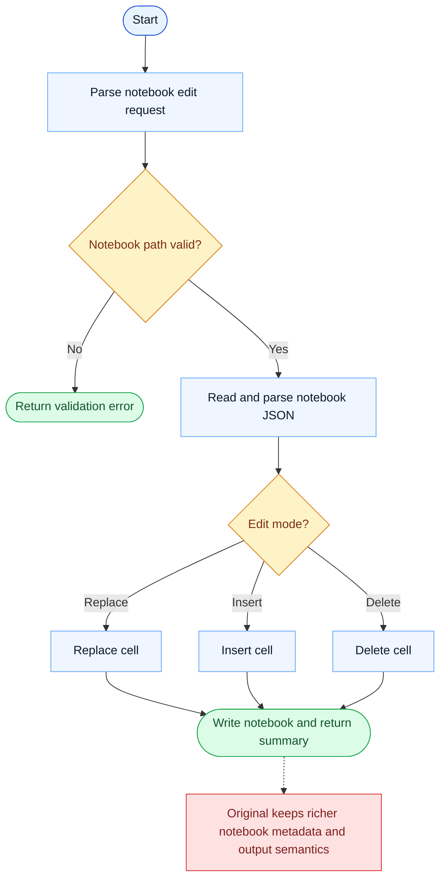

# NotebookEdit Parity Report

- Original: `src/tools/NotebookEditTool/NotebookEditTool.ts`
- Go: `tools/notebook.go`

## Verdict

- Summary: Exact surface; Go edits notebook cells correctly for the core path, but notebook-specific metadata and output are still lighter than in the original.

## Name And Description

- Name parity: exact.
- Description parity: Both versions describe the tool around the same core capability: Edits notebook cells with controlled modes instead of treating `.ipynb` files as opaque JSON blobs. Wording differences are minor unless called out under key gaps.

## Parameters And Types

- Type signature: notebook_path: string, cell_id?: string, new_source: string, cell_type?: string, edit_mode?: string.
- Parameter parity: top-level parameter names match the original audit; ordering differences are non-semantic.

## Implementation Overview

- Core capability: Edits notebook cells with controlled modes instead of treating `.ipynb` files as opaque JSON blobs.
- Typical scenarios: Use it when the model needs to update notebook code or markdown while preserving notebook structure.
- Core pain point addressed: It addresses notebook-specific ergonomics: direct text editing of raw notebook JSON is fragile and hard to reason about.
- Main challenges: The hard parts are cell targeting, insertion/deletion modes, notebook serialization, and returning enough structured context about what changed.
- Strategy consistency: Partially consistent. Both versions expose notebook-aware editing instead of raw JSON editing, but the original still carries richer notebook metadata and attribution behavior.

## Visual Flow And Decision Map

### How To Read The Diagram

- Read the blue path first to understand the shared happy path.
- Read the yellow diamonds next; they are the branch conditions that decide which path the tool takes.
- Read the red boxes last; they mark exact places where Go diverges from `../src`, or where a path is intentionally out of scope.

### Decision Points

- `Notebook path valid?` covers the required path and the `.ipynb` extension guard.
- `Edit mode?` routes the operation into replace, insert, or delete cell logic.

### Flow-Divergence Hotspots

- The core notebook mutation flow is already aligned: load JSON, mutate cells, write back.
- The remaining parity gap is around richer metadata and notebook-output semantics, not basic cell editing.

## Output And Format

- Output comparison: The original returns richer structured notebook results; Go returns a plain-text status message.

## Key Gaps

- Notebook metadata richness and result typing remain lighter in Go.
