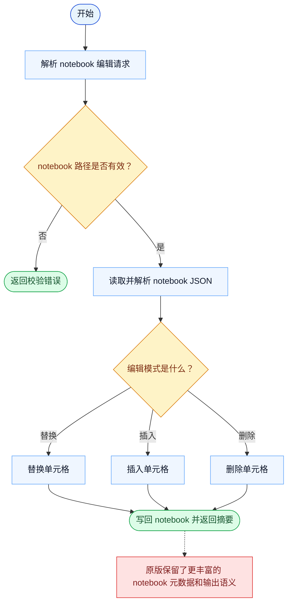

# NotebookEdit 一致性报告

- 原版: `src/tools/NotebookEditTool/NotebookEditTool.ts`
- Go版: `tools/notebook.go`

## 结论

- 摘要: 接口完全对齐；Go 已能在核心路径上正确编辑 notebook 单元，但 notebook 专属元信息和输出仍比原版轻。

## 名称与描述

- 名称一致性: 完全一致。
- 描述一致性: 两边都把这个工具描述为用于以受控模式编辑 notebook 单元，而不是把 `.ipynb` 当成不可理解的 JSON 大块。 除“关键差异”外，措辞差别不影响核心语义。

## 参数与类型

- 类型签名: notebook_path: string，cell_id?: string，new_source: string，cell_type?: string，edit_mode?: string。
- 参数一致性: 顶层参数名与原版审计结果一致；字段顺序差异不构成语义差异。

## 实现概要

- 核心能力: 以受控模式编辑 notebook 单元，而不是把 `.ipynb` 当成不可理解的 JSON 大块。
- 典型场景: 适用于模型需要修改 notebook 里的代码或 markdown，同时保留 notebook 结构。
- 核心痛点: 它解决的是 notebook 专用易用性问题：直接编辑原始 notebook JSON 很脆弱，也很难推理。
- 主要挑战: 难点在于 cell 定位、插入/删除模式、notebook 序列化，以及返回足够结构化的改动上下文。
- 实现思路一致性: 部分一致。两边都暴露了 notebook 感知编辑，而不是让用户直接改原始 JSON，但原版仍有更丰富的 notebook 元信息和 attribution 行为。

## 流程图与决策地图

### 如何阅读这张图

- 先读蓝色主路径，用它理解共享的 happy path。
- 再看黄色菱形，它们是决定工具走哪条分支的判断条件。
- 最后看红色节点，它们标出 Go 与 `../src` 真正分叉的位置，或被有意排除的范围。

### 决策点

- `notebook 路径是否有效？` 覆盖必填路径以及 `.ipynb` 扩展名保护。
- `编辑模式是什么？` 用来把操作分流到 replace、insert 或 delete 单元格逻辑。

### 差异热点

- 核心 notebook 变更流程已经对齐：加载 JSON、修改单元格、写回。
- 剩余一致性差异主要在更丰富的元数据和 notebook 输出语义，而不是基础单元格编辑。

## 输出与格式

- 输出对比: 原版返回更丰富的结构化 notebook 结果；Go 返回纯文本状态消息。

## 关键差异

- Notebook 元信息丰富度和结果类型在 Go 中仍更轻。
