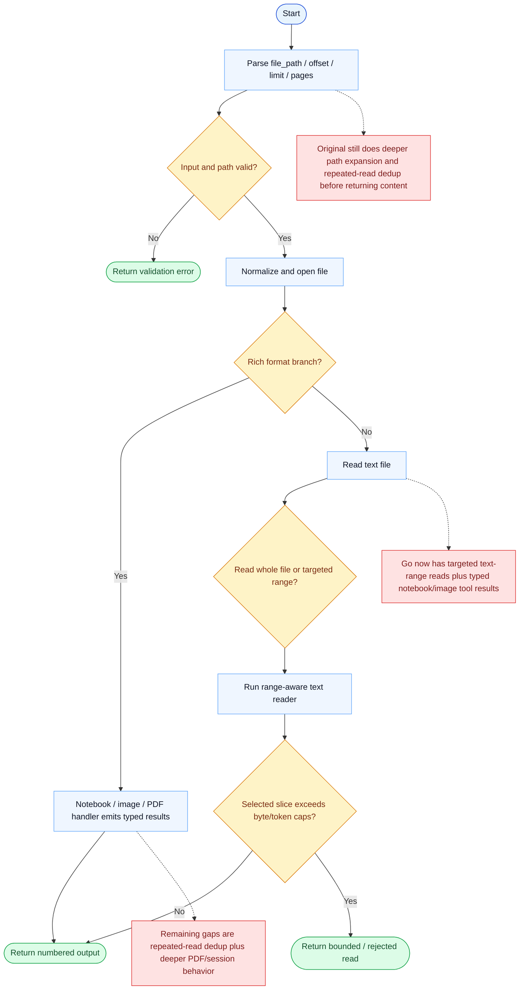

# Read Parity Report

- Original: `src/tools/FileReadTool/FileReadTool.ts`
- Go: `tools/file_operations.go`, `tools/read_multiformat.go`, `tools/pdf_renderer.go`

## Verdict

- Summary: Exact surface; Go now matches the original much more closely on text-range reads plus typed notebook/image tool results, while repeated-read state and deeper PDF/session semantics are still behind.

## Name And Description

- Name parity: exact.
- Description parity: Both versions describe the tool around the same core capability: Reads file content with range and modality-aware behavior around the raw bytes. Wording differences are minor unless called out under key gaps.

## Parameters And Types

- Type signature: file_path: string, offset?: number, limit?: number, pages?: string.
- Parameter parity: top-level parameter names match the original audit; ordering differences are non-semantic.

## Implementation Overview

- Core capability: Reads file content with range and modality-aware behavior around the raw bytes.
- Typical scenarios: Use it for source inspection, partial-file reading, PDF page access, and other read paths where the model needs grounded file content.
- Core pain point addressed: It addresses grounded context retrieval: the model needs exact file content, not memory or guesswork, and it needs that content in bounded slices.
- Main challenges: The hard parts are large-file range reads, multimodal formats, binary rejection, PDF pagination, caching, deduplication, and preserving rich content without breaking provider transport.
- Strategy consistency: Partially consistent. Text handling and notebook/image typed-result shaping are now much closer, but the original still carries richer repeated-read and session-aware behavior than Go.

## Visual Flow And Decision Map

### How To Read The Diagram

- Read the blue path first to understand the shared happy path.
- Read the yellow diamonds next; they are the branch conditions that decide which path the tool takes.
- Read the red boxes last; they mark exact places where Go diverges from `../src`, or where a path is intentionally out of scope.

### Decision Points

- `Input and path valid?` covers offset / limit validation, allowed-path checks, device-file rejection, and binary-path guards.
- `Rich format branch?` decides whether the read is delegated to notebook / image / PDF handlers or treated as plain text.
- `Read whole file or targeted range?` decides whether byte caps apply to the whole file or whether a requested slice can bypass the unrestricted full-file ceiling.
- `Selected slice exceeds byte/token caps?` decides whether the chosen content can be returned as-is or must error after range selection.

### Flow-Divergence Hotspots

- The shared path is already guard-heavy, especially around path safety and format branching.
- The text path is much closer now because Go also does range-aware reads before token checks and no longer injects an implicit default line cap.
- The notebook/image path is closer too because Go now emits typed tool results and image resize metadata instead of flattening everything into plain strings.
- The biggest remaining gaps are repeated-read state, deeper PDF/session-aware behavior, and some non-Anthropic transport details.

## Output And Format

- Output comparison: Both versions now use typed notebook/image results, but Go still uses a dual-path compatibility layer so non-Anthropic providers degrade to textual tool output plus multimodal follow-up messages.

## Key Gaps

- The remaining gaps are repeated-read dedup state, deeper original PDF/session-aware behavior, and some transport details outside Anthropic-native paths.
