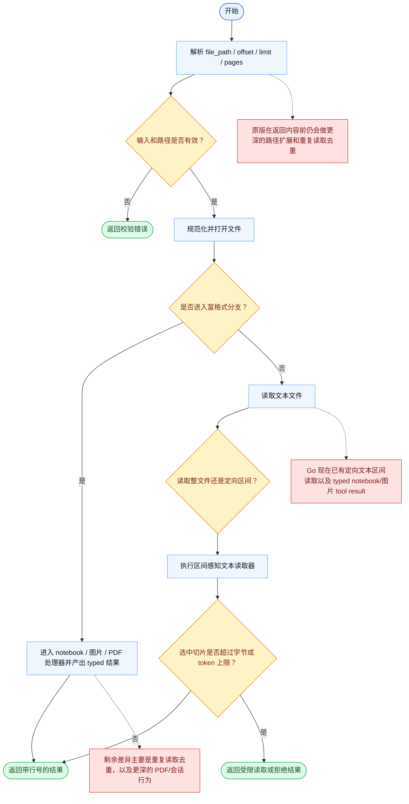

# Read 一致性报告

- 原版: `src/tools/FileReadTool/FileReadTool.ts`
- Go版: `tools/file_operations.go`, `tools/read_multiformat.go`, `tools/pdf_renderer.go`

## 结论

- 摘要: 接口完全对齐；Go 现在已经在文本区间读取以及 notebook/图片 typed tool result 路径上更接近原版，但重复读取状态和更深的 PDF/会话语义仍然落后。

## 名称与描述

- 名称一致性: 完全一致。
- 描述一致性: 两边都把这个工具描述为用于读取文件内容，并在原始字节之外附带区间与模态相关行为。 除“关键差异”外，措辞差别不影响核心语义。

## 参数与类型

- 类型签名: file_path: string，offset?: number，limit?: number，pages?: string。
- 参数一致性: 顶层参数名与原版审计结果一致；字段顺序差异不构成语义差异。

## 实现概要

- 核心能力: 读取文件内容，并在原始字节之外附带区间与模态相关行为。
- 典型场景: 适用于源码检查、局部文件读取、PDF 分页访问，以及其他模型需要基于真实文件内容做判断的读取路径。
- 核心痛点: 它解决的是基于事实的上下文获取问题：模型需要的是精确文件内容而不是记忆或猜测，而且这些内容还必须是有边界的切片。
- 主要挑战: 难点在于大文件区间读取、多模态格式、二进制拒读、PDF 分页、缓存、去重，以及在不破坏 provider 传输链路的前提下保留富内容。
- 实现思路一致性: 部分一致。文本处理以及 notebook/图片 typed-result 成形路径现在已经更接近，但原版在重复读取和会话感知行为上仍比 Go 更完整。

## 流程图与决策地图

### 如何阅读这张图

- 先读蓝色主路径，用它理解共享的 happy path。
- 再看黄色菱形，它们是决定工具走哪条分支的判断条件。
- 最后看红色节点，它们标出 Go 与 `../src` 真正分叉的位置，或被有意排除的范围。

### 决策点

- `输入和路径是否有效？` 覆盖 offset / limit 校验、允许路径检查、设备文件拒绝，以及二进制路径保护。
- `是否进入富格式分支？` 决定读取是委托给 notebook / 图片 / PDF 处理器，还是按纯文本处理。
- `读取整文件还是定向区间？` 决定字节上限是作用于整文件，还是在请求了区间时允许绕过整文件硬上限。
- `选中切片是否超过字节或 token 上限？` 决定选中的内容能否直接返回，还是要在区间选择之后报错。

### 差异热点

- 共享路径本身已经有很多保护，尤其在路径安全和格式分支上。
- 文本路径现在更接近了，因为 Go 也会在 token 校验前先做区间感知读取，并且不再注入隐式默认行数上限。
- notebook/图片路径也更接近了，因为 Go 现在会发送 typed tool result 和图片缩放元信息，而不是把所有内容都压成纯字符串。
- 目前最大的剩余差异主要是重复读取状态、更深的 PDF/会话感知行为，以及非 Anthropic 传输路径上的一些细节。

## 输出与格式

- 输出对比: 两边现在都会使用 typed notebook/图片结果，但 Go 仍通过一层双轨兼容来适配非 Anthropic provider，把它降级成文本 tool output 加多模态 follow-up message。

## 关键差异

- 剩余差异主要是重复读取去重状态、原版更深的 PDF/会话感知行为，以及 Anthropic 原生路径之外的一些传输细节。
