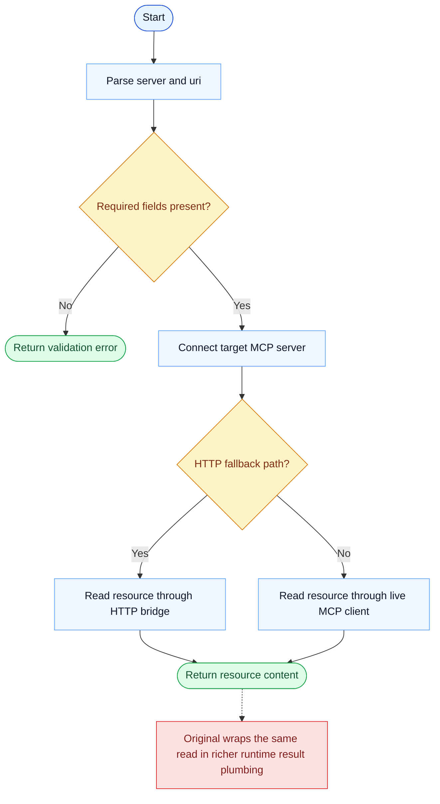

# ReadMcpResourceTool Parity Report

- Original: `src/tools/ReadMcpResourceTool/ReadMcpResourceTool.ts`
- Go: `tools/mcp_tools.go`

## Verdict

- Summary: Exact surface; the active MCP single-resource read path is close between the two implementations.

## Name And Description

- Name parity: exact.
- Description parity: Both versions describe the tool around the same core capability: Reads one MCP resource from a named server. Wording differences are minor unless called out under key gaps.

## Parameters And Types

- Type signature: server: string, uri: string.
- Parameter parity: top-level parameter names match the original audit; ordering differences are non-semantic.

## Implementation Overview

- Core capability: Reads one MCP resource from a named server.
- Typical scenarios: Use it when the model already knows the target resource and needs its content, not just discovery metadata.
- Core pain point addressed: It solves access to external MCP-managed resources without forcing the model to know each backend protocol directly.
- Main challenges: The hard parts are server discovery, connection management, and normalizing remote resource results.
- Strategy consistency: Largely consistent. Both versions use MCP as the abstraction boundary and then expose a model-facing tool on top.

## Visual Flow And Decision Map

### How To Read The Diagram

- Read the blue path first to understand the shared happy path.
- Read the yellow diamonds next; they are the branch conditions that decide which path the tool takes.
- Read the red boxes last; they mark exact places where Go diverges from `../src`, or where a path is intentionally out of scope.

### Decision Points

- `Required fields present?` rejects requests that do not identify both a server and a concrete resource URI.
- `HTTP fallback path?` decides whether the read goes through an HTTP bridge or a live MCP protocol client.

### Flow-Divergence Hotspots

- The active resource read path is already close between Go and the original.
- The remaining difference is mostly in surrounding runtime result plumbing and metadata, not in the core fetch itself.

## Output And Format

- Output comparison: The original returns a richer runtime result; Go returns plain-text resource content.

## Key Gaps

- The remaining gap is mostly surrounding runtime integration rather than the core read action.
