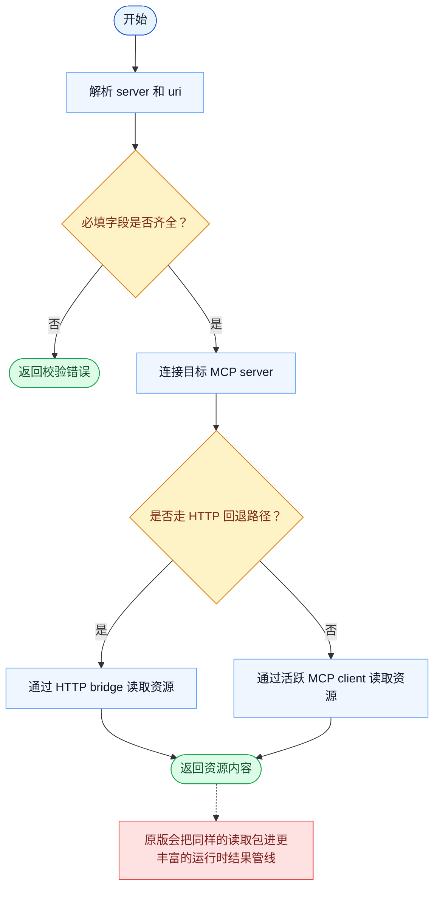

# ReadMcpResourceTool 一致性报告

- 原版: `src/tools/ReadMcpResourceTool/ReadMcpResourceTool.ts`
- Go版: `tools/mcp_tools.go`

## 结论

- 摘要: 接口完全对齐；对当前启用的 MCP 单资源读取路径，两边已比较接近。

## 名称与描述

- 名称一致性: 完全一致。
- 描述一致性: 两边都把这个工具描述为用于从指定 server 读取一个 MCP 资源。 除“关键差异”外，措辞差别不影响核心语义。

## 参数与类型

- 类型签名: server: string，uri: string。
- 参数一致性: 顶层参数名与原版审计结果一致；字段顺序差异不构成语义差异。

## 实现概要

- 核心能力: 从指定 server 读取一个 MCP 资源。
- 典型场景: 适用于模型已经知道目标资源，需要的是它的内容，而不是发现层面的元信息。
- 核心痛点: 它解决的是访问外部 MCP 管理资源的问题，不需要模型直接理解每个后端协议。
- 主要挑战: 难点在于服务发现、连接管理，以及把远端资源结果规范化。
- 实现思路一致性: 大体一致。两边都把 MCP 作为抽象边界，再在其上暴露模型可见工具。

## 流程图与决策地图

### 如何阅读这张图

- 先读蓝色主路径，用它理解共享的 happy path。
- 再看黄色菱形，它们是决定工具走哪条分支的判断条件。
- 最后看红色节点，它们标出 Go 与 `../src` 真正分叉的位置，或被有意排除的范围。

### 决策点

- `必填字段是否齐全？` 用来拒绝那些既没有 server 也没有具体资源 URI 的请求。
- `是否走 HTTP 回退路径？` 决定读取是通过 HTTP bridge，还是通过活跃的 MCP 协议 client。

### 差异热点

- 在激活的资源读取路径上，Go 和原版已经比较接近。
- 剩余差异主要在外围的运行时结果管线和元数据，而不是核心读取本身。

## 输出与格式

- 输出对比: 原版返回更丰富的运行时结果；Go 返回纯文本资源内容。

## 关键差异

- 剩余差异主要在外围运行时集成，而不是核心读取动作本身。
