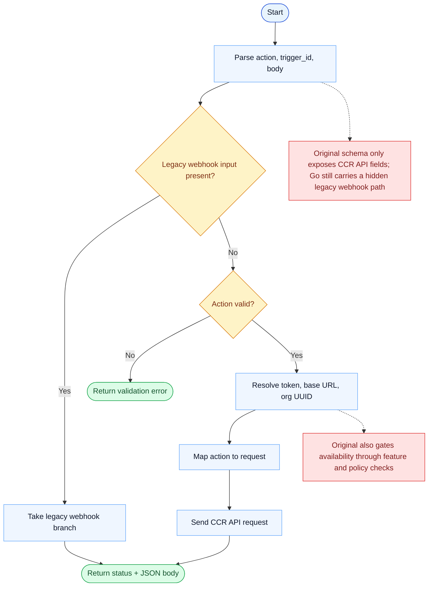

# RemoteTrigger Parity Report

- Original: `src/tools/RemoteTriggerTool/RemoteTriggerTool.ts`
- Go: `tools/misc.go`, `tools/remote_trigger.go`

## Verdict

- Summary: Exact surface; Go now hits the real OAuth-backed trigger API, but full feature, policy, and lifecycle parity with the original is still incomplete.

## Name And Description

- Name parity: exact.
- Description parity: Both versions describe the tool around the same core capability: Creates, updates, or otherwise manages remote triggers for agent execution. Wording differences are minor unless called out under key gaps.

## Parameters And Types

- Type signature: action: string, trigger_id?: string, body?: object.
- Parameter parity: top-level parameter names match the original audit; ordering differences are non-semantic.

## Implementation Overview

- Core capability: Creates, updates, or otherwise manages remote triggers for agent execution.
- Typical scenarios: Use it when work should be triggered remotely instead of only from the current interactive loop.
- Core pain point addressed: It addresses automation beyond the current session: some actions need a durable remote trigger instead of an immediate local command.
- Main challenges: The hard parts are auth, organization resolution, API compatibility, feature gating, and matching the original trigger lifecycle semantics.
- Strategy consistency: Partially consistent. Both versions center on remote trigger infrastructure, but the Go path still trails the original in feature/policy coverage and lifecycle semantics.

## Visual Flow And Decision Map

### How To Read The Diagram

- Read the blue path first to understand the shared happy path.
- Read the yellow diamonds next; they are the branch conditions that decide which path the tool takes.
- Read the red boxes last; they mark exact places where Go diverges from `../src`, or where a path is intentionally out of scope.

### Decision Points

- `Legacy webhook input present?` is the Go-only branch that bypasses the stricter CCR-API-only shape used by the original.
- `Action valid?` covers required action names and trigger-id shape before any network request is sent.

### Flow-Divergence Hotspots

- The core authenticated CCR request path is now close enough to talk to the real API.
- The biggest remaining divergence is shape and availability control: Go still carries a legacy branch, while the original is stricter and more explicitly gated.

## Output And Format

- Output comparison: The original returns richer runtime-aware trigger results; Go returns a JSON string with `status` and `json` payloads.

## Key Gaps

- Feature-policy parity and some lifecycle semantics remain incomplete in Go.
