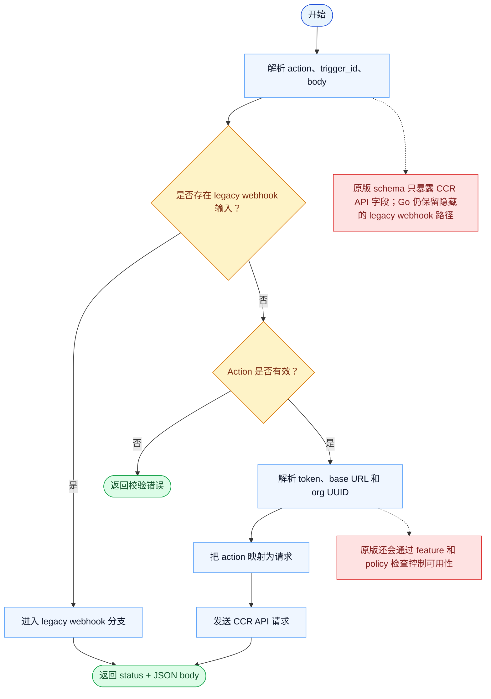

# RemoteTrigger 一致性报告

- 原版: `src/tools/RemoteTriggerTool/RemoteTriggerTool.ts`
- Go版: `tools/misc.go`, `tools/remote_trigger.go`

## 结论

- 摘要: 接口完全对齐；Go 现已打到真实 OAuth 支撑的 trigger API，但与原版在 feature、policy 和 lifecycle 上的完整对齐仍未完成。

## 名称与描述

- 名称一致性: 完全一致。
- 描述一致性: 两边都把这个工具描述为用于创建、更新或管理用于 agent 执行的远程触发器。 除“关键差异”外，措辞差别不影响核心语义。

## 参数与类型

- 类型签名: action: string，trigger_id?: string，body?: object。
- 参数一致性: 顶层参数名与原版审计结果一致；字段顺序差异不构成语义差异。

## 实现概要

- 核心能力: 创建、更新或管理用于 agent 执行的远程触发器。
- 典型场景: 适用于工作应由远程触发，而不是只能从当前交互循环里启动。
- 核心痛点: 它解决的是超出当前会话范围的自动化问题：有些动作需要的是持久化远程触发器，而不是立即执行的本地命令。
- 主要挑战: 难点在于鉴权、组织解析、API 兼容性、feature gate，以及对齐原版触发器生命周期语义。
- 实现思路一致性: 部分一致。两边都围绕远程触发器基础设施展开，但 Go 路径在 feature/policy 覆盖和生命周期语义上仍落后于原版。

## 流程图与决策地图

### 如何阅读这张图

- 先读蓝色主路径，用它理解共享的 happy path。
- 再看黄色菱形，它们是决定工具走哪条分支的判断条件。
- 最后看红色节点，它们标出 Go 与 `../src` 真正分叉的位置，或被有意排除的范围。

### 决策点

- `是否存在 legacy webhook 输入？` 是 Go 独有的分支，它绕过了原版更严格的 CCR-API-only 输入形状。
- `Action 是否有效？` 覆盖必填 action 名称和 trigger_id 形状校验，先于任何网络请求发生。

### 差异热点

- 核心的带认证 CCR 请求路径现在已经足够接近，可以访问真实 API。
- 最大的剩余分歧在输入形状和可用性控制上：Go 仍保留 legacy 分支，而原版更严格、gate 更明确。

## 输出与格式

- 输出对比: 原版返回更富运行时感知的 trigger 结果；Go 返回包含 `status` 和 `json` 载荷的 JSON 字符串。

## 关键差异

- Feature-policy 对齐以及部分生命周期语义在 Go 中仍未补齐。
