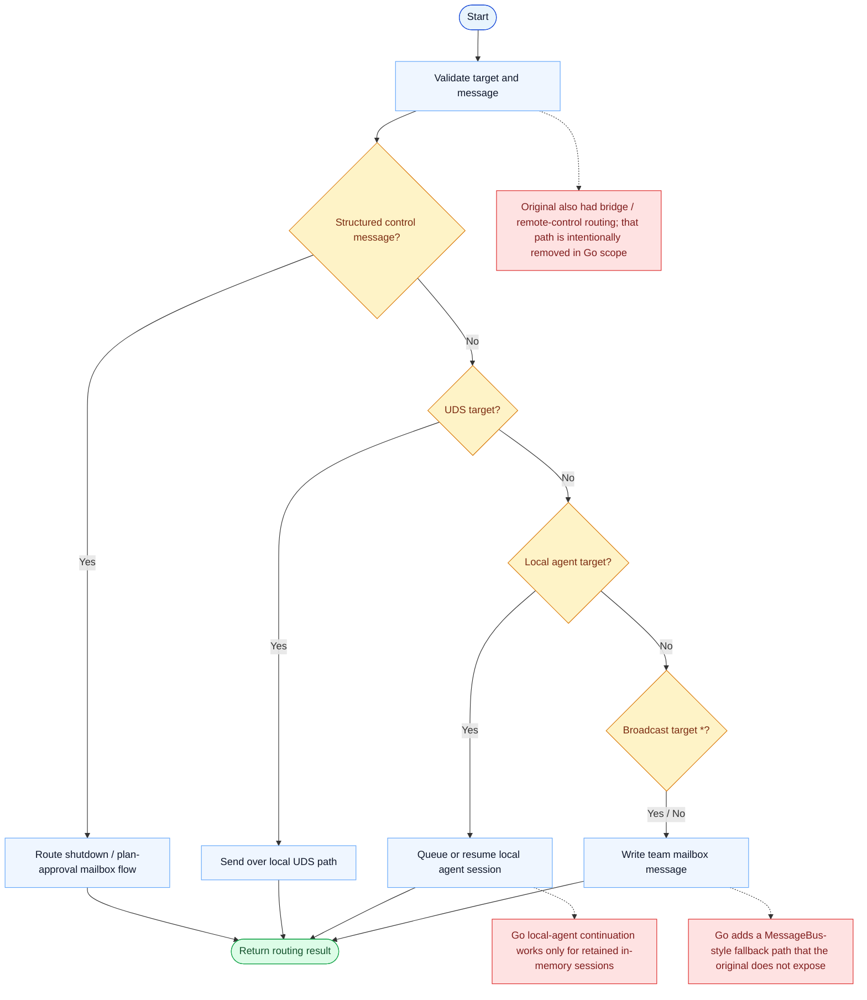

# SendMessage Parity Report

- Original: `src/tools/SendMessageTool/SendMessageTool.ts`
- Go: `tools/team.go`, `tools/send_message_routing.go`

## Scope

- Scope note: this report excludes the removed `bridge:` / Remote Control sub-path and scores only the supported Go subset.

## Verdict

- Summary: Exact surface for the supported subset; teammate, local-agent, mailbox, and `uds:` paths are useful, but the original removed `bridge:` / Remote Control path is intentionally out of scope in Go.

## Name And Description

- Name parity: exact.
- Description parity: Both versions describe the tool around the same core capability: Sends a plain-text or structured message to a teammate, a local continued agent, a team mailbox recipient, or a local `uds:` peer. Wording differences are minor unless called out under key gaps.

## Parameters And Types

- Type signature: to: string, summary?: string, message: string | object.
- Parameter parity: top-level parameter names match the original audit; ordering differences are non-semantic.

## Implementation Overview

- Core capability: Sends a plain-text or structured message to a teammate, a local continued agent, a team mailbox recipient, or a local `uds:` peer.
- Typical scenarios: Use it for leader-teammate coordination, shutdown/approval control messages, local agent continuation, and local socket delivery.
- Core pain point addressed: It addresses explicit coordination: team communication should be observable, routable, and resumable instead of hidden in free-form assistant text.
- Main challenges: The hard parts are recipient resolution, mailbox persistence, structured control messages, agent continuation, and keeping unsupported cross-session paths from masquerading as real features.
- Strategy consistency: Partially consistent. Both versions treat messaging as an explicit coordination surface, but the Go implementation intentionally stops at teammate/local-agent/`uds:` delivery instead of original remote-control peer messaging.

## Visual Flow And Decision Map

### How To Read The Diagram

- Read the blue path first to understand the shared happy path.
- Read the yellow diamonds next; they are the branch conditions that decide which path the tool takes.
- Read the red boxes last; they mark exact places where Go diverges from `../src`, or where a path is intentionally out of scope.

### Decision Points

- `Structured control message?` decides whether the tool is routing control-plane mailbox traffic instead of free-form text.
- `UDS target?` separates local peer-session delivery from normal team / agent routing.
- `Local agent target?` determines whether the runtime should resume or queue a retained local agent session.
- `Broadcast target *?` controls whether the same mailbox message fans out to the whole team or goes to one recipient.

### Flow-Divergence Hotspots

- The supported Go subset is still useful: teammate mailboxes, local retained agents, and `uds:` peers all work.
- The clearest parity break is explicit and intentional: the original bridge / remote-control path is not part of Go scope anymore.
- Even inside the supported subset, original continuation and shutdown semantics remain richer than Go's in-memory approximation.

## Output And Format

- Output comparison: The original returns richer structured routing results across more peer types; Go returns JSON strings with `success`, `message`, and routing/request metadata for the supported subset.

## Key Gaps

- Original peer-session / Remote Control delivery is intentionally excluded; parity should only be claimed for teammate, local-agent, mailbox, and `uds:` behavior.
