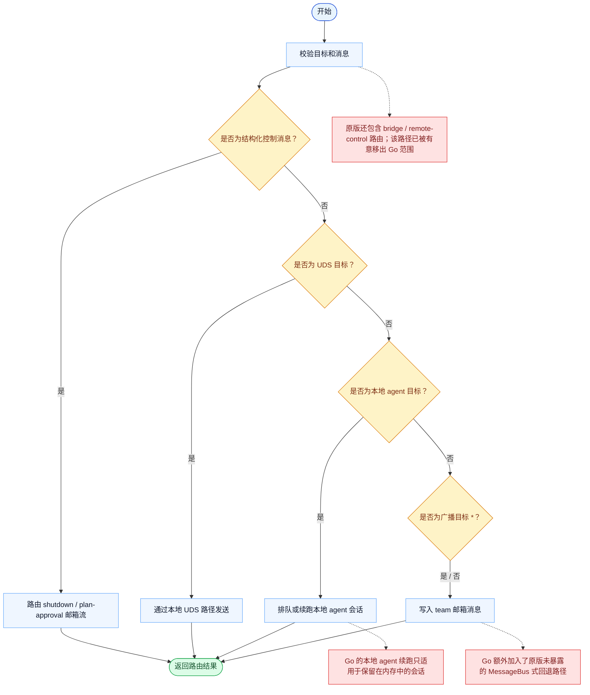

# SendMessage 一致性报告

- 原版: `src/tools/SendMessageTool/SendMessageTool.ts`
- Go版: `tools/team.go`, `tools/send_message_routing.go`

## 范围

- 范围说明：本报告排除了已删除的 `bridge:` / Remote Control 子路径，只评估 Go 当前支持的子集。

## 结论

- 摘要: 在受支持子集上接口完全对齐；teammate、本地 agent、mailbox 和 `uds:` 路径都已可用，但原版的 `bridge:` / Remote Control 路径在 Go 中被有意排除。

## 名称与描述

- 名称一致性: 完全一致。
- 描述一致性: 两边都把这个工具描述为用于向 teammate、本地续跑 agent、team mailbox 接收者或本地 `uds:` peer 发送纯文本或结构化消息。 除“关键差异”外，措辞差别不影响核心语义。

## 参数与类型

- 类型签名: to: string，summary?: string，message: string | object。
- 参数一致性: 顶层参数名与原版审计结果一致；字段顺序差异不构成语义差异。

## 实现概要

- 核心能力: 向 teammate、本地续跑 agent、team mailbox 接收者或本地 `uds:` peer 发送纯文本或结构化消息。
- 典型场景: 适用于 leader-teammate 协调、shutdown/approval 控制消息、本地 agent 续跑，以及本地 socket 投递。
- 核心痛点: 它解决的是显式协同问题：团队通信应当是可观察、可路由、可续跑的，而不是藏在自由文本回复里。
- 主要挑战: 难点在于接收者解析、mailbox 持久化、结构化控制消息、agent 续跑，以及避免让不支持的跨会话路径伪装成真实功能。
- 实现思路一致性: 部分一致。两边都把消息发送当作显式协同面，但 Go 实现有意停在 teammate/local-agent/`uds:` 投递，不再覆盖原版 remote-control peer messaging。

## 流程图与决策地图

### 如何阅读这张图

- 先读蓝色主路径，用它理解共享的 happy path。
- 再看黄色菱形，它们是决定工具走哪条分支的判断条件。
- 最后看红色节点，它们标出 Go 与 `../src` 真正分叉的位置，或被有意排除的范围。

### 决策点

- `是否为结构化控制消息？` 决定工具是在路由控制面邮箱消息，还是普通自由文本。
- `是否为 UDS 目标？` 用来区分本地 peer-session 发送与普通 team / agent 路由。
- `是否为本地 agent 目标？` 决定运行时是否应该续跑或排队一个已保留的本地 agent 会话。
- `是否为广播目标 *？` 控制同一条邮箱消息是扇出到整个 team，还是只发给一个接收者。

### 差异热点

- Go 当前支持的子集仍然有实际价值：teammate 邮箱、本地保留 agent，以及 `uds:` peer 都能工作。
- 最清晰的一处一致性断点是显式且有意的：原版的 bridge / remote-control 路径已不再属于 Go 范围。
- 即便在支持的子集内，原版的 continuation 和 shutdown 语义仍然比 Go 的内存近似实现更丰富。

## 输出与格式

- 输出对比: 原版会针对更多 peer 类型返回更丰富的结构化路由结果；Go 则针对受支持子集返回包含 `success`、`message` 和路由/request 元信息的 JSON 字符串。

## 关键差异

- 原版 peer-session / Remote Control 投递已被有意排除；一致性只能对 teammate、本地 agent、mailbox 和 `uds:` 行为做声明。
