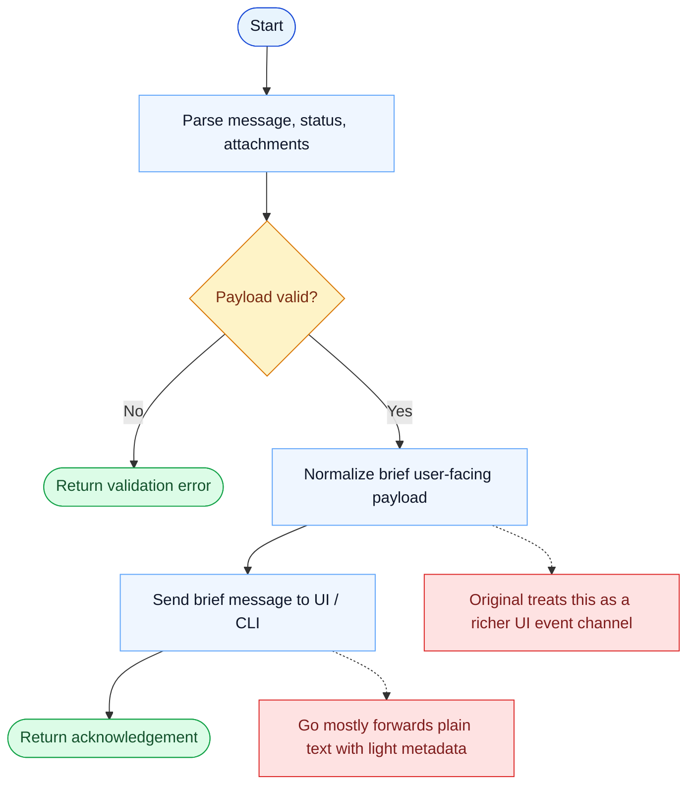

# SendUserMessage Parity Report

- Original: `src/tools/BriefTool/BriefTool.ts`
- Go: `tools/misc.go`

## Verdict

- Summary: Exact surface; Go keeps the same contract but still implements it mostly as a thin CLI passthrough.

## Name And Description

- Name parity: exact.
- Description parity: Both versions describe the tool around the same core capability: Sends a brief user-facing message or status update. Wording differences are minor unless called out under key gaps.

## Parameters And Types

- Type signature: message: string, attachments?: array, status?: string.
- Parameter parity: top-level parameter names match the original audit; ordering differences are non-semantic.

## Implementation Overview

- Core capability: Sends a brief user-facing message or status update.
- Typical scenarios: Use it when the model should explicitly communicate a concise user-facing note instead of burying that message in a longer response.
- Core pain point addressed: It addresses separation of concerns: some runtime messages are UI/status events, not normal assistant prose.
- Main challenges: The hard parts are integrating attachments, status semantics, and UI presentation without collapsing everything into plain text.
- Strategy consistency: Partially consistent. Both versions expose an explicit user-message surface, but the Go version still treats it much more like plain text transport.

## Visual Flow And Decision Map

### How To Read The Diagram

- Read the blue path first to understand the shared happy path.
- Read the yellow diamonds next; they are the branch conditions that decide which path the tool takes.
- Read the red boxes last; they mark exact places where Go diverges from `../src`, or where a path is intentionally out of scope.

### Decision Points

- `Payload valid?` covers whether the tool received a coherent message body and optional presentation metadata.

### Flow-Divergence Hotspots

- The shared flow is short: validate, normalize, send, acknowledge.
- The main difference is conceptual: the original models a richer UI event, while Go still behaves like a lightweight message passthrough.

## Output And Format

- Output comparison: The original has richer user-facing message semantics; Go returns plain text and does not deeply interpret attachments or status.

## Key Gaps

- UI/status semantics remain much lighter in Go than in the original runtime.
