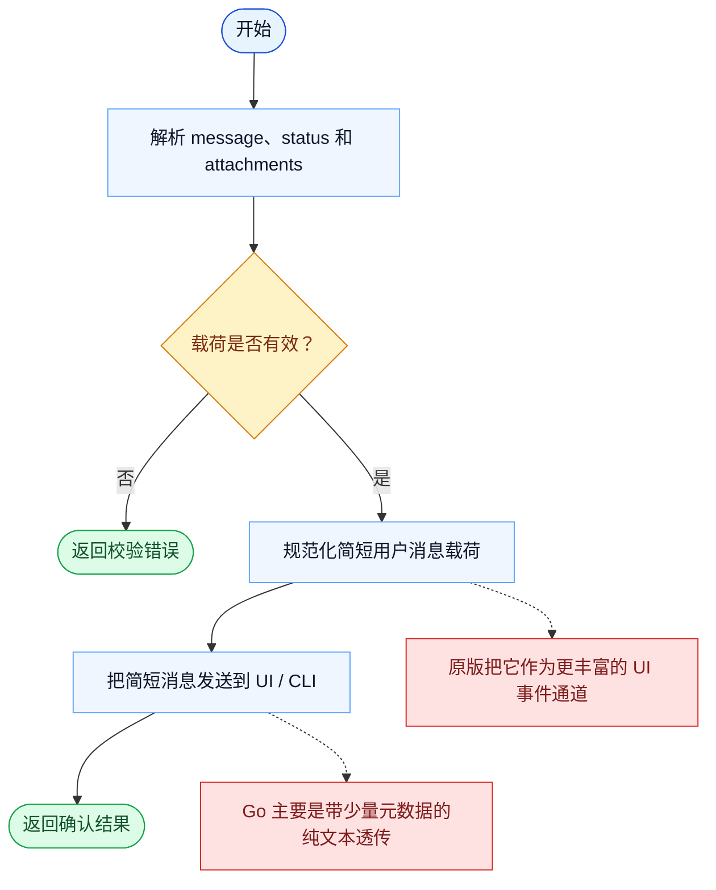

# SendUserMessage 一致性报告

- 原版: `src/tools/BriefTool/BriefTool.ts`
- Go版: `tools/misc.go`

## 结论

- 摘要: 接口完全对齐；Go 保留了相同契约，但实现上仍主要是轻量 CLI 透传。

## 名称与描述

- 名称一致性: 完全一致。
- 描述一致性: 两边都把这个工具描述为用于向用户发送一条简短消息或状态更新。 除“关键差异”外，措辞差别不影响核心语义。

## 参数与类型

- 类型签名: message: string，attachments?: array，status?: string。
- 参数一致性: 顶层参数名与原版审计结果一致；字段顺序差异不构成语义差异。

## 实现概要

- 核心能力: 向用户发送一条简短消息或状态更新。
- 典型场景: 适用于模型需要显式发送一条面向用户的简短提示，而不是把那条信息埋进长回复里。
- 核心痛点: 它解决的是关注点分离问题：有些运行时消息属于 UI/状态事件，不应等同于普通助手正文。
- 主要挑战: 难点在于接入附件、状态语义和 UI 呈现，而不是把所有东西都压扁成纯文本。
- 实现思路一致性: 部分一致。两边都暴露了显式的用户消息面，但 Go 版仍更像纯文本传输层。

## 流程图与决策地图

### 如何阅读这张图

- 先读蓝色主路径，用它理解共享的 happy path。
- 再看黄色菱形，它们是决定工具走哪条分支的判断条件。
- 最后看红色节点，它们标出 Go 与 `../src` 真正分叉的位置，或被有意排除的范围。

### 决策点

- `载荷是否有效？` 覆盖的是工具是否收到了一致的消息体，以及可选的展示元数据。

### 差异热点

- 共享流程本身很短：校验、规范化、发送、确认。
- 主要差异是概念层面的：原版把它建模为更丰富的 UI 事件，而 Go 仍更像轻量消息透传。

## 输出与格式

- 输出对比: 原版有更丰富的用户消息语义；Go 返回纯文本，也不会深度解释 attachments 或 status。

## 关键差异

- UI/状态语义在 Go 中仍然比原版轻得多。
