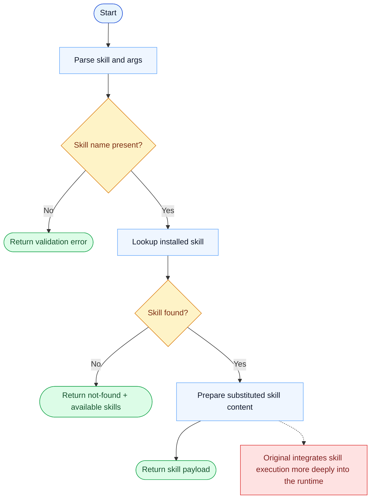

# Skill Parity Report

- Original: `src/tools/SkillTool/SkillTool.ts`
- Go: `tools/skill.go`

## Verdict

- Summary: Exact surface; the skill-loading contract is aligned, but the original skill/runtime integration is still broader than Go.

## Name And Description

- Name parity: exact.
- Description parity: Both versions describe the tool around the same core capability: Loads an installed skill prompt, optionally with arguments. Wording differences are minor unless called out under key gaps.

## Parameters And Types

- Type signature: skill: string, args?: string.
- Parameter parity: top-level parameter names match the original audit; ordering differences are non-semantic.

## Implementation Overview

- Core capability: Loads an installed skill prompt, optionally with arguments.
- Typical scenarios: Use it when the model should pull in a reusable skill definition instead of reconstructing that guidance from scratch.
- Core pain point addressed: It addresses reuse: repeated specialized workflows should live as explicit skills rather than fragile prompt fragments.
- Main challenges: The hard parts are resolution of installed skills, argument plumbing, and integrating the skill output with the broader runtime.
- Strategy consistency: Partially consistent. Both versions expose skill loading as a first-class tool, but the Go runtime around installed skills is still simpler.

## Visual Flow And Decision Map

### How To Read The Diagram

- Read the blue path first to understand the shared happy path.
- Read the yellow diamonds next; they are the branch conditions that decide which path the tool takes.
- Read the red boxes last; they mark exact places where Go diverges from `../src`, or where a path is intentionally out of scope.

### Decision Points

- `Skill name present?` rejects empty invocations before any manager lookup happens.
- `Skill found?` decides whether the tool can expand a real installed skill or must stop with an availability message.

### Flow-Divergence Hotspots

- The shared flow is simple and explicit: parse, lookup, substitute, return.
- The remaining difference is mostly runtime depth: the original skill system is woven more deeply into the wider assistant runtime.

## Output And Format

- Output comparison: The original has a richer surrounding skill runtime; Go returns the prepared skill content as plain text.

## Key Gaps

- The main gap is runtime integration depth rather than the core loading contract.
