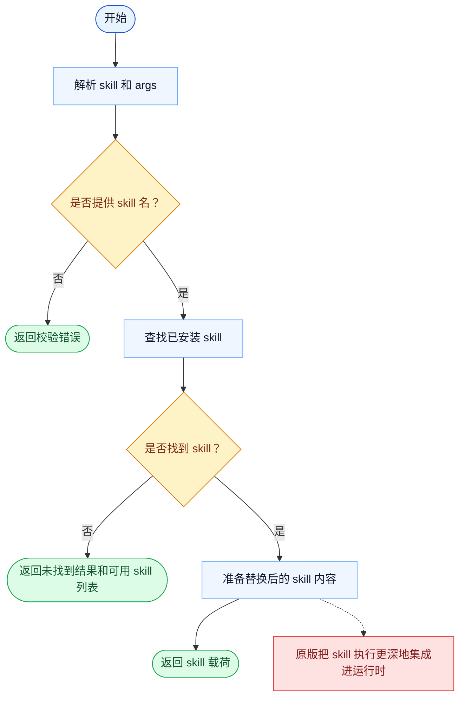

# Skill 一致性报告

- 原版: `src/tools/SkillTool/SkillTool.ts`
- Go版: `tools/skill.go`

## 结论

- 摘要: 接口完全对齐；skill 加载契约已对齐，但原版的 skill/运行时集成仍比 Go 更宽。

## 名称与描述

- 名称一致性: 完全一致。
- 描述一致性: 两边都把这个工具描述为用于加载一个已安装的 skill prompt，并可附带参数。 除“关键差异”外，措辞差别不影响核心语义。

## 参数与类型

- 类型签名: skill: string，args?: string。
- 参数一致性: 顶层参数名与原版审计结果一致；字段顺序差异不构成语义差异。

## 实现概要

- 核心能力: 加载一个已安装的 skill prompt，并可附带参数。
- 典型场景: 适用于模型需要引入一个可复用的 skill 定义，而不是每次从头重建这套指导。
- 核心痛点: 它解决的是复用问题：重复出现的专业流程应当沉淀为显式 skill，而不是脆弱的 prompt 碎片。
- 主要挑战: 难点在于已安装 skill 的解析、参数传递，以及把 skill 输出接入更宽的运行时。
- 实现思路一致性: 部分一致。两边都把 skill 加载暴露成一等工具，但 Go 在已安装 skill 周围的运行时仍更简单。

## 流程图与决策地图

### 如何阅读这张图

- 先读蓝色主路径，用它理解共享的 happy path。
- 再看黄色菱形，它们是决定工具走哪条分支的判断条件。
- 最后看红色节点，它们标出 Go 与 `../src` 真正分叉的位置，或被有意排除的范围。

### 决策点

- `是否提供 skill 名？` 用来在任何 manager lookup 发生前拒绝空调用。
- `是否找到 skill？` 决定工具是展开一个真实已安装的 skill，还是只能返回可用性提示。

### 差异热点

- 共享流程简单直接：解析、查找、替换、返回。
- 剩余差异主要在运行时深度：原版 skill 系统和更大的 assistant runtime 织得更紧。

## 输出与格式

- 输出对比: 原版有更丰富的外围 skill 运行时；Go 返回准备好的纯文本 skill 内容。

## 关键差异

- 主要差距在于运行时集成深度，而不是核心加载契约。
