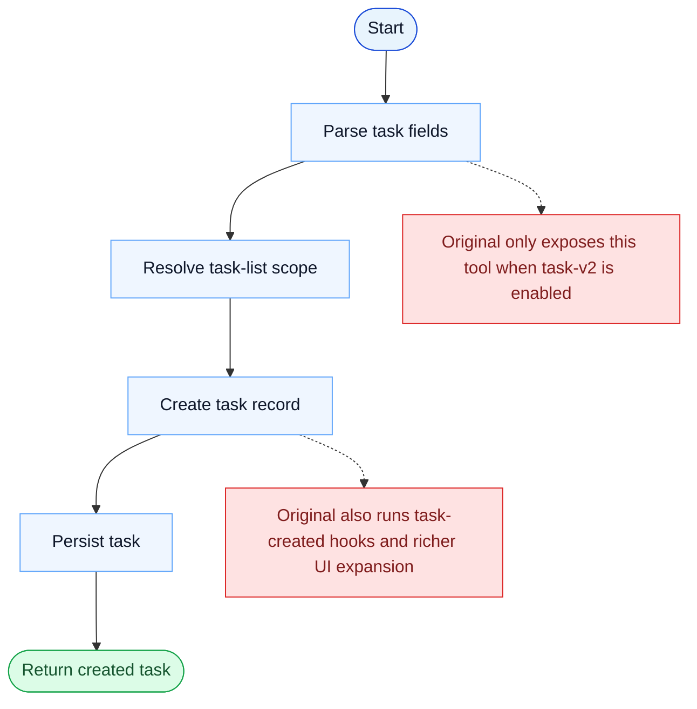

# TaskCreate Parity Report

- Original: `src/tools/TaskCreateTool/TaskCreateTool.ts`
- Go: `tools/tasks.go`

## Verdict

- Summary: Exact surface; the create contract is aligned, and Go now creates tasks on top of a persistent, scope-aware, locked backend, though the original runtime is still richer.

## Name And Description

- Name parity: exact.
- Description parity: Both versions describe the tool around the same core capability: Creates a task entry in the shared task system. Wording differences are minor unless called out under key gaps.

## Parameters And Types

- Type signature: subject: string, description?: string, activeForm?: string, metadata?: object.
- Parameter parity: top-level parameter names match the original audit; ordering differences are non-semantic.

## Implementation Overview

- Core capability: Creates a task entry in the shared task system.
- Typical scenarios: Use it when work should be tracked explicitly rather than left implicit in free-form reasoning.
- Core pain point addressed: It addresses visibility and coordination for multi-step work so the model does not have to track the whole plan in free text.
- Main challenges: The hard parts are persistence, dependency edges, blocking semantics, and keeping task state consistent across tools and sessions.
- Strategy consistency: Partially consistent. Both versions revolve around a shared persistent task system, and Go now mirrors more of the original scope, locking, and runtime-task substrate, but the original still has a richer hook-aware app-state runtime.

## Visual Flow And Decision Map

### How To Read The Diagram

- Read the blue path first to understand the shared happy path.
- Read the yellow diamonds next; they are the branch conditions that decide which path the tool takes.
- Read the red boxes last; they mark exact places where Go diverges from `../src`, or where a path is intentionally out of scope.

### Decision Points

- This tool's main hidden decision is scope resolution: which task list the new task belongs to in the current session / team context.

### Flow-Divergence Hotspots

- The shared happy path is create-and-persist.
- The original wraps that path in task-v2 gating, hook execution, and richer UI/runtime side effects that Go does not yet mirror.

## Output And Format

- Output comparison: The original returns a structured task result; Go returns a plain-text creation summary on top of the newer persistent task substrate.

## Key Gaps

- The remaining gaps are mainly hook/app-state integration, richer typed results, and the broader original teammate/runtime lifecycle.
