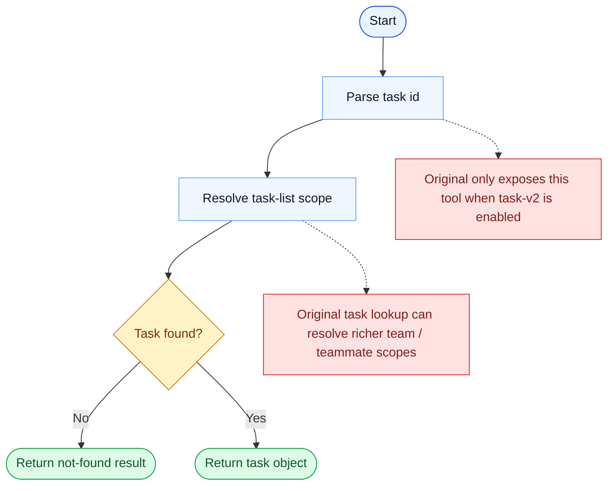

# TaskGet Parity Report

- Original: `src/tools/TaskGetTool/TaskGetTool.ts`
- Go: `tools/tasks.go`

## Verdict

- Summary: Exact surface; the lookup contract is aligned, and the task object now comes from a persistent, scope-aware Go backend, though the original runtime still carries richer hooks and typing.

## Name And Description

- Name parity: exact.
- Description parity: Both versions describe the tool around the same core capability: Fetches one task by identifier from the shared task system. Wording differences are minor unless called out under key gaps.

## Parameters And Types

- Type signature: taskId: string.
- Parameter parity: top-level parameter names match the original audit; ordering differences are non-semantic.

## Implementation Overview

- Core capability: Fetches one task by identifier from the shared task system.
- Typical scenarios: Use it when the model needs the authoritative state of a specific task before taking the next action.
- Core pain point addressed: It addresses visibility and coordination for multi-step work so the model does not have to track the whole plan in free text.
- Main challenges: The hard parts are persistence, dependency edges, blocking semantics, and keeping task state consistent across tools and sessions.
- Strategy consistency: Partially consistent. Both versions revolve around a shared persistent task system, and Go now mirrors more of the original scope, locking, and runtime-task substrate, but the original still has a richer hook-aware app-state runtime.

## Visual Flow And Decision Map

### How To Read The Diagram

- Read the blue path first to understand the shared happy path.
- Read the yellow diamonds next; they are the branch conditions that decide which path the tool takes.
- Read the red boxes last; they mark exact places where Go diverges from `../src`, or where a path is intentionally out of scope.

### Decision Points

- `Task found?` is the visible branch, but the more important hidden branch is scope resolution before lookup starts.

### Flow-Divergence Hotspots

- Lookup itself is straightforward once the correct task list is resolved.
- The main differences are exposure gating and the richer original scope-resolution logic for teams and teammates.

## Output And Format

- Output comparison: The original returns a structured task object; Go returns a text rendering backed by the newer persistent task substrate.

## Key Gaps

- The remaining gaps are mainly hook/app-state integration, richer typed results, and the broader original teammate/runtime lifecycle.
