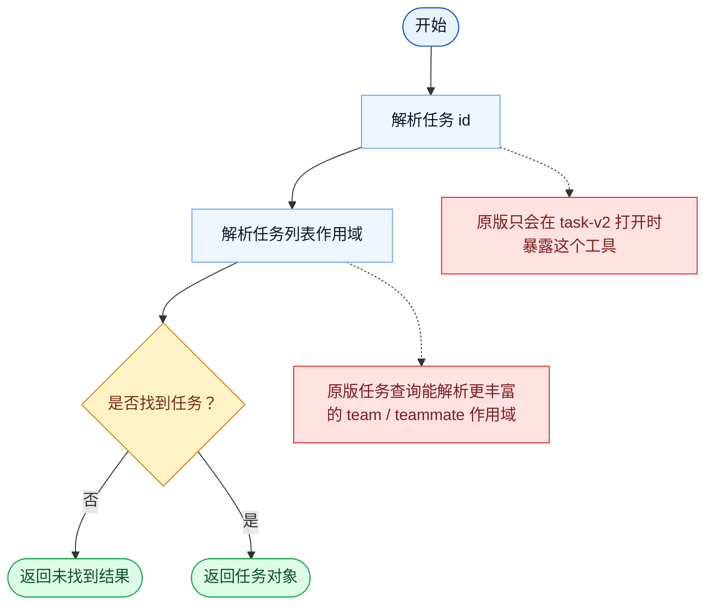

# TaskGet 一致性报告

- 原版: `src/tools/TaskGetTool/TaskGetTool.ts`
- Go版: `tools/tasks.go`

## 结论

- 摘要: 接口完全对齐；查询契约已对齐，任务对象现在也来自持久化、scope-aware 的 Go 后端，但原版运行时仍有更丰富的 hook 和类型系统。

## 名称与描述

- 名称一致性: 完全一致。
- 描述一致性: 两边都把这个工具描述为用于按标识从共享任务系统中读取一个任务。 除“关键差异”外，措辞差别不影响核心语义。

## 参数与类型

- 类型签名: taskId: string。
- 参数一致性: 顶层参数名与原版审计结果一致；字段顺序差异不构成语义差异。

## 实现概要

- 核心能力: 按标识从共享任务系统中读取一个任务。
- 典型场景: 适用于模型在执行下一步前，需要知道某个任务的权威状态。
- 核心痛点: 它解决的是多步骤工作的可见性和协同问题，避免模型只能靠自由文本硬记整套计划。
- 主要挑战: 难点在于持久化、依赖边、阻塞语义，以及跨工具、跨会话保持任务状态一致。
- 实现思路一致性: 部分一致。两边都围绕共享的持久化任务系统展开，Go 现在也已镜像更多原版的 scope、加锁和 runtime-task 底座，但原版仍然有更丰富、带 hook 的 app-state 运行时。

## 流程图与决策地图

### 如何阅读这张图

- 先读蓝色主路径，用它理解共享的 happy path。
- 再看黄色菱形，它们是决定工具走哪条分支的判断条件。
- 最后看红色节点，它们标出 Go 与 `../src` 真正分叉的位置，或被有意排除的范围。

### 决策点

- `是否找到任务？` 是可见分支，但更关键的隐含分支其实是查找开始前的作用域解析。

### 差异热点

- 一旦解析到正确的任务列表，查询本身就很直接。
- 主要差异在工具暴露 gate，以及原版针对 team 和 teammate 更丰富的作用域解析逻辑。

## 输出与格式

- 输出对比: 原版返回结构化任务对象；Go 返回的是由新持久化任务底座支撑的文本渲染结果。

## 关键差异

- 剩余差距主要集中在 hook/app-state 集成、更丰富的 typed 结果，以及更宽的原版 teammate/runtime 生命周期。
