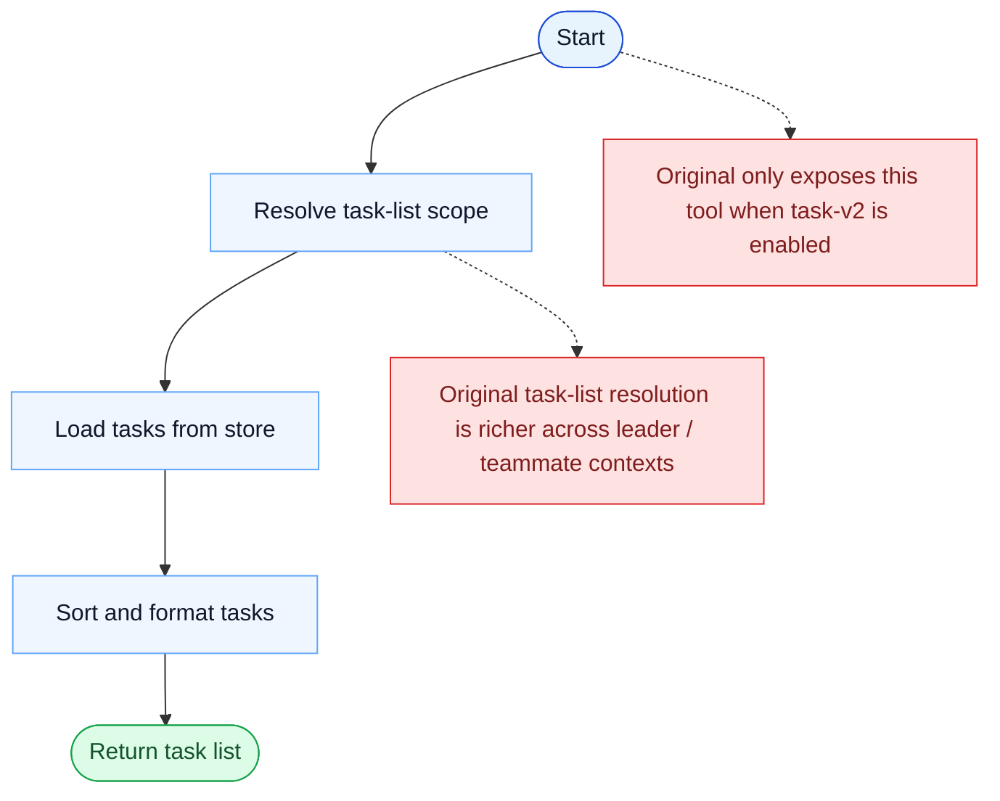

# TaskList Parity Report

- Original: `src/tools/TaskListTool/TaskListTool.ts`
- Go: `tools/tasks.go`

## Verdict

- Summary: Exact surface; the listing contract is aligned, and listed tasks now come from a persistent, scope-aware, locked Go backend.

## Name And Description

- Name parity: exact.
- Description parity: Both versions describe the tool around the same core capability: Lists the current tasks from the shared task system. Wording differences are minor unless called out under key gaps.

## Parameters And Types

- Type signature: No input parameters.
- Parameter parity: top-level parameter names match the original audit; ordering differences are non-semantic.

## Implementation Overview

- Core capability: Lists the current tasks from the shared task system.
- Typical scenarios: Use it when the model needs a global view of current work before prioritizing or updating tasks.
- Core pain point addressed: It addresses visibility and coordination for multi-step work so the model does not have to track the whole plan in free text.
- Main challenges: The hard parts are persistence, dependency edges, blocking semantics, and keeping task state consistent across tools and sessions.
- Strategy consistency: Partially consistent. Both versions revolve around a shared persistent task system, and Go now mirrors more of the original scope, locking, and runtime-task substrate, but the original still has a richer hook-aware app-state runtime.

## Visual Flow And Decision Map

### How To Read The Diagram

- Read the blue path first to understand the shared happy path.
- Read the yellow diamonds next; they are the branch conditions that decide which path the tool takes.
- Read the red boxes last; they mark exact places where Go diverges from `../src`, or where a path is intentionally out of scope.

### Decision Points

- As with other task tools, the critical hidden decision is which task list is being read in the current session context.

### Flow-Divergence Hotspots

- The visible flow is simple: resolve scope, load, sort, return.
- The real divergence is around exposure gating and richer original task-list scope resolution.

## Output And Format

- Output comparison: The original returns a richer structured list; Go returns a plain-text task list produced from the newer persistent task substrate.

## Key Gaps

- The remaining gaps are mainly hook/app-state integration, richer typed results, and the broader original teammate/runtime lifecycle.
