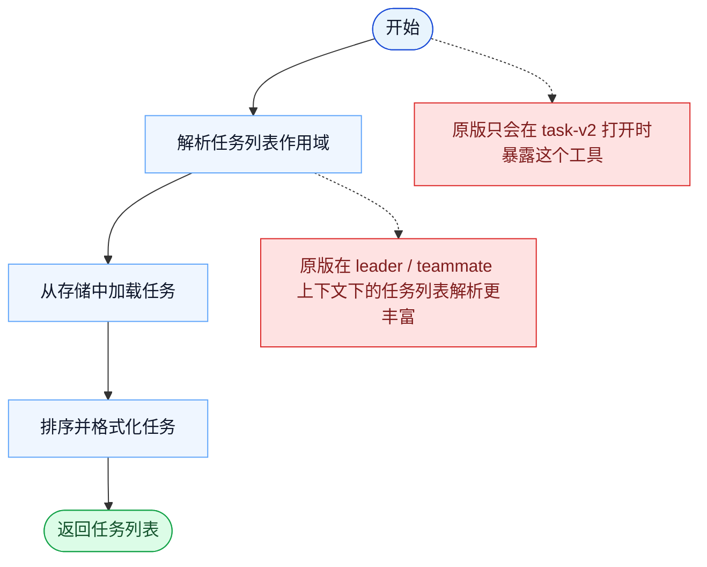

# TaskList 一致性报告

- 原版: `src/tools/TaskListTool/TaskListTool.ts`
- Go版: `tools/tasks.go`

## 结论

- 摘要: 接口完全对齐；列出契约已对齐，返回的任务现在也来自持久化、scope-aware、带锁的 Go 后端。

## 名称与描述

- 名称一致性: 完全一致。
- 描述一致性: 两边都把这个工具描述为用于列出共享任务系统中的当前任务。 除“关键差异”外，措辞差别不影响核心语义。

## 参数与类型

- 类型签名: 无输入参数。
- 参数一致性: 顶层参数名与原版审计结果一致；字段顺序差异不构成语义差异。

## 实现概要

- 核心能力: 列出共享任务系统中的当前任务。
- 典型场景: 适用于模型在排优先级或更新任务前，需要看到当前工作的全局视图。
- 核心痛点: 它解决的是多步骤工作的可见性和协同问题，避免模型只能靠自由文本硬记整套计划。
- 主要挑战: 难点在于持久化、依赖边、阻塞语义，以及跨工具、跨会话保持任务状态一致。
- 实现思路一致性: 部分一致。两边都围绕共享的持久化任务系统展开，Go 现在也已镜像更多原版的 scope、加锁和 runtime-task 底座，但原版仍然有更丰富、带 hook 的 app-state 运行时。

## 流程图与决策地图

### 如何阅读这张图

- 先读蓝色主路径，用它理解共享的 happy path。
- 再看黄色菱形，它们是决定工具走哪条分支的判断条件。
- 最后看红色节点，它们标出 Go 与 `../src` 真正分叉的位置，或被有意排除的范围。

### 决策点

- 和其他任务工具一样，关键的隐含决策是：在当前 session 上下文中到底读取哪一个任务列表。

### 差异热点

- 可见流程很简单：解析作用域、加载、排序、返回。
- 真正的差异在工具暴露 gate，以及原版更丰富的任务列表作用域解析上。

## 输出与格式

- 输出对比: 原版返回更丰富的结构化列表；Go 返回的是基于新持久化任务底座生成的纯文本任务列表。

## 关键差异

- 剩余差距主要集中在 hook/app-state 集成、更丰富的 typed 结果，以及更宽的原版 teammate/runtime 生命周期。
