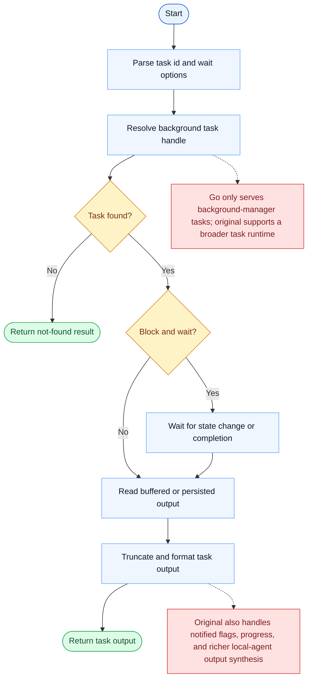

# TaskOutput Parity Report

- Original: `src/tools/TaskOutputTool/TaskOutputTool.tsx`
- Go: `tools/tasks.go`

## Verdict

- Summary: Exact surface; Go now reads from a persisted runtime-task store with better blocking behavior, but the original async task-output runtime is still richer.

## Name And Description

- Name parity: exact.
- Description parity: Both versions describe the tool around the same core capability: Reads the output of a task, optionally waiting for that task to finish. Wording differences are minor unless called out under key gaps.

## Parameters And Types

- Type signature: task_id: string, block?: boolean, timeout?: number.
- Parameter parity: top-level parameter names match the original audit; ordering differences are non-semantic.

## Implementation Overview

- Core capability: Reads the output of a task, optionally waiting for that task to finish.
- Typical scenarios: Use it when a task has already been launched and the model needs its result without redoing the work.
- Core pain point addressed: It addresses visibility and coordination for multi-step work so the model does not have to track the whole plan in free text.
- Main challenges: The hard parts are persistence, dependency edges, blocking semantics, and keeping task state consistent across tools and sessions.
- Strategy consistency: Partially consistent. Both versions revolve around a shared persistent task system, and Go now mirrors more of the original scope, locking, and runtime-task substrate, but the original still has a richer hook-aware app-state runtime.

## Visual Flow And Decision Map

### How To Read The Diagram

- Read the blue path first to understand the shared happy path.
- Read the yellow diamonds next; they are the branch conditions that decide which path the tool takes.
- Read the red boxes last; they mark exact places where Go diverges from `../src`, or where a path is intentionally out of scope.

### Decision Points

- `Task found?` decides whether the tool can inspect a live background handle at all.
- `Block and wait?` controls whether output is returned immediately or after the runtime waits for more task progress.

### Flow-Divergence Hotspots

- The Go path is much narrower because it only knows about the background task manager's task types.
- The original task-output runtime covers more task kinds and richer post-processing around notifications, progress, and synthesized agent output.

## Output And Format

- Output comparison: The original returns typed task-output payloads; Go returns plain text sourced from the persisted runtime-task substrate, with stronger truncation and blocking semantics than before.

## Key Gaps

- Typed task-output richness and the broader original async runtime are still not fully reproduced in Go.
